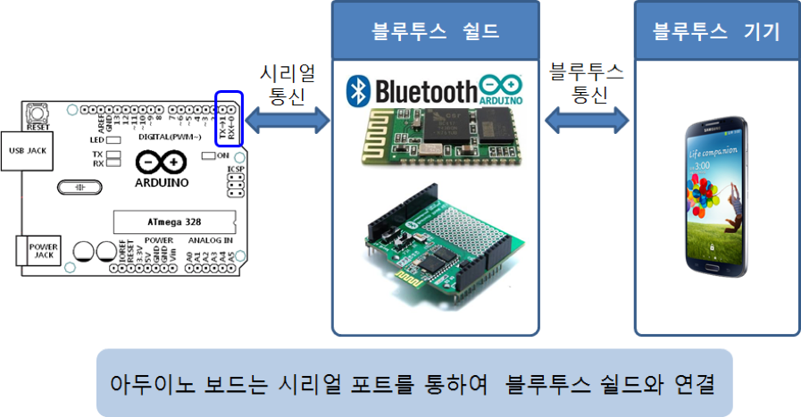
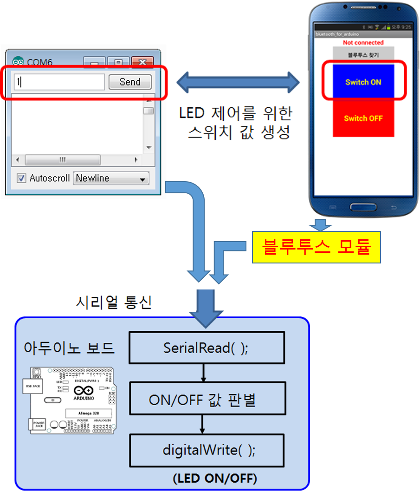
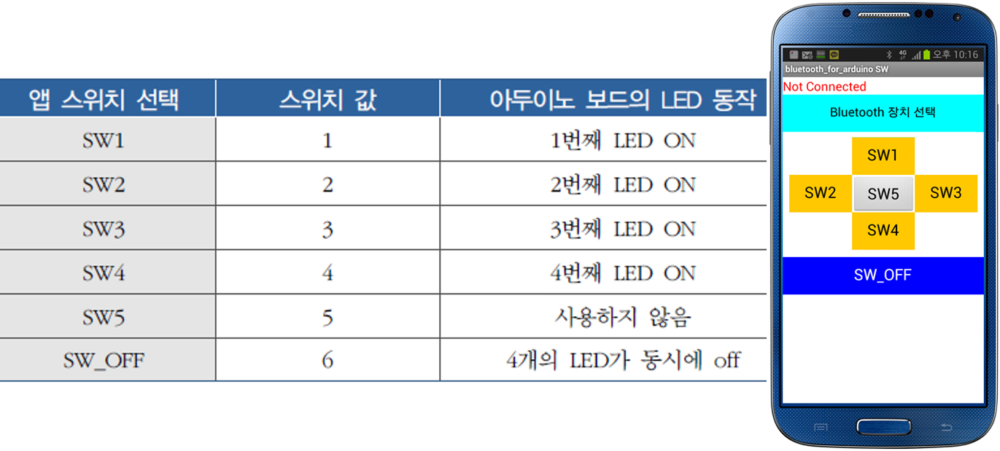
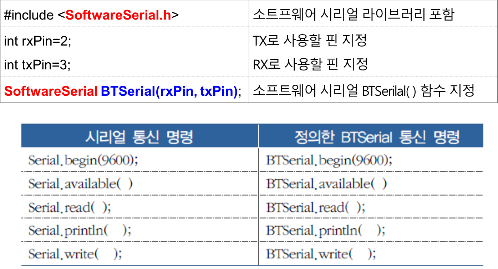
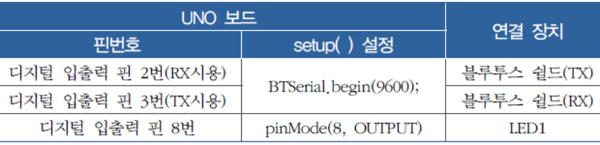

# 블루투스 통신

## 학습목표
- 블루투스 모듈의 사용법을 학습한다.
- 블루투스 모듈을 사용하여 스마트폰으로 아두이노의 LED를 제어하는 방법을 학습한다.
- 블루투스 모듈을 사용하여 아두이노 보드의 가변저항 값을 스마트폰에 출력하는 방법을 학습한다.

## 1. 블루투스 통신이란?
- **블루투스**는 1994년에 에릭슨이 최초로 개발한 디지털 통신 기기를 위한 개인 근거리 무선 통신 산업 표준
- 산업, 과학, 의료용으로 할당된 ISM(Industiral Scientific and Medical) 대역에 포함되는 **2.4~2.485GHz**의 단파 UHF 전파를 이용하여 전자 장비 간의 짧은 거리(10m 전후)의 데이터 통신
- ISM 주파수 대역은 전파사용의 허가가 필요 없는 대역이므로, 무선 랜 서비스, RFID, XBee, 블루투스 등 다양한 통신에 사용되므로, 주파수 간섭이 발생할 수 있음.
	- 해당 주파수 대역에서 비어있는 채널을 찾아 데이터를 전송하기 때문에 간섭이 일어난다 하더라도 즉시 다른 빈 곳으로 전송하게 된다. 음성기기의 사용 시 아주 잠깐의 지연현상이 발생하지만 체감하기 어렵다.

### 1.1 블루투스 모듈 HC-05
- 전송속도(9600bps), data bits(8), stop bit(1), Parity(No parity) 기본설정
- Default **PINCODE** : "**1234**“
- 10m 거리이내사용가능

	

### 1.2 아두이노 보드 연결 구성: 블루투스 모듈 HC-05
- 블루투스 모듈  **HC-05**를 베이스보드 우측상단의 **Sensor** 섹션에 삽입 (아래 그림 참조)
- **HC-05** 모듈의 **TX, RX** (**Sensor** 섹션의 **S4, S5**)와 **Uno** 보드의 **TX, RX** (디지털입출력 핀 1,0)를 서로 교차하게 연결
	-  **HC-05** 모듈의 **TX** --> **Uno** 보드의 **RX**
	-  **HC-05** 모듈의 **RX** --> **Uno** 보드의 **TX**
- **HC-05** 모듈의 **VCC**는 (브레드보드를 통해) **Uno** 보드의 **5V**에 연결
- **HC-05** 모듈의 **GND**는 (브레드보드를 통해) **Uno** 보드의 **GND**에 연결

	

## 2. 블루투스 모듈을 이용한 아두이노 보드와 스마트 폰간의 통신
- 스마트 폰과 블루투스 모듈간에 블루투스 방식으로 통신
- 아두이노 보드는 블루투스 모듈과 시리얼 통신

	

### 1.4 안드로이드 스마트폰과 블루투스 모듈 연결
- 안드로이드 스마트폰의 설정에서 연결가능한 블루투스 기기를 검색하여 아두이노 보드에 장착된 블루투스 모듈을 찾아 연결하고 활성화
	1. 스마트폰의 설정에서 블루투스 기능 ON
	2. **사용 가능한 디바이스** 검색
	3. 검색된 아두이노 블루투스 모듈 선택
	4. PIN코드를 "**1234**"로 입력하여 등록(페어링)

	

## 2. 스마트 폰에서 아두이노 보드 LED 제어하기
- 스마트 폰에는 PC가 시리얼 모니터를 통해서 그림과 같이 LED를 제어 할 수 있는 스위치 값을 전달했던 것처럼 스마트 폰에서도 시리얼 통신으로 전달할 스위치 값을 발생시켜 줄 엡(App)을 설치하여 사용

	

### 2.1 예제 1 (스마트폰을 이용한 LED ON/OFF 제어)
- 스마트 폰에 ON/OFF제어를 할 수 있는 "[**BT_ONOFFSW.apk**](app/BT_ONOFFSW.apk)"를 설치하고, 블루투스 모듈이 장착된 아두이노 보드에 연결된 LED를 ON/OFF

#### 2.1.1 아두이노 보드 연결 구성


#### 2.1.2 Sketch 프로그램

```c
int ledPin = 8;       // 아두이노 보드의 디지털입출력 핀 8번에 LED연결

void setup( ) {
   Serial.begin(9600);      // BT 모듈의 통신 속도 9600bps 설정
   pinMode(ledPin, OUTPUT); // 디지털입출력 핀 8번을 출력으로 설정
}

void loop() {
  char r_data;
  if (Serial.available( )> 0) { // BT 모듈을 통한 시리얼 통신 입력 발생 검사
    r_data = Serial.read( );    // 시리얼 통신 문자 입력 값 저장, (시리얼 통신으로 수신되는 데이터의 타입이 문자형 임을 가정)

    if( r_data == '1') {        // 스마트 폰의 앱 “BT_ONOFFSW.apk”의 "Switch ON"이 터치될 때, 문자 '1'이 전송됨
         digitalWrite(ledPin, HIGH);  // LED 켜기
    }
    if( r_data == '2') {        // 스마트 폰의 앱 “BT_ONOFFSW.apk”의 "Switch OFF"이 터치될 때, 문자 '2'가 전송됨
         digitalWrite(ledPin, LOW);   // LED 끄기
    }
  }
}
```

#### 2.1.3  스마트 폰에 App 설치
1. 휴대폰에서 다음 [링크](app/BT_ONOFFSW.apk)를 클릭하여 앱 (**BT_ONOFFSW.apk**) 다운로드
2. 다운로드된 후, 파일 **열기**를 클릭하여 설치
	- "*보안상의 이유로 이 소스에서 가져온 알 수 없는 앱을 휴대전화에 설치할 수 없습니다.*" 메시지가 나오면, **설정**을 클릭한후 "**이 출처 허용**"을 활성화
	- 앞 페이지로 이동한 후에, **설치**를 클릭하여 설치

#### 3.1.4 실행
1. 스마트폰에서 앱 실행
2. **블루투스 찾기** 버튼 클릭하여 연결할 블루투스 모듈 선택
	- 연결이 되면, 화면 상단에 **연결 ON**이 표시됨
3. **Switch ON** 혹은 **Switch OFF** 버튼을 눌러 8번 핀에 연결된 LED의 ON/OFF 확인


<a name="ex2"></a>
### 2.2 예제 2 (스마트폰을 이용한 4개의 LED ON/OFF 제어)
- 아두이노 보드에 4개의 LED 연결
- 스마트 폰과 블루투스 모듈을 통하여 4개의 LED  ON/OFF
- 6개의 기능 버튼이 있는 스마트 폰 App ([BT_SW6.apk](app/BT_SW6.apk)) 설치

	

#### 2.2.1 아두이노 보드 연결 구성
- 이전 보드 연결 구성에서 다음 연결 추가
	- 디지털 입출력 핀 9, 10, 11 번과 LED 1,2,3 연결 추가

	


#### 2.2.2 Sketch 프로그램
```c
int ledPin[4] = {8,9,10,11};
int k, num;
char phoneData;

void setup( ) {
   Serial.begin(9600);
   for (k=0; k<4; k++) {
      pinMode(ledPin[k], OUTPUT);
   }
}

/*
  SerialEvent occurs whenever a new data comes in the hardware serial RX. This
  routine is run between each time loop() runs, so using delay inside loop can
  delay response. Multiple bytes of data may be available.
*/
void serialEvent() {
  phoneData = Serial.read( );
}

void loop() {
    if (phoneData == '1') {
         digitalWrite(ledPin[0], HIGH);
    } else if (phoneData == '2') {
         digitalWrite(ledPin[1], HIGH);
    } else if (phoneData == '3') {
         digitalWrite(ledPin[2], HIGH);
    } else if (phoneData == '4') {
         digitalWrite(ledPin[3], HIGH);
    } else if (phoneData == '6') {
      for (k=0; k<4; k++) {
        digitalWrite(ledPin[k], LOW);
      }
    }
}
```

- [**serialEvent**](https://www.arduino.cc/en/Reference/SerialEvent)() 함수
	- 이 함수는 loop()함수가 실행될 때마다, 시리얼 데이터가 있으면 호출됨
	- 이 함수는 [Esplora](https://store.arduino.cc/arduino-esplora), [Leonardo](https://store.arduino.cc/arduino-leonardo-without-headers), [Micro](https://store.arduino.cc/arduino-micro-without-headers) 아두이노 보드에서는 호환되지 않음

#### 2.2.3 스마트 폰에 App 설치
1. 휴대폰에서 다음 [링크](app/BT_SW6.apk)를 클릭하여 앱 BT_SW6.apk 다운로드
2. 다운로드된 후, 파일 열기를 클릭하여 설치
	- "보안상의 이유로 이 소스에서 가져온 알 수 없는 앱을 휴대전화에 설치할 수 없습니다." 메시지가 나오면, 설정을 클릭한후 "이 출처 허용"을 활성화
	- 앞 페이지로 이동한 후에, 설치를 클릭하여 설치

#### 2.2.4 실행
1. 스마트폰에서 앱 실행
2. 블루투스 찾기 버튼 클릭하여 연결할 블루투스 모듈 선택
	- 연결이 되면, 화면 상단에 연결 ON이 표시됨
2. SW1, SW2, SW3, SW4, SW_OFF 버튼을 눌러 8,9,10,11번 핀에 연결된 LED의 ON/OFF 확인

## 3. 블루투스 통신으로 스마트폰에 데이터 전송


<a name="ex3"></a>
### 3.1 예제 3 (아두이노 보드의 가변저항 값을 스마트폰에 표시하기)
- "[BT_RCV1.apk](app/BT_RCV1.apk)" 설치
- 블루투스 쉴드가 장착된 아두이노 보드에 가변저항 연결
- 가변저항 값을 스마트 폰 표시
- 저항 값에 따라 LED 밝기 조절

	

#### 3.1.1 스마트폰 앱 기능과 아두이노 동작


#### 3.1.2 아두이노 보드 연결 구성


#### 3.1.3 Sketch 프로그램

```c
int ledPin = 5;       // 아두이노 보드의 PWM핀 5번에 LED연결
int vrVal;            // 가변저항 값 저장을 위한 변수
int vrPercentage;     // 가변저항 값을 100분율로 표시한 값을 저장하는 변수
int pwmVal;           // 가변저항 값을 0~255사이의 값으로 변환한 값을 저장하는 변수
char select;          //

void setup( ) {
   Serial.begin(9600);
}

void serialEvent() {
  select = Serial.read(); // 시리얼 통신 입력값이 있으면 읽어서 select 변수에 저장 (문자 '1' 혹은 '2' 중에 하나가 수신됨)
}

void loop() {
  if (select == '1') {      // 스마트 폰 엡에서 ‘수신 시작’ 명령 수신 (문자 '1'을 보냄)
    vrVal = analogRead(2);  // 아두이노 보드에 연결된 VR로 부터 값 입력
    vrPercentage = map(vrVal, 0, 1023, 0, 100); // %값으로 변환
    Serial.write(vrPercentage);   // 블루투스를 이용한 시리얼 통신으로 스마트 폰에 값 전달

    pwmVal = map(vrVal, 0, 1023, 0,255);  // PWM 값으로 변환
    analogWrite(ledPin,pwmVal);           //VR값에 비례한 LED 밝기 표시
    delay(1000);
  }
  if (select =='2') {       // 스마트 폰 엡에서 ‘수신 종료’ 명령 수신 (문자 '2'을 보냄)
    analogWrite(ledPin,0);  // LED OFF
    delay(20);
  }
}
```

## 4. 소프트웨어 시리얼을 이용한 블루투스 통신
- 블루투스 쉴드는 아두이노 보드의 UART 포트인 **0번(RX)**와 **1번(TX)**를 **TXD**와 **RXD**로 연결 사용
	- PC의 시리얼과 블루투스 쉴드가 같은 통신 포트 사용하게 되어 충돌
- 소프트웨어적으로 시리얼 기능 사용
	- 아두이노 보드의 0번과 1번 대신에 **다른 디지털입출력 핀을 소프트웨어적으로 정의하여 시리얼 통신**
	- 소프트웨어 시리얼 통신용으로 사용하는 핀이 다른 용도로 중복되지 않도록 주의
		- 예를 들면 디지털입출력 핀 2번과 3번을 소프트웨어적으로 TX와 RX로 정의하여 사용
	- **사용방법**
		- \<SoftwareSerial.h>를  스케치에 포함
		- 소프트웨어 시리얼 함수 정의

			
			
### 4.1 예제 4 (소프트웨어 시리얼 기능을 갖는 블루투스 쉴드를 이용한 LED의 ON/OFF 제어)

#### 4.1.1 아두이노 보드 연결 구성



#### 4.1.2 Sketch 프로그램
```c
#include <SoftwareSerial.h>
int rxPin=2;
int txPin=3;
SoftwareSerial BTSerial(rxPin,txPin); // 소프트웨어 시리얼 설정

int ledPin = 8;       // 아두이노 보드의 디지털입출력 핀 8번에 LED연결

void setup( ) { 
   BTSerial.begin(9600);      // BT 모듈의 통신 속도 9600bps 설정
   pinMode(ledPin, OUTPUT); // 디지털입출력 핀 8번을 출력으로 설정
}

void loop() {
  char r_data;
  if (BTSerial.available( )> 0) { // BT 모듈을 통한 시리얼 통신 입력 발생 검사
    r_data = BTSerial.read( );    // 시리얼 통신 문자 입력 값 저장, (시리얼 통신으로 수신되는 데이터의 타입이 문자형 임을 가정)

    if( r_data == '1') {        // 스마트 폰의 앱 “BT_ONOFFSW.apk”의 "Switch ON"이 터치될 때, 문자 '1'이 전송됨
         digitalWrite(ledPin, HIGH);  // LED 켜기
    }
    if( r_data == '2') {        // 스마트 폰의 앱 “BT_ONOFFSW.apk”의 "Switch OFF"이 터치될 때, 문자 '2'가 전송됨
         digitalWrite(ledPin, LOW);   // LED 끄기
    }
  }
}
```

<a name="exercise"></a>
## 5. 연습문제
1. [예제 2 (스마트폰을 이용한 4개의 LED ON/OFF 제어)](#ex2)를 소프트웨어 시리얼을 이용하도록 Sketch 프로그램을 수정하시오 
2. [예제 3 (아두이노 보드의 가변저항 값을 스마트폰에 표시하기)](#ex3)를 소프트웨어 시리얼을 이용하도록 Sketch 프로그램을 수정하시오 