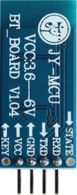

# 블루투스 통신 1

## 학습목표
- 블루투스 모듈의 사용법을 학습한다.
- 블루투스 모듈을 사용하여 스마트폰으로 아두이노의 LED를 제어하는 방법을 학습한다.

## 1. 블루투스 통신이란?
- **블루투스**는 1994년에 에릭슨이 최초로 개발한 디지털 통신 기기를 위한 근거리무선통신 산업 표준
- 산업, 과학, 의료용으로 할당된 ISM(Industiral Scientific and Medical) 대역에 포함되는 **2.4~2.485GHz**의 단파 UHF 전파를 이용하여 전자 장비 간의 짧은 거리(10m 전후)의 데이터 통신
- ISM 주파수 대역은 전파사용의 허가가 필요 없는 대역이므로, WiFi, RFID, ZigBee, 블루투스 등 다양한 통신에 사용되므로, 주파수 간섭이 발생할 수 있음.
	- 해당 주파수 대역에서 비어있는 채널을 찾아 데이터를 전송하기 때문에 간섭이 일어난다 하더라도 즉시 다른 빈 곳으로 전송하게 된다. 음성기기의 사용 시 아주 잠깐의 지연현상이 발생하지만 체감하기 어렵다.

### 1.1 블루투스 모듈을 이용한 아두이노 보드와 스마트 폰간의 통신
- 스마트 폰과 블루투스 모듈간에 블루투스 방식으로 통신
- 아두이노 보드는 블루투스 모듈과 시리얼 통신
	
	

    	
  	

### 1.2 블루투스 모듈 HC-05
- 전송속도(9600bps), data bits(8), stop bit(1), Parity(No parity) 기본설정
- Default **PINCODE** : "**1234**“
- 10m 거리이내사용가능

	

### 1.3 아두이노 보드 연결 구성: 블루투스 모듈 HC-05
- 블루투스 모듈  **HC-05**를 베이스보드 우측상단의 **Sensor** 섹션에 삽입 (아래 그림 참조)
- **HC-05** 모듈의 **TX, RX** (**Sensor** 섹션의 **S4, S5**)와 **Uno** 보드의 **TX, RX** (디지털입출력 핀 1,0)를 서로 교차하게 연결
	-  **HC-05** 모듈의 **TX** --> **Uno** 보드의 **RX**
	-  **HC-05** 모듈의 **RX** --> **Uno** 보드의 **TX**
- **HC-05** 모듈의 **VCC**는 (브레드보드를 통해) **Uno** 보드의 **5V**에 연결
- **HC-05** 모듈의 **GND**는 (브레드보드를 통해) **Uno** 보드의 **GND**에 연결

	
	

    	
  	

  	
## 2. 스마트 폰에서 아두이노 보드 LED 제어하기
- 스마트 폰에는 PC가 시리얼 모니터를 통해서 그림과 같이 LED를 제어 할 수 있는 스위치 값을 전달했던 것처럼 스마트 폰에서도 시리얼 통신으로 전달할 스위치 값을 발생시켜 줄 엡(App)을 설치하여 사용

	- [예제 1 (스마트폰을 이용한 LED ON/OFF 제어)](bluetooth_ex1.html)
	- [예제 2 (스마트폰을 이용한 4개의 LED ON/OFF 제어)](bluetooth_ex2.html)

## 3. 연습문제
1. [예제 1 (스마트폰을 이용한 LED ON/OFF 제어)](bluetooth_ex1.html)를 [예제 2 (스마트폰을 이용한 4개의 LED ON/OFF 제어)](bluetooth_ex2.html)와 같이 [**serialEvent**](https://www.arduino.cc/en/Reference/SerialEvent)()함수를 이용하는 방식으로 수정하시오.
2. [예제 2 (스마트폰을 이용한 4개의 LED ON/OFF 제어)](bluetooth_ex2.html)를 
[예제 1 (스마트폰을 이용한 LED ON/OFF 제어)](bluetooth_ex1.html)와 같이 **serialEvent**() 함수를 **이용하지 않고** 작동하도록 수정하시오.