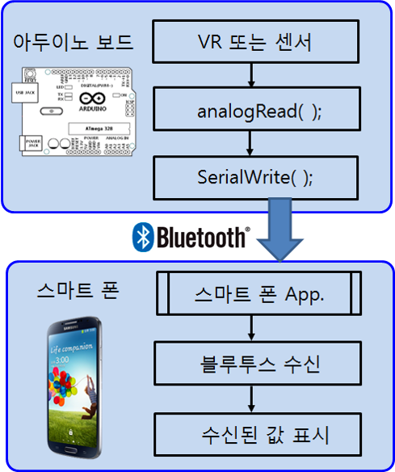

# 블루투스 통신 2

## 학습목표
- 블루투스 모듈을 사용하여 아두이노 보드의 가변저항 값을 스마트폰에 출력하는 방법을 학습한다.
- 소프트웨어 시리얼을 시용한 블루투스 통신 방법을 학습한다.

## 1. 블루투스 통신으로 스마트폰에 데이터 전송
- 아두이노 보드에서 블루투스 통신을 이용하여 스마트 폰에 정보를 전송하는 방법을 학습한다.
- [**시리얼 통신의 예제 2**](../serial/serial.html#ex2)에서 가변저항이나 센서들의 측정 값을 시리얼 통신으로 PC의 시리얼 모니터에 나타낸 것과 같이, 블루투스 모듈이 장착된 아두이노 보드에서 시리얼 포트로 데이터를 출력하면, 블루투스 모듈은 아두이노 보드의 시리얼 포트로 들어온 데이터를 블루투스 통신을 통해서 스마트폰으로 데이터를 전송한다. 
	- [예제 3 (아두이노 보드의 가변저항 값을 스마트폰에 표시하기)](bluetooth_ex3.html)

	

	    
	

## 2. 소프트웨어 시리얼을 이용한 블루투스 통신
- 블루투스 쉴드는 아두이노 보드의 UART 포트인 **0번(RX)**와 **1번(TX)**를 **TXD**와 **RXD**로 연결 사용
	- PC의 시리얼과 블루투스 쉴드가 같은 통신 포트 사용하게 되어 충돌
- 소프트웨어적으로 시리얼 기능 사용
	- 아두이노 보드의 0번과 1번 대신에 **다른 디지털입출력 핀을 소프트웨어적으로 정의하여 시리얼 통신**
	- 소프트웨어 시리얼 통신용으로 사용하는 핀이 다른 용도로 중복되지 않도록 주의
		- 예를 들면 디지털입출력 핀 2번과 3번을 소프트웨어적으로 TX와 RX로 정의하여 사용
	- **사용방법**
		- \<SoftwareSerial.h>를  스케치에 포함
		- 소프트웨어 시리얼 함수 정의

			

    			
			

			
	- [예제 4 (소프트웨어 시리얼 기능을 갖는 블루투스 쉴드를 이용한 LED의 ON/OFF 제어)](bluetooth_ex4.html)

## 3. 연습문제

1. [예제 2 (스마트폰을 이용한 4개의 LED ON/OFF 제어)](bluetooth_ex2.html)를 소프트웨어 시리얼을 이용하도록 Sketch 프로그램을 수정하시오 
2. [예제 3 (아두이노 보드의 가변저항 값을 스마트폰에 표시하기)](bluetooth_ex3.html)를 소프트웨어 시리얼을 이용하도록 Sketch 프로그램을 수정하시오 