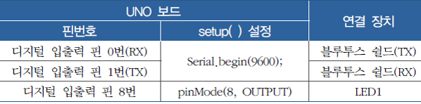
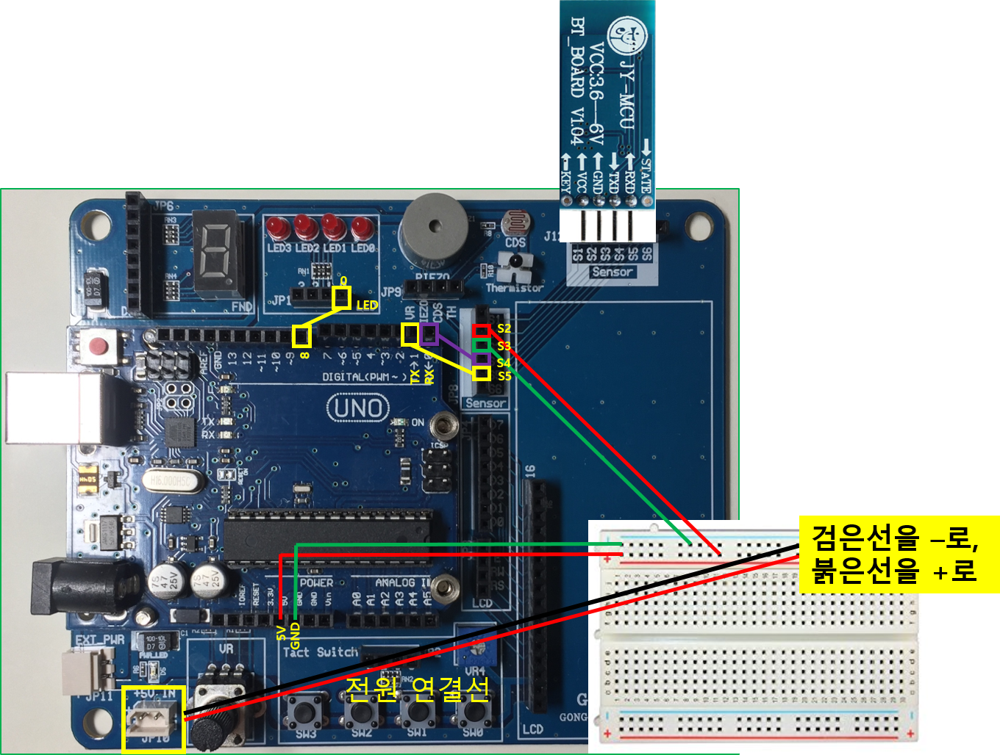

<style>
div.polaroid {
  	width: 500px;
  	box-shadow: 0 10px 30px 0 rgba(0, 0, 0, 0.2), 0 16px 30px 0 rgba(0, 0, 0, 0.19);
  	text-align: center;
	margin-bottom: 0.5cm;
}
</style>

<a name="ex1"></a>
### 2.1 예제 1 (스마트폰을 이용한 LED ON/OFF 제어)
- 스마트 폰에 ON/OFF제어를 할 수 있는 안드로이드 앱을 설치하고, 블루투스 모듈이 장착된 아두이노 보드에 연결된 LED를 ON/OFF

	<div class="polaroid">
    	
  	</div>

#### 2.1.1 아두이노 보드 연결 구성

<div class="polaroid">
    	
</div>

<div class="polaroid">
    	
</div>

#### 2.1.2 Sketch 프로그램

```c
int ledPin = 8;       // 아두이노 보드의 디지털입출력 핀 8번에 LED연결

void setup( ) {
   Serial.begin(9600);      // BT 모듈의 통신 속도 9600bps 설정
   pinMode(ledPin, OUTPUT); // 디지털입출력 핀 8번을 출력으로 설정
}

void loop() {
  char r_data;
  if (Serial.available( )> 0) { // BT 모듈을 통한 시리얼 통신 입력 발생 검사
    r_data = Serial.read( );    // 시리얼 통신 문자 입력 값 저장, (시리얼 통신으로 수신되는 데이터의 타입이 문자형 임을 가정)

    if( r_data == '1') {        // 스마트 폰의 앱 “BT_ONOFFSW.apk”의 "Switch ON"이 터치될 때, 문자 '1'이 전송됨
         digitalWrite(ledPin, HIGH);  // LED 켜기
    }
    if( r_data == '2') {        // 스마트 폰의 앱 “BT_ONOFFSW.apk”의 "Switch OFF"이 터치될 때, 문자 '2'가 전송됨
         digitalWrite(ledPin, LOW);   // LED 끄기
    }
  }
}
```

#### 2.1.3 스케치 업로드
1. 블루투스 모듈을 아두이노 보드에서 분리한 후 스케치 업로드
2. 스케치 업로드 후에 다시 아두이노 보드에 블루투스 모듈 재장착하고, PC와 아두이노 보드 사이의 USB 케이블 연결을 제거

- **주의** 
	- **아두이노 UNO 보드는 하드웨어적으로 하나의 시리얼 포트 밖에 제공**하지 않으므로, PC에서 아두이노 UNO 보드로 스케치를 업로드 할 때는 블루투스 모듈을 아두이노 보드에서 분리하여야 한다.
	- 반대로 아두이노 보드가 블루투스 모듈을 사용하여 통신하기 위해서는 PC와 아두이노 보드 사이에 연결하였던 USB 케이블을 제거해야 한다.

#### 2.1.4  스마트 폰에 App 설치
1. 휴대폰에서 아래 링크를 클릭하여 앱(**BT_ONOFFSW.apk**) 다운로드
	- [**BT_ONOFFSW.apk** 다운로드 링크](https://github.com/kwanulee/iot/releases/download/v1/BT_ONOFFSW.apk)
2. 다운로드된 후, 파일 **열기**를 클릭하여 설치
	- "*보안상의 이유로 이 소스에서 가져온 알 수 없는 앱을 휴대전화에 설치할 수 없습니다.*" 메시지가 나오면, **설정**을 클릭한후 "**이 출처 허용**"을 활성화
	- 앞 페이지로 이동한 후에, **설치**를 클릭하여 설치

#### 2.1.5 안드로이드 스마트폰과 블루투스 모듈 연결
- 안드로이드 스마트폰의 설정에서 연결가능한 블루투스 기기를 검색하여 아두이노 보드에 장착된 블루투스 모듈을 찾아 연결하고 활성화
	1. 스마트폰의 설정에서 블루투스 기능 ON
	2. **사용 가능한 디바이스** 검색
	3. 검색된 아두이노 블루투스 모듈 선택
	4. PIN코드를 "**1234**"로 입력하여 등록(페어링)

	<div class="polaroid">
    	
  	</div> 
  	
#### 2.1.6 스마트폰에서 앱 실행
1. **블루투스 찾기** 버튼 클릭하여 연결할 블루투스 모듈 선택
	- 연결이 되면, 화면 상단에 **연결 ON**이 표시됨
3. **Switch ON** 혹은 **Switch OFF** 버튼을 눌러 8번 핀에 연결된 LED의 ON/OFF 확인
