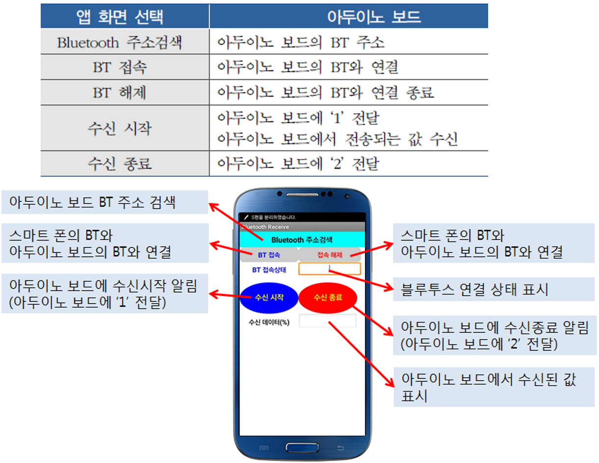
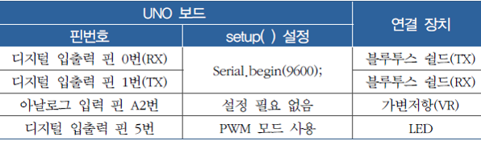
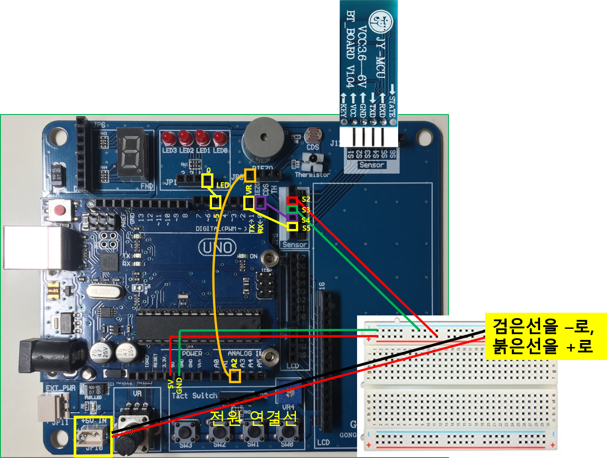

<style>
div.polaroid {
  	width: 500px;
  	box-shadow: 0 10px 30px 0 rgba(0, 0, 0, 0.2), 0 16px 30px 0 rgba(0, 0, 0, 0.19);
  	text-align: center;
	margin-bottom: 0.5cm;
}
</style>

<a name="ex3"></a>
### 3.1 예제 3 (아두이노 보드의 가변저항 값을 스마트폰에 표시하기)
- 휴대폰에서 아래 링크를 클릭하여 앱(**BT_RCV1.apk**) 다운로드
	- [**BT_RCV1.apk** 다운로드 링크](https://github.com/kwanulee/iot/releases/download/v1/BT_RCV1.apk)
- 블루투스 쉴드가 장착된 아두이노 보드에 가변저항 연결
- 가변저항 값을 스마트 폰 표시
- 저항 값에 따라 LED 밝기 조절
	
	<div class="polaroid">
    	
	</div>

#### 3.1.1 스마트폰 앱 기능과 아두이노 동작


<div class="polaroid">
    
</div>

#### 3.1.2 아두이노 보드 연결 구성

<div class="polaroid">
    
</div>

<div class="polaroid">
    
</div>


#### 3.1.3 Sketch 프로그램

```c
int ledPin = 5;       // 아두이노 보드의 PWM핀 5번에 LED연결
int vrVal;            // 가변저항 값 저장을 위한 변수
int vrPercentage;     // 가변저항 값을 100분율로 표시한 값을 저장하는 변수
int pwmVal;           // 가변저항 값을 0~255사이의 값으로 변환한 값을 저장하는 변수
char select;          //

void setup( ) {
   Serial.begin(9600);
}

void serialEvent() {
  select = Serial.read(); // 시리얼 통신 입력값이 있으면 읽어서 select 변수에 저장 (문자 '1' 혹은 '2' 중에 하나가 수신됨)
}

void loop() {
  if (select == '1') {      // 스마트 폰 엡에서 ‘수신 시작’ 명령 수신 (문자 '1'을 보냄)
    vrVal = analogRead(2);  // 아두이노 보드에 연결된 VR로 부터 값 입력
    vrPercentage = map(vrVal, 0, 1023, 0, 100); // %값으로 변환
    Serial.write(vrPercentage);   // 블루투스를 이용한 시리얼 통신으로 스마트 폰에 값 전달

    pwmVal = map(vrVal, 0, 1023, 0,255);  // PWM 값으로 변환
    analogWrite(ledPin,pwmVal);           //VR값에 비례한 LED 밝기 표시
    delay(1000);
  }
  if (select =='2') {       // 스마트 폰 엡에서 ‘수신 종료’ 명령 수신 (문자 '2'을 보냄)
    analogWrite(ledPin,0);  // LED OFF
    delay(20);
  }
}
```
