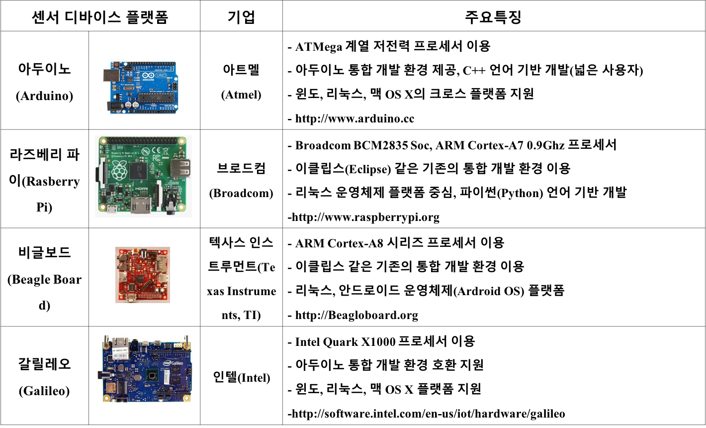

# 디바이스 플랫폼 기술

## 1. 센서 기술

### 센서 (Sensor) 란?
- 이미지, 동작, 소리, 빛, 열, 가스, 온도, 습도 등 주변의 물리·화학·생물학적 정보를 감지하여 전기적 신호로 변환하는 장치
- 데이터를 수집하고 이를 처리하여 전달하는 기능을 수행
	- 예) 자동차를 타고 가다가 앞차가 급정거를 하는 경우, 충돌 방지 레이더나 충돌 방지 센서, 카메라 등이 이를 감지

### 스마트 센서
- 센서 기술에 반도체 기술을 결합시킨 것으로 우수한 데이터 처리 능력, 판단 기능, 메모리, 통신 기능 등을 내장

- 사례
	- [물리량 측정을 위한 **PocketLab**](https://m.post.naver.com/viewer/postView.nhn?volumeNo=5511139&memberNo=29546687&vType=VERTICAL) 
	- [일반시계는 스마트 워치로 만들어주는 **Chronos**](https://wearchronos.com/)

### 사물인터넷 서비스 부분별 센서 응용 예
|분야|응용 예 | 활용센서|
|---|---|---|
|스마트시티|<ul><li> 빌딩, 다리 등 구조물 상태 모니터링 <li> 날씨 적응형 가로등 조명</ul>| <ul><li> 균열 검출, 균열 전파, 가속도계, 선형변위 센서 <li> 광 센서(LDR), 구동기 릴레이</ul>|
|스마트환경|<ul><li> 연소가스 및 화재예방 조건 모니터링 <li> 공장 CO2 배출, 차량 오염가스 배출 등 제어</ul>|<ul><li> CO, CO2, 온도, 습도 센서 <li> NO2, SH2, CO, CO2, 탄화수소, 메탄 검출 센서</ul>|
|스마트농업|<ul><li> 과일 생산 및 품질제고를 위한 농작물 생육환경 제어 <li>포도 당도 제어를 위한 토양 수분 모니터링</ul>|토양 온도, 습도, 잎 습기, 기압, 일사량 센서|
|스마트홈| <ul><li>에너지·물 공급과 소비 모니터링 <li>원격으로 가전제품 제어 </ul>|<ul><li>전류 및 전압 센서, 액체유동 센서 <li>구동기 릴레이 </ul>|
|헬스케어| <ul><li>백신, 의약품 저장 냉장고의 상태 제어 <li> 병원 및 환자 자택에서 환자 상태 모니터링</ul>|<ul><li>빛, 온도, 습도, 임팩트, 진동, 가속도계 센서 <li>ECG(심전도), 펄스, 가속도계, 호흡 센서</ul>|

## 2. 센서 디바이스 플랫폼 기술

### 플랫폼이란?

출처: https://www.computerworld.com/article/3089505/internet/5-steps-to-turning-your-company-into-a-platform.html
		
- 다양한 제품이나 서비스를 제공하고 소비하기 위해 사용하는 토대
- 컴퓨터 분야로 확대해보면, 하나의 운영체제 또는 컴퓨터 아키텍처
- 소프트웨어를 실행할 수 있는 기반
	- 예) 개인용 컴퓨터의 운영체제(MS Window, Linux, Mac OS X), 스마트폰의 운영체제 (iOS, 안드로이드)

### 센서 디바이스
- [칩셋](https://ko.wikipedia.org/wiki/%EC%B9%A9%EC%85%8B)과 통신 모듈을 이용하여 통신이 가능하고, 주변상황을 인지하는 센서가 포함되며, 간단한 데이터 처리를 수행하는 경량 소프트웨어가 포함된 형태
- 예, 스마트폰, 웨어러블 디바이스, 스마트 센서, 등 

<!--
- 프로세서, 통신 모듈, 센서 모듈, 구동기 모듈, 개방형 응용 프로그래밍 인터페이스(Open Application Programming Interface,　Open API) 소프트웨어로 구성
-->

### 개방형 센서 디바이스 플랫폼
- 다양한 종류의 센서 디바이스를 필요로 하는 사물인터넷 서비스 개발을 효율적으로 지원할 수 있음
- 센서 디바이스의 기능을 쉽게 이용하고 센서 내부 모듈에 대한 접근 및 제어를 효율적으로 제공할 수 있는 개방형 응용 프로그래밍 인터페이스 소프트웨어를 개방형 소스(Open Source) 기반으로 제공
- 서비스 개발자들은 개방형 응용 프로그래밍 인터페이스를 이용하여 자신이 원하는 서비스들을 손쉽게 개발
	
	
	
- 사례

	

