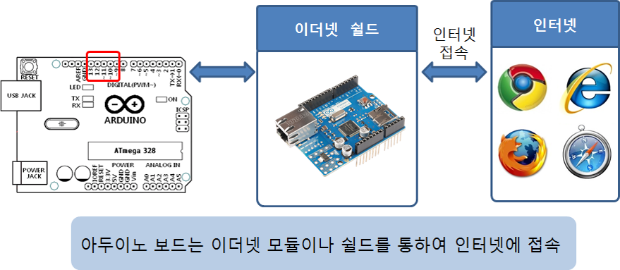
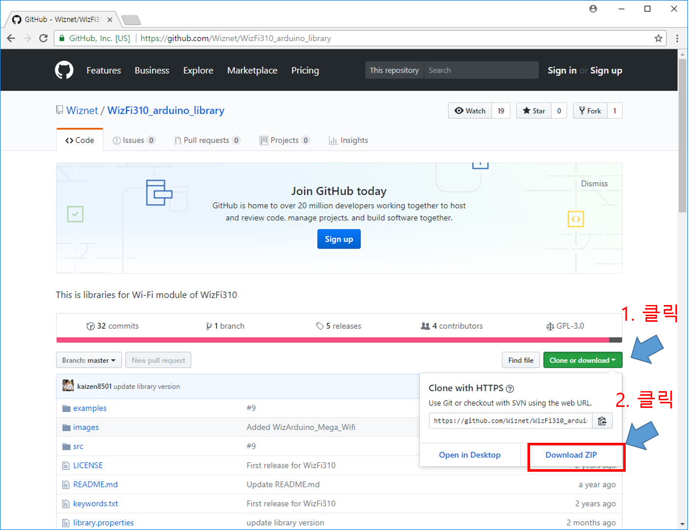
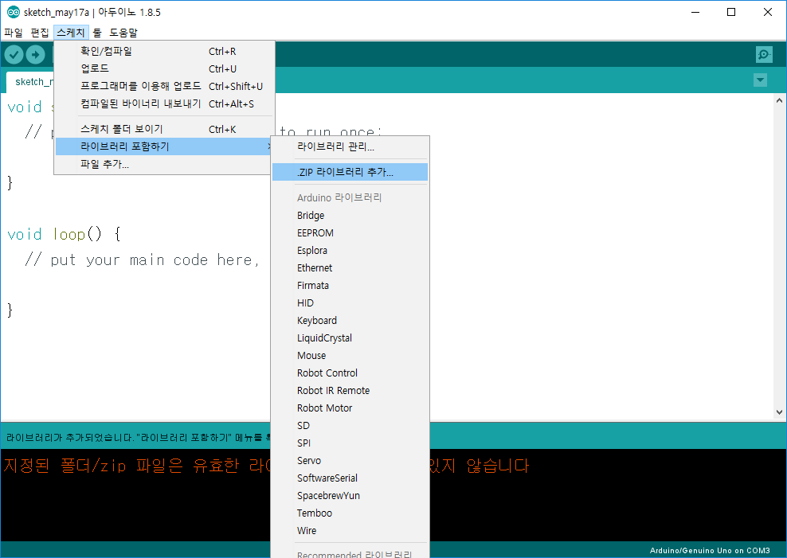
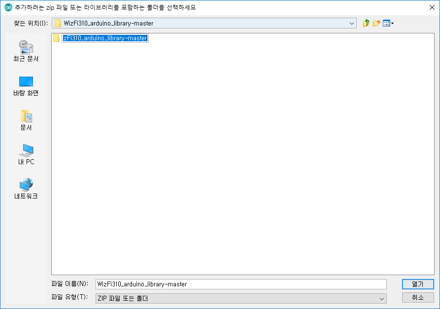
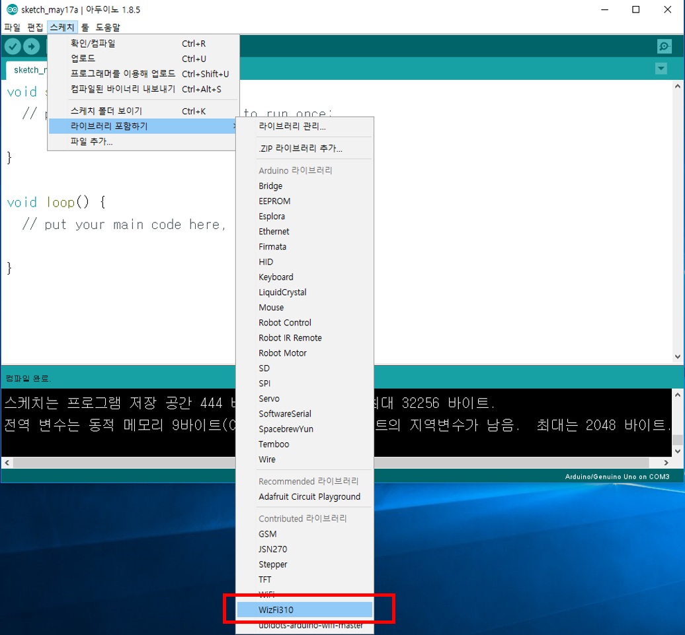
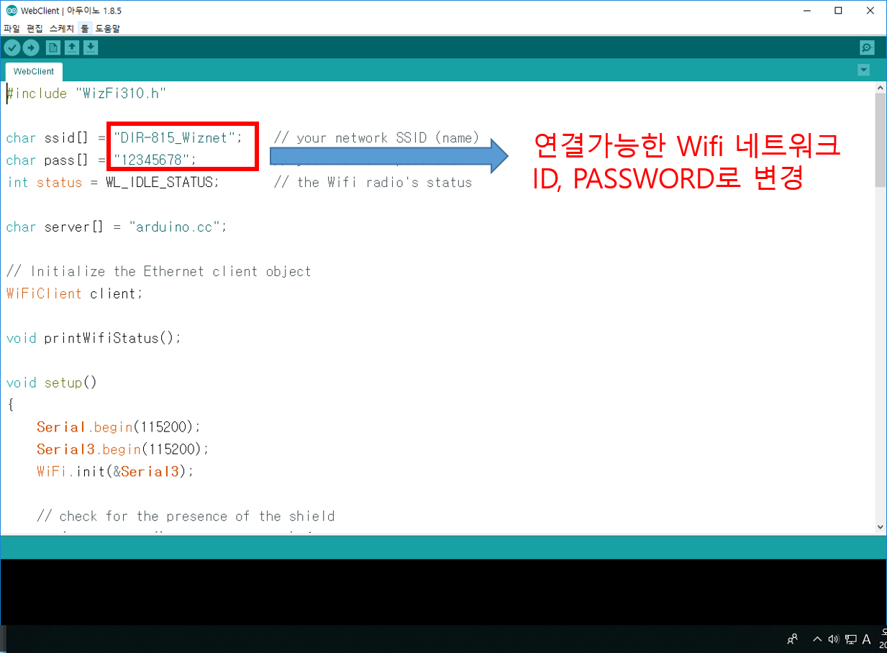
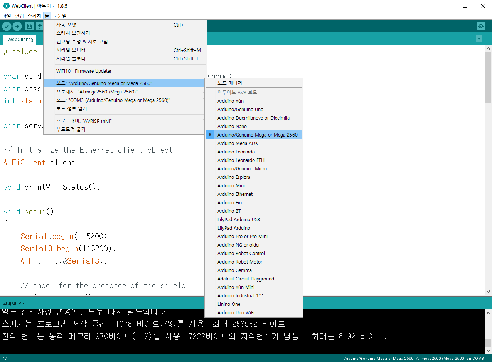
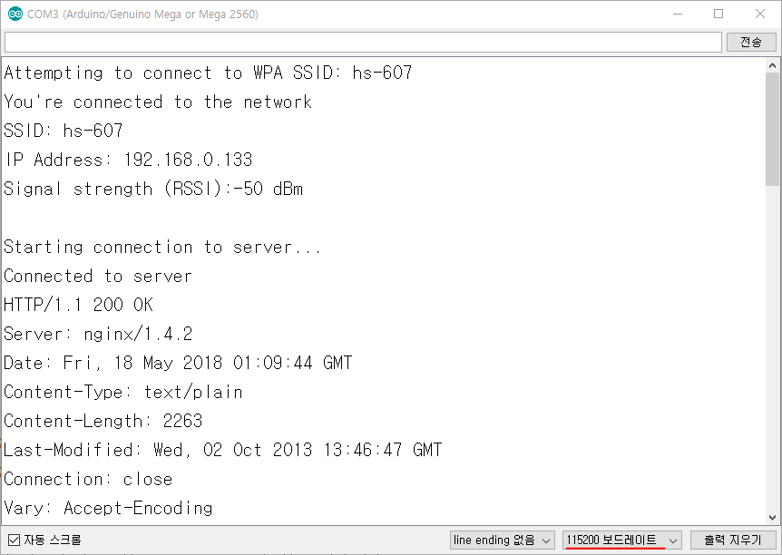

<style>
div.polaroid {
  	width: 400px;
  	box-shadow: 0 10px 30px 0 rgba(0, 0, 0, 0.2), 0 16px 30px 0 rgba(0, 0, 0, 0.19);
  	text-align: center;
	margin-bottom: 0.5cm;
}
</style>

# 컴퓨터 네트워크, 인터넷, 아두이노
- **사물인터넷이란?**
	- 다양한 **사물들을** 센서와 **통신기술을 더해** 사물과 사물, 사물과 사람을 **연결**함으로써 정보를 주고 받으며 새로운 가치를 만드는 것

## 학습목표
- **컴퓨터 네트워크**와 **인터넷**의 기본 개념을 학습한다.
- **아두이노**를 **인터넷**에 연결하는 방법을 학습한다.

---
## 1. 컴퓨터 네트워크
- 컴퓨터 네트워크는 둘 이상의 컴퓨터의 집합이며, **컴퓨터 간에 정보와 자원을 공유하기 위해 연결**된 것
- 네트워크 상의 컴퓨터는 전화선, 동축 케이블, 위성통신, 무선 등 **다양한 통신 기술로 상호 연결**되어 있음
- 컴퓨터들은 지리적으로 어느 곳에서나 위치할 수 있음.


### 1.1 네트워크 종류
- 네트워크 범위에 따른 분류
	- **LAN (Local Area Network)**
		- 집, 사무실, 학교, 대학 캠퍼스 등과 같이 소규모 공간 내의 컴퓨터들을 연결하는 근거리 통신망
	- **WAN (Wide Area Network**
		- 국가, 대륙 등과 같은 넓은 지역을 연결하는 원거리 통신망
		- 다른 지역의 LAN이나 다른 종류의 네트워크를 연결하는 네트워크

	

### 1.2 네트워크 기술
- **이더넷 (Ethernet)**
	- 네트워크에 연결된 각 기기들이 48비트 길이의 고유의 **MAC (Media Access Control)주소**를 가지고 이 주소를 이용해 상호간에 데이터를 주고 받음
	- 일반적으로 LAN에서 가장 많이 활용되는 기술 규격
	- [IEEE 802.3](https://en.wikipedia.org/wiki/IEEE_802.3) 표준 규격
	- 버스 토폴로지를 사용

	

- **와이파이 (WiFi)**
	- 유선 LAN 형태인 이더넷의 단점을 보완하기 위해 고안된 기술
		- 보통 폐쇄되지 않은 넓은 공간(예를 들어, 하나의 사무실)에 하나의 **핫스팟**을 설치하며, **외부 WAN과 백본 스위치, 각 사무실 핫스팟 사이를 이더넷 네트워크로 연결**
		- **핫스팟부터 각 사무실의 컴퓨터는 무선으로 연결**
	- 주로 2.4 GHz (12센티미터) UHF 및 5 GHz (6센티미터) SHF의 ISM (Industiral Scientific and Medical) 무선 대역을 사용
	- [IEEE 802.11](https://ko.wikipedia.org/wiki/IEEE_802.11) 표준 규격

	

## 2. 인터넷
- **인터넷**은 **TCP/IP 프로토콜**을 이용해 정보를 주고 받는 **컴퓨터 네트워크**이다.

### 2.1 TCP/IP 프로토콜
- 프로토콜이란?
	- 통신 프로토콜 또는 통신 규약은 컴퓨터나 원거리 통신 장비 사이에서 메시지를 주고 받는 양식과 규칙의 체계 [[참고자료]](https://ko.wikipedia.org/wiki/%ED%86%B5%EC%8B%A0_%ED%94%84%EB%A1%9C%ED%86%A0%EC%BD%9C)

		

- **인터넷 프로토콜** (**IP**, **I**nternet **P**rocotol)
	- **호스트의 주소** 지정, **패킷 기반**의 정보 전송
	- IP는 패킷 전달 여부를 보증하지 않고, 패킷을 보낸 순서와 받는 순서가 다를 수 있다
- **전송 제어 프로토콜** (**TCP**, **T**ransmission **C**ontrol **P**rotocol)
	- **TCP**는 **IP** 위에서 동작하는 프로토콜로, 데이터의 전달을 보증하고 보낸 순서대로 받게 해준다.

	
	[참고자료, https://image.slidesharecdn.com/081-111113041506-phpapp01/95/08-1-3-728.jpg?cb=1321157739]	  

### 2.2 IP 주소
- 컴퓨터 네트워크에서 **IP(Internet Protocol) 주소**는 전세계 컴퓨터에 부여된 **고유의 식별 주소**다
- **IPv4** (IP version 4) 주소 체계
	- 0~255 범위의 10진수 4개와 .(점)으로 표현하며, 실제로 32비트로 구성됨
	- 예, 211.102.111.012  
- **IPv6** (IP version 6) 주소 체계
	- IPv4의 주소 부족 문제 해결을 위해 제정됨
	- 128비트로 구성됨
	- 예, 3122:FFAB:1234:3120:1111:DCDD:2241:0099

### 2.3 자동 IP (DHCP)와 고정 IP
- IP 주소 할당 방식에 따라 고정 IP와 자동 IP로 구분됨
- **고정 IP 주소**
	- 인터넷 서비스 업체의 의해서 할당된 IP 주소로서 항상 고정된 주소임
- **자동 IP 주소 (Dynamic Host Configuration Protocol, DHCP)**
	- 컴퓨터가 부팅될 때마다 DHCP 서버에 의해 할당된 IP 주소로서 유동적임.

### 2.4 게이트웨이
- 다른 네트워크로 들어가는 톨게이트 역할을 하는 네트워크 포인트
- 외부 인터넷으로 나가기 위해서는 반드시 게이트웨이 설정이 필요함
- 게이트웨이에도 중복되지 않는 IP 주소가 필요함
	- 일반적으로 게이트웨어 IP 주소는 컴퓨터에 할당된 IP 주소 중 끝자리만 다른형태, 보통 1을 지정
	- 예, 211.102.111.1

### 2.5 DNS
- **도메인 네임 시스템 (Domain Name System, DNS)**는 사람이 이해하기 쉬운 도메인 이름을 숫자로 식별된 IP 주소로 변환해 줌
	

### 2.6 IP 주소 및 네트워크 정보를 확인하는 방법
- 운영체계가 MS 윈도우 라면,
	1. [**시작**]-[**실행**]에서 *cmd*를 입력
	2. **명령 프롬프트** 창에서 *ipconfig /all* 명령을 입력하여 실행

	  


---
## 3. 아두이노와 인터넷
- 아두이노에서 인터넷을 사용하려면 **이더넷 (Ethernet)**이나 **와이파이 (WiFi)**을 지원하는 모듈이나 쉴드 혹은 이더넷이나 와이파이 기능이 내장된 보드를 이용해야 한다.

	

### 3.1 이더넷 쉴드
- 아두이노 이더넷 쉴드 (정품)
	<div class="polaroid">
	  	
	</div>

- [[참고자료] ARDUINO ETHERNET SHIELD TUTORIAL](http://www.instructables.com/id/Arduino-Ethernet-Shield-Tutorial/)

### 3.2 와이파이 쉴드 및 모듈
- 아두이노 와이파이 쉴드 (정품)
	<div class="polaroid">
	  	
	</div>

- 다양한 종류의 와이파이 쉴드 및 모듈이 시중에 판매되고 있으나, 사용법이 제품별로 다소 상이함.

### 3.3 와아파이 결합 보드
- WizArduino MEGA WiFi
	<div class="polaroid">
			
	</div>

<a name="practice"> </a>
## 4. WizArduino MEGA WiFi를 이용한 인터넷 연결 실습

### 4.1 라이브러리 및 예제 설치
1. https://github.com/Wiznet/WizFi310_arduino_library 접속
- 라이브러리 및 예제 다운로드

	<div class="polaroid">
			
	</div>

3. 다운로드된 zip 파일  압축 풀기
4. 아두이노 IDE에서 [**스케치**]-[**라이브러리 포함하기**]-[**.ZIP 라이브러리 추가...**] 선택

	<div class="polaroid">
			
	</div>

5. 압축이 풀린 폴더 하위의 폴더를 선택 후 [**열기**] 클릭
	<div class="polaroid">
			
	</div>
6. 라이브러리 추가 확인
	<div class="polaroid">
			
	</div>

### 4.2 WebClient 예제 실행
1. 아두이노 IDE의 [**파일**]-[**예제**]-[**WizFi310**]-[**WebClient**] 선택
2. WiFi 네트워크 설정

	<div class="polaroid">
			
	</div>
3. WizArduino MEGA WiFi 보드를 mini-USB (5pin)으로 PC와 연결 후, 업로드
    - 아두이노 IDE의 [**툴**]-[**보드**]에서  **"Arduino/Genuino Mega or Mega 2560"** 선택 해야함

    <div class="polaroid">
  			
  	</div>

4. 시리얼 모니터 창에서 결과 확인
    - 시리얼 모니터 창 하단에 **115200 보드레이트** 로 설정해야 함
  <div class="polaroid">
      
  </div>

### 4.2 WebClient 예제 분석

#### 4.2.1 선언부

- WizFi310 와이파이 모듈을 사용하기 위해 필요한 WizFi310 라이브러리 선언

	```c
	#include "WizFi310.h"
	```

- 와이파이 무선 액세스 포인터의 네트워크 ID와 패스워드 설정

	```c
	char ssid[] = "DIR-815_Wiznet";    // your network SSID (name)
	char pass[] = "12345678";          // your network password
	int status = WL_IDLE_STATUS;       // the Wifi radio's status
	```

- 인터넷을 통해 접속할 서버 주소 (다른 주소)

	```c
	char server[] = "arduino.cc";
	```

- WiFiClient 객체 선언

	```c
	// Initialize the Ethernet client object
	WiFiClient client;
	```
	
  - [WiFiClient](https://github.com/Wiznet/WizFi310_arduino_library/blob/master/src/WizFi310Client.cpp)는 서버와의 연결 및 데이터 수신/전송 기능을 구현한 클래스

- printWifiStatus() 함수 프로토타입 선언

	```c
	void printWifiStatus();
	```
  - 함수 프로토타입 선언은 "함수정의가 뒤에 나올 거니까 에러 없이 넘어가줘"라고 우리에게 말해주는 것입니다.

#### 4.2.2 setup()함수
- 시리얼 통신 초기화 및 와아파이 모듈 초기화
	
	```c
	Serial.begin(115200);
	Serial3.begin(115200);
	WiFi.init(&Serial3);
	```

- 와이파이 쉴드가 없으면 더이상 진행하지 않음

	```c
	// check for the presence of the shield
	if (WiFi.status() == WL_NO_SHIELD) {
	    Serial.println("WiFi shield not present");
	    //SerialUSB.println("WiFi shield not present");
	    // don't continue
	    while (true);
	}
	```

- 현재 와이파이 네트워크에 연결되지 않았으면, 와이파이 네트워크에 접속
	
	```c
	// attempt to connect to WiFi network
	while ( status != WL_CONNECTED) {
	    Serial.print("Attempting to connect to WPA SSID: ");
	    Serial.println(ssid);
	    // Connect to WPA/WPA2 network
	    status = WiFi.begin(ssid, pass);
	}
	// you're connected now, so print out the data
	Serial.println("You're connected to the network");
	```

- server (arduino.cc)에 접속하여, *asciilogo.txt* 파일을 요청

	```c
	Serial.println();
	Serial.println("Starting connection to server...");
	// if you get a connection, report back via serial
	if (client.connect(server, 80)) {
	    Serial.println("Connected to server");
	    // Make a HTTP request
	    client.println("GET /asciilogo.txt HTTP/1.1");
	    client.println("Host: arduino.cc");
	    client.println("Connection: close");
	    client.println();
	}
	```


#### 4.2.3 loop()함수
- 서버로부터 온 수신 데이터가 있으면, 이를 읽어서 시리얼 모니터에 출력

	```c
	// if there are incoming bytes available
	// from the server, read them and print them
	while (client.available()) {
	    char c = client.read();
	    Serial.write(c);
	}
	```

- 서버로의 연결이 끊어졌다면, 메시지 출력과 함께 종료

	```c
	// if the server's disconnected, stop the client
	if (!client.connected()) {
	Serial.println();
	Serial.println("Disconnecting from server...");
	client.stop();
	// do nothing forevermore
	    while (true);
	}
	```
