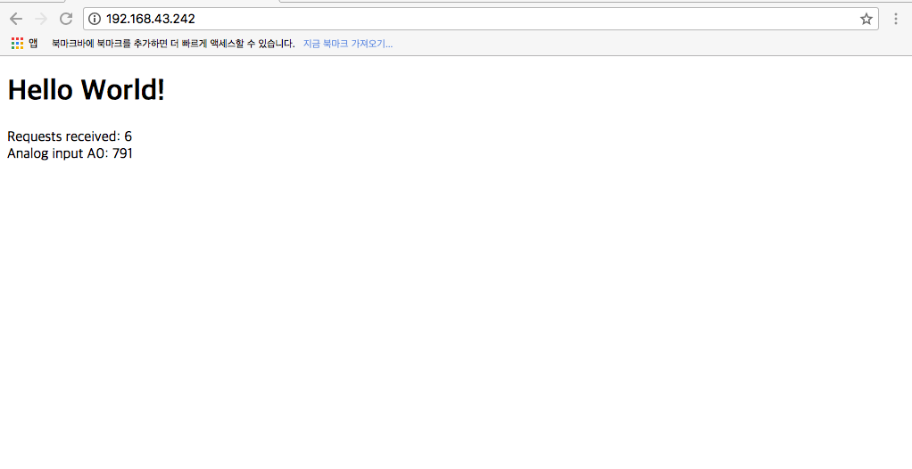
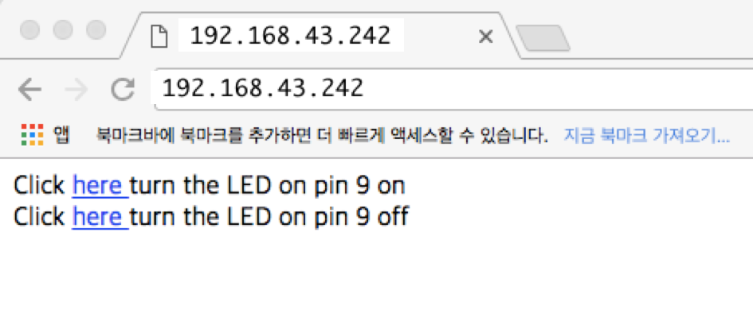
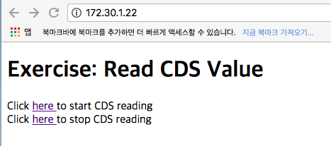

<style>
div.polaroid {
  	width: 400px;
  	box-shadow: 0 10px 30px 0 rgba(0, 0, 0, 0.2), 0 16px 30px 0 rgba(0, 0, 0, 0.19);
  	text-align: center;
	margin-bottom: 0.5cm;
}
</style>

# 웹과 아두이노

## 학습목표
- **웹**과 **HTTP 프로토콜**의 기본 개념을 학습한다.
- **아두이노**를 **웹 애플리케이션**에 연결하는 방법을 학습한다.

---
## 1. 웹과 HTTP 프로토콜
### 1.1 웹이란?
- 웹(Web)은 월드 와이드 웹 (World Wide Web)의 약자
- 인터넷 환경에서 수많은 정보를 손쉽게 주고 받기 위해 제공된 정보공간
	- [하이퍼텍스트](https://ko.wikipedia.org/wiki/%ED%95%98%EC%9D%B4%ED%8D%BC%ED%85%8D%EC%8A%A4%ED%8A%B8) 방식을 통해 정보를 연결함

	


### 1.2 HTML이란? 
- **HTML**은 **하이퍼텍스트 마크업 언어(HyperText Markup Language)**라는 의미의 웹 페이지를 위한 지배적인 마크업 언어다.

- 간단한 HTML 문서 예제

	```html
	<html>
	    <meta charset="utf-8">
		<head>
			<title> Introduction to IoT </title>
		</head>
		<body>
			<h1> 강의자료 </h1>
	        <ul>
	            <li><a href="https://kwanulee.github.io/iot/docs/internet/internet.html">
	              컴퓨터 네트워크, 인터넷, 아두이노</a></li>
	            <li><a href="https://kwanulee.github.io/iot/docs/internet/wifi.html">
	              웹과 아두이노</a></li>
	        </ul>
		</body>
	</html>
```

### 1.3 HTTP란?
- [**HTTP (HyperText Transfer Protocol)**](https://www.joinc.co.kr/w/Site/Network_Programing/AdvancedComm/HTTP)는 인터넷 상에서 **HTML** 문서와 같은 리소스들을 가져올 수 있도록 해주는 프로토콜 (protocol)
	- **HTTP**는 **HTML** 문서 뿐만아니라, 이미지, 동영상, 오디오, 텍스트 문서들도 전송할 수 있도록 설계되어 있다.
- **작동 방식**
	- 클라이언트(웹 브라우저)에서 서버(웹 서버)에 있는 리소스를 요청하면, 서버는 요청을 처리해서 응답한다.
		- 웹 브라우저는 [**URI**](https://en.wikipedia.org/wiki/Uniform_Resource_Identifier#Examples)를 이용하여 웹서버에 접속하고, 웹서버의 리소스를 **요청**하는 **클라이언트 프로그램** (Chrom, Firefox, IE 등)
		- 웹 서버는 클라이언트(웹 브라우저)의 요청을 받아서, 이를 해석하고 응답을 하는 소프트웨어 (Apache, IIS, nginx 등)
		- 요청은 서버가 인식할 수 있는 약속된 형식(**HTTP Request / HTTP Response**)을 따라야 한다.


	

#### 1.3.1 HTTP Request	
- 웹 브라우져는 웹 서버와 접속이 확립되면 다음과 같은 항목으로 구성된 요청을 보낸다.
	- **Request** : 요청은 서버 상의 동작을 일으키기 위해 클라이언트가 전송하는 메시지입니다. 시작 줄은 다음의 세 가지 요소를 포함
		- 요청 메서드: GET 혹은 POST (GET은 하나의 리소스를 불러와야 한다는 것을 가리키며, POST는 데이터가 서버로 들어가야 함을 의미)
		- URI: 요청하는 리소스의 위치
		- HTTP 버전: 사용하는 HTTP 의 버전을 의미하며 버전에 따라 사용할 수 있는 메서드나 요청할 수 있는 헤더의 종류가 달라지므로 명확히 버전을 지정해야 함 
	- **Header** : 통신의 부가정보(메타정보)가 포함되어 있다
	- Empty line: 헤더의 끝을 알리기 위해 공백 행을 추가
	- Body: 대부분은 생략가능하나, POST 요청인 경우에 필요함

- **예제**

	```
	GET / HTTP/1.1\r\n
	HOST: arduino.cc
	CONNECTION: close\r\n
	\r\n
	```
	
<!--
#### 1.3.1 URL
- **URL (Uniform Resource Locator)**는 네트워크 상에서 자원이 어디 있는지를 알려주기 위한 규약이다.
- 흔히 웹 사이트 주소로 알고 있지만, URL은 웹 사이트 주소뿐만 아니라 컴퓨터 네트워크상의 자원을 모두 나타낼 수 있다.
- 형식

	```	
	scheme://host/path[?query][#fragment]
	```	

- 예
	- 이미지 리소스 : https://upload.wikimedia.org/wikipedia/commons/4/41/Sistema_hipertextual.jpg	
-->

#### 1.3.2 HTTP Response
- 웹 서버는 웹 브라우저로부터 요구를 받은 뒤, 다음과 같은 항목으로 구성된 응답을 돌려준다.
	- **Status Line**
	- **Header**
	- Empty line
	- **Body**
	

- 예제 

	```
	HTTP/1.1 200 OK
	Server: nginx/1.4.2
	Date: Fri, 25 May 2018 10:22:26 GMT
	Content-Type: text/plain
	Content-Length: 2263
	Last-Modified: Wed, 02 Oct 2013 13:46:47 GMT
	Connection: close
	Vary: Accept-Encoding
	ETag: "524c23c7-8d7"
	Accept-Ranges: bytes
	\r\n
	
	```
	
	- **Status Line** : 반드시 첫줄에 와야 한다. 3개의 필드로 구성돼 있다.
		- HTTP/1.1 : 응답 프로토콜과 버전
		- 200 : 응답 코드
		- OK : 응답 메시지. Not Found, Internal Server Error 등의 메시지다.
	- **Header**
		- Server: 서버로써 사용하고 있는 소프트웨어의 이름
		- Date: 응답을 돌려준 날짜
		- Content-Type: 본문에 적혀있는 것이 어떤 종류의 문서인가를 표시
		- Content-Length: 본문의 사이즈
		- Last-Modified: 본문에 적혀있는 웹 페이지가 마지막으로 경신된 날짜를 표시한다. 
		- ETag: Entity Tag의 줄임말으로써, 본문의 내용을 식별하기 위한 ID같은 역할을 하는 문자열이다. 해당 자원이 업데이트 되기 전에는 결코 변하지 않는 값이다.
	
		
---
## 2. 아두이노와 웹

### 2.1 아날로그 입력 값 출력하기

#### 2.1.1 시작하기
1. 아두이노 IDE의 [**파일**]-[**예제**]-[**WizFi310**]-[**WebServer**] 선택
	
2. WiFi 네트워크 설정

	<div class="polardoid">
		
	</div>
3. 하드웨어 구성
	- **WizArduino MEGA WiFi** 보드의 **5V**, **GND**를 **베이스보드**의 전원 입력에 연결
	- **WizArduino MEGA WiFi** 보드의 아날로그 입력 **A0**를 **베이스보드**의 **CDS** 핀에 연결

	<div class="polardoid">
		
	</div>
4. **WizArduino MEGA WiFi** 보드를 mini-USB (5pin)으로 PC와 연결 후, 업로드
 	- 아두이노 IDE의 [**툴**]-[**보드**]에서  **"Arduino/Genuino Mega or Mega 2560"** 선택 해야함

5. 시리얼 모니터 창에서 웹서버 주소 확인하기

	<div class="polardoid">
		
	</div>
6. 웹 브라우저의 주소창에 시리얼모니터에서 확인한 아두이노 보드로 만든 서버의 IP주소를 입력한다.
	- 20초 마다 화면이 갱신되면서 새로운 값이 표시됨을 확인한다.
	<div class="polardoid">
		
	</div>
	
- **주의 할점**
	- 아두이노 보드의 WiFi가 연결한 네트워크와 PC에 연결된 네트워크는 동일해야 한다.
		- 만약 아두이노 보드의 WiFi는 휴대폰의 Hotspot을 통해 연결되어 있고, PC는 학교 네트워크에 연결된 경우라면 결과가 제대로 실행되지 않는다.
		- 이 경우에 PC도 휴대폰의 Hotspot을 통해 연결한 후에 웹브라우저에서 아두이노 서버로 접속하면 원하는 결과를 볼 수 있다.

#### 2.1.2 작동원리

<div class="polardoid">
	
</div>

#### 2.1.3 코드 분석
```c
WiFiServer server(80); 		// 80포트의 웹서버를 위한 변수 선언

void setup() {
	...
	server.begin();			// 웹서버 시작
}

void loop() {
  // 웹서버로 클라이언트 요청이 들어오면, 이 클라이언트의 요청을 처리할 웹서버 대리인 (client) 반환
  WiFiClient client = server.available();
  
  if (client) {
    Serial.println("New client");
    boolean currentLineIsBlank = true; // 변수 초기화
  
    while (client.connected()) {
        if (client.available()) {
        char c = client.read();
        Serial.write(c);
    
    // 빈 줄을 읽었다면, HTTP request의 끝을 나타내므로, HTTP response를 보냄    
    if (c == '\n' && currentLineIsBlank) {
            Serial.println("Sending response");

            // send a standard http response header
            // use \r\n instead of many println statements to speedup data send
            client.print(
            "HTTP/1.1 200 OK\r\n"
            "Content-Type: text/html\r\n"
            "Connection: close\r\n"  // the connection will be closed after completion of the response
            "Refresh: 20\r\n"        // refresh the page automatically every 20 sec
            "\r\n");
            client.print("<!DOCTYPE HTML>\r\n");
            client.print("<html>\r\n");
            client.print("<h1>Hello World!</h1>\r\n");
            client.print("Requests received: ");
            client.print(++reqCount);
            client.print("<br>\r\n");
            client.print("Analog input A0: ");
            client.print(analogRead(0));
            client.print("<br>\r\n");
            client.print("</html>\r\n");
            break;
        }
        if (c == '\n') {
            // you're starting a new line
            currentLineIsBlank = true;
        }
        else if (c != '\r') {
            // you've gotten a character on the current line
            currentLineIsBlank = false;
        }
      }
    }
    // give the web browser time to receive the data
    delay(10);

    // close the connection:
    client.stop();
    server.closeAllClientSocket();
    Serial.println("Client disconnected");
  }
}

```
	  

### 2.2 LED 제어하기

1. 하드웨어 구성
	- **WizArduino MEGA WiFi** 보드의 **5V**, **GND**를 **베이스보드**의 전원 입력에 연결
	- **WizArduino MEGA WiFi** 보드의 디지털출력핀 **9**를 **베이스보드**의 **LED 0** 에 연결

	<div class="polardoid">
		
	</div>
- **2.1 아날로그 입력 값 출력하기** 예제를 수정
	- 아두이노 IDE의 [**파일**]-[**예제**]-[**WizFi310**]-[**WebServer**] 선택
	- setup() 함수에서 다음 줄 추가
	
	```c
	void setup()
	{
		...
	    pinMode(9,OUTPUT);    //  LED 연결을 위한 추가
	}
	```
	
	- loop() 함수를 아래 코드로 대치
	
	```c
	void loop()
	{
	  // listen for incoming clients
	  WiFiClient client = server.available();
	  
	  if (client) {
	    Serial.println("New client");
	    // an http request ends with a blank line
	    boolean currentLineIsBlank = true;
	    
	    String currentLine = ""; // http 요청 빈 라인 검사용 변수
	    
	     while (client.connected()) {
	        if (client.available()) {
	          char c = client.read();       // 데이터가 있으면 읽어서 저장
	          Serial.write(c);
	          // if you've gotten to the end of the line (received a newline
	          // character) and the line is blank, the http request has ended,
	          // so you can send a reply
	          if (c == '\n' && currentLineIsBlank) {
	              Serial.println("Sending response");
	  
	              // send a standard http response header
	              // use \r\n instead of many println statements to speedup data send
	              client.print(
	              "HTTP/1.1 200 OK\r\n"
	              "Content-Type: text/html\r\n"
	              "Connection: close\r\n"  // the connection will be closed after completion of the response
	              
	              "\r\n");
	              client.print("<!DOCTYPE HTML>\r\n");
	              client.print("<html>\r\n");
	              client.println( );
	              client.print("Click <a href=\"/H\"> here </a> turn the LED on pin 9 on <br>");
	              client.print("Click <a href=\"/L\"> here </a> turn the LED on pin 9 off <br>");
	              client.println( );
	  
	              client.print("</html>\r\n");
	              break;
	          }
	          if (c == '\n') {
	              // you're starting a new line
	              currentLineIsBlank = true;
	              currentLine = "";
	          }
	          else if (c != '\r') {
	              // you've gotten a character on the current line
	              currentLineIsBlank = false;
	              currentLine += c ;		// currentLine에 읽어들인 문자를 추가 
	  
	          }
	          
	          // currentLine의 끝이 GET /H로 끝나는지 검사
	          if (currentLine.endsWith("GET /H")) { 
	            digitalWrite(9, HIGH); 
	          }
	          if (currentLine.endsWith("GET /L")) {
	            digitalWrite(9, LOW); 
	          }
	      }
	    }
	    // give the web browser time to receive the data
	    delay(10);
	
	    // close the connection:
	    client.stop();
	    server.closeAllClientSocket();
	    Serial.println("Client disconnected");
	  }
	}
	```
	
3. 시리얼 모니터 창에서 웹서버 주소 확인하기

	<div class="polardoid">
		
	</div>
4. 웹 브라우저의 주소창에 시리얼모니터에서 확인한 아두이노 보드로 만든 서버의 IP주소를 입력한다.
	<div class="polardoid">
		
	</div>

5. 링크를 클릭하여 LED 불이 켜지고 꺼지는 것을 확인

<a name="exercise"> </a>
## 3. 연습과제
- CDS 센서값을 읽어 출력하는 웹서버 스케치를 작성하시오.
	- CDS reading을 시작시키는 링크를 누르면 5초 간격으로 새로운 CDS 센서값을 읽어 출력한다.
	- CDS reading을 중지시키는 링크를 누르면 CDS 센서값을 출력하지 않는다.
- [힌트] 2.1 2.2 예제를 조합하여 작성하면 됩니다.
- 결과 화면
	- 웹브라우저에 웹서버 주소를 입력한 상태
	<div class="polardoid">
		
	</div>
	
	- CDS reading을 시작하는 링크를 누른경우
	<div class="polardoid">
		
	</div>
	
  	- CDS reading을 중지하는 링크를 누른경우
	<div class="polardoid">
		
	</div>
