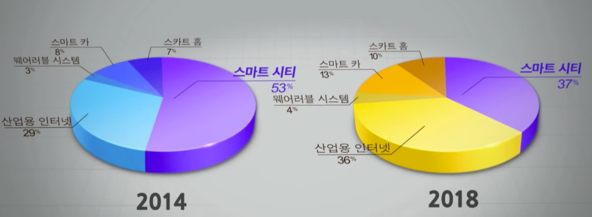
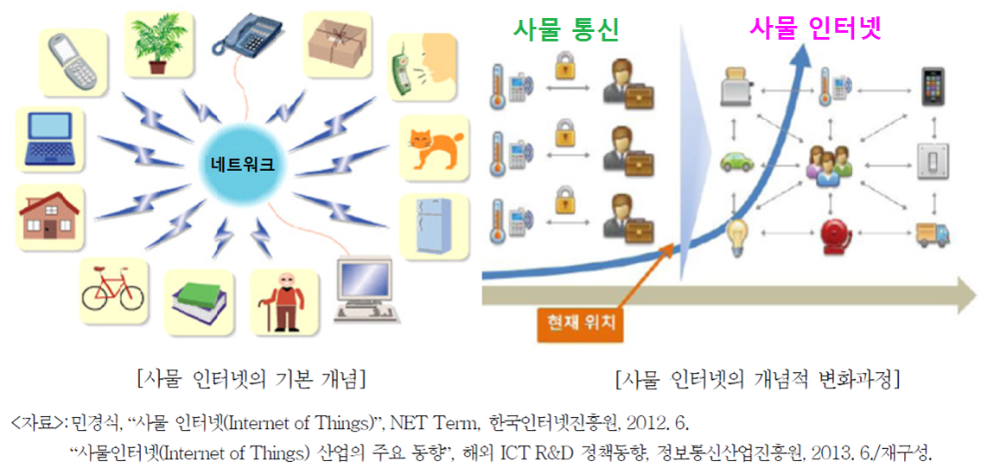
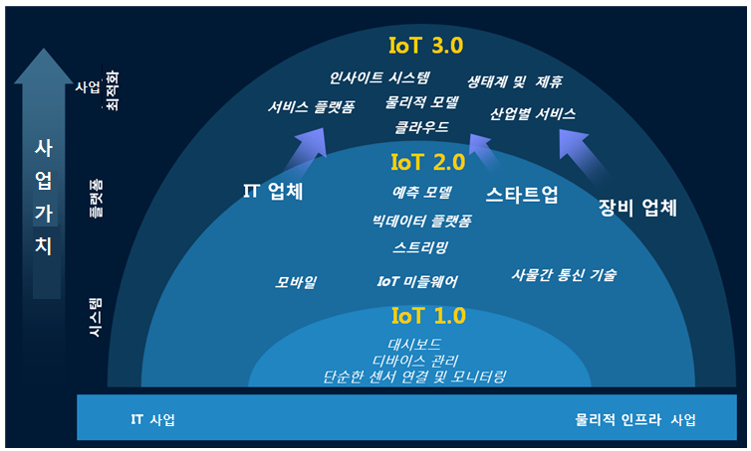

# 사물인터넷 개요

- 사물인터넷이란 무엇인가?
- 사물인터넷의 기반 기술은 무엇인가?
- 사물인터넷의 이슈는 무엇인가?
- 사물인터넷의 주요 사례는 어떠한 것들이 있는가?

***
## 1. 사물인터넷 개념

### 1.1 사물인터넷이란?
- 사물인터넷의 단어적 의미는 사물들(things)이 서로 연결된 인터넷 환경을 말함.
- 사물인터넷의 본질은 **다양한 사물들을 센서와 통신기술을 더해 사물과 사물, 사물과 사람을 연결함으로써 정보를 주고 받으며 새로운 가치를 만드는 것**임. 즉, 기본의 개별적인 사물이 제공하지 못했던 새로운 서비스를 제공해주는 데 의의가 있음.
	- 스마트 홈: 침대에서 사람이 잠들면 집안에 켜진 전등을 끄고, 잠에서 깨면 창문을 열어 환기를 하고, 커피를 자동으로 내려줌

### 1.2 사물인터넷 역사
- 사물인터넷(Internet of Things)이라는 용어의 탄생은 1999년에 비누, 샴푸, 칫솔 등 다양한 종류의 소비재를 제조 및 판매했던 P&G에서 브랜드 매니저로 근무하던 캐빈 애시턴(Kevin Ashton)이 이 용어를 처음으로 사용.
	- 자사의 제품들에 [RFID](https://www.youtube.com/watch?v=_WLbp91r8Ro) 태그를 부착함으로써 제품들의 가시성을 확보 
- 사물인터넷의 개념은 RFID뿐만 아니라 다양한 센서 및 통신기술들과 결합하며 발전해 나가기 시작
	- **WSE(Wireless Sensor Network)**: 무선 센서 네트워크는 근거리 무선 통신 기능을 포함하고 있는 소형의 센서 장치들이 결합하여 산불 감시, 하천 범람, 건물 내 온도 분포 등 특정 장소의 상태 및 환경 변화 정보를 종합적으로 수집하여 관리하기 위한 기술
	
		
	
	- **M2M(Machine-to-Machine)**: 이동통신 기술을 이용하여 멀리 떨어져 있는 기계장치와 기계장치를 연결함으로써 효율적으로 장치를 운용하는 기술
		- 병원에서는 응급상황, 환자의 상태모니터링, 의학 데이터 등을 연결하여 건강관리 시스템을 구축
		
			
			
- 이후 다양한 센서장치와 디바이스를 결합함으로써 새로운 사용자 가치를 창출하려는 시도가 나타나면서, 소비자 유통, 헬스케어, 스마트홈 등 다양한 분야에서 사물인터넷 시대가 본격화되기 시작됨	
			
참고자료: https://terms.naver.com/entry.nhn?docId=3386811&cid=58369&categoryId=58369&expCategoryId=58369

<!--
- 사물인터넷 사례
	- 버스 안내시스템
	- 다양한 사물인터넷 제품들: 조명 제어,
	- 작업자 안전관리 시스템
	- HIS: 조명 제어, 침입자 감지, 누수감지
	- IoT 기반 출입문 통제 시스템
	- 검체 위치추적및 상태 모니터링
- IoT 혁신센터 - 스타트업을 위한 전문 프로그램
	- 스마트 팜 시스템
		- 충북 4개의 축산농가에 보급
		- 젓소의 행동을 감지에 인공수정의 적기 예측
	- 드론 배송 시스템
	- 정보주도 사물인터넷 적용 도시: 바르셀로나
		- 스마트 주차장
		- 사물인터넷 적용 쓰레기통
		- 가스, 전기 사용량 자동 정산 시스템
		- 스마트 가로등 시스템
- 사물인터넷의 주요 분야별 비율
	

- 사물인터넷에서의 해결해야할 과제
	- 개인정보 유출/보호
-->
###1.2 사물인터넷에서 사물이란?
  - 네트워크에 연결된 사용자 단말이나 다양한 형태의 장치
  - 임의의 프로세서를 장착한 일종의 내장형 시스템
    - 스마트폰이나 태블릿과 같은 모바일 기기
    - 안경이나 시계 같은 착용형 기기
    - 자동차, 로봇, 드론
    - TV, 냉장고와 같은 가전제품
    - 폐쇄 회로 텔레비전(Closed Circuit Television, CCTV) 등

  - **사물에 부착된 장치**
    - 주변 상황을 인지하고 필요한 데이터를 수집할 수 있는 **센서**
    - 수집한 데이터를 처리하거나 저장할 수 있는 **처리기** 및 **저장 공간**
    - 인터넷 망과 연결하여 데이터를 주고받을 수 있는 **통신 모듈**
    - 자체 **전원**으로 구성

  - 사물들은 자율적으로 동작하면서 필요한 정보를 공유

###1.3 사물인터넷의 개념적 변화과정
- 사물 통신의 개념이 사물인터넷에 흡수되어 차세대 지능통신으로 발전

  

###1.4 사물인터넷의 발전단계

  
  출처: IBM GTO 2014 - IoT 3.0, http://klabcamss.blogspot.kr/2014/08/iot-30.html

- **IoT 1.0 : 디바이스 연결 단계** (초기 단계)
	- 사물을 인터넷에 연결하는 기술 중심
	- 네트워크에 연결된 사물의 기능이나 정보가 제한적이고, 대시보드를 통해 실시간으로 데이터를 조회하는 수준의 단계
	- [사례1: IoT 디바이스 관리 플랫폼 NeoIDM 적용사례](https://www.youtube.com/watch?v=yjWHU59g8l8)

- **IoT 2.0 : 인프라 구축 단계** (중간 단계) 
	- 사물이 주변 환경을 센싱하는 능력으로 다른 사물과 연결이 가능해지는 시기
		- 센서가 직접 센싱한 데이터나 이벤트를 구동기에 보내고 구동기는 전달된 신호에 따라 기계를 작동시키거나 간단한 동작이 가능
    	- [사례2: 스마트 홈 시스템](https://www.youtube.com/watch?v=qR3vACJnkFA)
	- 센서와 통신모듈 가격 하락, 통신기술 발전 등으로 인터넷에 연결된 기기 수가 급격히 증가, 대량의 데이터 수집, 분석을 위한 **빅 데이터 플랫폼**, **예측분석 IoT 미들웨어** 등 다양한 인프라 기술이 개발되는 단계

- **IoT 3.0 : 산업별 혁신 솔루션 개발 단계** (마지막 단계) 
	- 사물의 자동 수행 능력과 상호 연결성을 이용하여 산업혁신을 위한 솔루션을 만들어가는 시기
   	- 자동차, 교통, 스마트홈, 에너지, 유틸리티, 보안, 금융, 헬스케어, 제조업 등 광범위한 분야에서 서비스가 구현되는 단계
	- 현실 세계의 물리적 원인과 그에 따른 물리적 결과의 복잡한 현상을 사물을 통해 관측되는 데이터를 기반으로 추상화하고 사업 문제 해결을 위해 프로그램화한 사업 솔류션 개발
    - 사물은 더욱 지능화되어 주변 환경을 센싱, 다른 사물이나 센서, 서비스 등과 상호작용하면서 스스로 정보를 수집하고 공유
    - 기업은 자체 인프라 구축보다는 저비용, 구축 신속성, 고가용성, 고확장성 등의 이유로 클라우드 기반 서비스를 점차 선호
    - 사례3: 스마트 시티

    	<iframe width="560" height="315" src="https://www.youtube.com/embed/A5fVAxFjIbs?rel=0&amp;start=783&end=1228" frameborder="0" allow="autoplay; encrypted-media" allowfullscreen></iframe>

## 2. 사물인터넷 기반 기술

###2.1 센싱 기술
- 사물과 주위 환경에서 정보를 얻기 위한 기술
- 센서
  - 대상으로부터 물리, 화학, 생물학적 요소를 측정하여 사용자나 시스템에서 사용할 수 있게 해주는 기능을 제공
  - 온도, 습도, 열, 가스, 조도, 위치, 모션 센서 등 다양한 기능의 센서가 활용
  - 센서 내에 프로세서를 내장하여 스스로 판단하고, 정보를 처리할 수 있는 [스마트센서(Smart Sensor)](http://www.elec4.co.kr/article/articleView.asp?idx=7276) 등장

###2.2 통신 및 네트워킹 기술
- 인간-사물-서비스를 연결하는 데 필요
- [IP(인터넷프로토콜)](https://ko.wikipedia.org/wiki/%EC%9D%B8%ED%84%B0%EB%84%B7_%ED%94%84%EB%A1%9C%ED%86%A0%EC%BD%9C)를 사용하는 기기 간 통신 기술
  - 와이파이(Wireless-Fidelity, Wi-Fi)
  - 3세대 이동통신(3rd Generation Mobile Communication, 3G)/4세대 이동통신(4th Generation Mobile Communication, 4G)/LTE(Long Term Evolution)
  - 5세대 이동통신(5th Generation Mobile Communication, 5G, IMT-2020)
- IP를 사용하지 않는 기기 간 통신
  - USB(Universal Serial Bus)
  - [블루투스(Bluetooth)](https://ko.wikipedia.org/wiki/%EB%B8%94%EB%A3%A8%ED%88%AC%EC%8A%A4)
  - [지그비(ZigBee)](https://ko.wikipedia.org/wiki/%EC%A7%81%EB%B9%84)
  - [전파 식별(Radio Frequency IDentification, RFID)](https://ko.wikipedia.org/wiki/RFID)
  		- [RFID 활용 사례](https://www.youtube.com/watch?v=_WLbp91r8Ro)
  - [근거리 무선 통신(Near Field Communication, NFC)](https://ko.wikipedia.org/wiki/%EA%B7%BC%EA%B1%B0%EB%A6%AC_%EB%AC%B4%EC%84%A0_%ED%86%B5%EC%8B%A0) 등

###2.3 서비스 인터페이스 기술
- 사물인터넷 주요 구성요소(사람·사물·서비스)를 통해 **특정 기능을 수행하는 응용 서비스와 연동하는 역할**
  - 즉, 단순한 네트워크 인터페이스 개념이라기 보다는 사물인터넷 망을 통해 정보를 센싱, 처리 및 변환, 저장, 검색, 판단 등 다양한 서비스를 제공하는 인터페이스 역할을 수행
- 개방형 웹 아키텍쳐인 REST가 가장 대표적으로 사용됨

###2.4 사물인터넷과 클라우드, 빅데이터, 인공지능 기술
-  **빅데이터**
  - 센서로부터 수집된 방대한 양의 데이터에 대한 분석 및 가공의 필요성이 증가
- **인공 지능의 딥 러닝(Deep Learning)**
  - 수많은 데이터를 학습하고 해당 데이터가 의미하는 바를 스스로 해독하여 목적에 맞는 최적의 답안을 찾아내는 기술의 필요성 증가
  - 고객 개인의 취향과 수요(needs)를 예측하여 가장 적합한 맞춤 서비스 제공, 고객이 원하는 정보 검색, 고객 상황에 맞는 기기 제어(조명, 온도 등), 고객에게 필요한 상품 주문 등이 가능

- **클라우드 컴퓨팅(Cloud Computing)**
  - 방대한 센싱 데이터를 다양한 분석 방법으로 패턴, 연관관계 등을 추출함으로써 의미 있는 정보로 가공해내어 다양한 서비스에서 활용하기 위해
  대용량의 저장장치와 분석을 위한 고성능의 컴퓨팅 처리능력이 필요

---

## 3. 사물인터넷의 특징 및 이슈

###3.1 사물인터넷의 특징
- 기술적인 특징
  - 사물 인터넷 환경에서는 **다양한 종류의 디바이스가 서로 다른 플랫폼에서 서로 다른 프로토콜을 이용하여 통신**을 하면서 동작
    	- 상호운용성 문제
    	- 이종성으로 인한 효율적인 보안 서비스 제공이 어려움
    	- 표준화를 통한 상호운용성 문제 해결
  - 자원제약성을 가진 사물 인터넷 기기들은 최소 자원(Minimum Resource) 요구사항을 만족해야 함
  - 사물 인터넷은 높은 이동성(Mobility)으로 인해 네트워크 토폴로지(Topology)가 동적
  		- 수많은 기기들이 수시로 재연결 요청과 함게 인증을 요청하므로, 사물인터넷 환경은 크게 구성될수록 유연하고 확장성을 가져야 함

- 시장의 특징
  - 사물 인터넷은 완전히 새로운 카테고리의 상품이라기보다는 기존상품의 가치를 높이는 경우가 많음
  		- 예, [스마트 냉장고](https://www.youtube.com/watch?v=P2mdhVPBByI)  
  - 하드웨어, 소프트웨어, 네트워크, 보안 등 여러 기술적 요소를 결합한 시스템 상품(System Goods)
  		- 다양한 요소를 결합하는 통합 역량이 중요하고 복잡성 관리가 사업의 관건
  - 플랫폼 주도권 경쟁 치열
  		- PC 시대 플랫폼: 인털+윈도우
  		- 모바일 시대 플랫폼: 안드로이드, IOS
  		- 사물인터넷 시대 플랫폼: ??

###3.2 사물인터넷의 이슈
- 보안 및 사생활의 침해 위협
  - 개인정보 유출로 인한 사생활 침해
	- 제조공장, 전력을 포함한 사회 인프라, 자동차, 의료, 가전제품 등 모든 사물이나 서비스가 악의적 공격의 대상
  - 상호 연결되는 사물이나 기기들 간의 보안은 센서를 포함한 하드웨어, 서비스, 응용 프로그램 모든 수준에서 고려
  - 도입 초기부터 보안을 위한 기술적 문제 해결책과 법·제도적 측면의 대비책 등 종합적인 방안 마련이 전제
- 상호운용성을 위한 글로벌 표준 확보

 | 표준단체 | 개요 |
 |--------|-------|
 | 키비콘(Qivicon) | 2011년, 독일 통신사 도이치텔레콤(Deutsche Telekom; DT)의 주도로 설립. 엔베베(EnBW), 미에레(Miele), 삼성전자, 필립스(Phillips) 등 통신, 에너지, 가전 분야의 약 30개 기업이 가입|
| oneM2M |  2012년, 글로벌 사물 인터넷 서비스 플랫폼 표준 개발을 위해 유럽통신표준협회 (ETSI), 미국 통신 산업 협회(TIA), 미국 통신정보표준협회(ATIS) 등 7개의 세계 주요 표준화 단체가 공동으로 oneM2M을 설립 |
| 올씬얼라이언스(AllSeen Alliance) | 2013년, 퀄컴(Qualcomm)과 리눅스 파운데이션(Linux Foundation), 시스코, 마이크로소프트, LG전자 등이 참가하여 결성한 표준화 단체 |
|산업 인터넷 컨소시엄(IIC)| 2014년, 인텔과 시스코, AT&T, GE, IBM은 산업용 사물 인터넷에 목적을 둔 표준을 개발하기 위해 결성, 이후 마이크로소프트가 합류|
| IEEE P2413 | 2014년, IEEE는 사물 인터넷 아키텍쳐 구축을 통해 다양한 산업과 기술 영역으로 확장을 목적으로 IEEE P2413 프로젝트를 공식 개시 |
| 쓰레드그룹(Thread Group) | 2014년, 구글(Nest Labs) 주도로 설립된 사물 인터넷 프로토콜 컨소시엄으로 삼성전자, 암(ARM), 프리스케일(Freescale), 실리콘 랩(Silicon Labs) 등이 참여|
|오픈 인터커넥트 컨소시엄(OIC)|2014년, 인텔, 아트멜(Atmel), 델(Dell), 삼성전자 등은 퀄컴 주도의 올씬얼라이언스에 대항하고, 사물 인터넷 기기의 연결성 확보를 목표로 설립|

## 참고자료
- 양순옥, 김성석, "4차 산업혁명을 견인하는 다이버전스 기술, 사물인터넷 (IoT)", 생능출판사, 2018.
- 민경식, "사물인터넷 (Internet of Things)", http://www.kisa.or.kr/uploadfile/201306/201306101740531675.pdf
