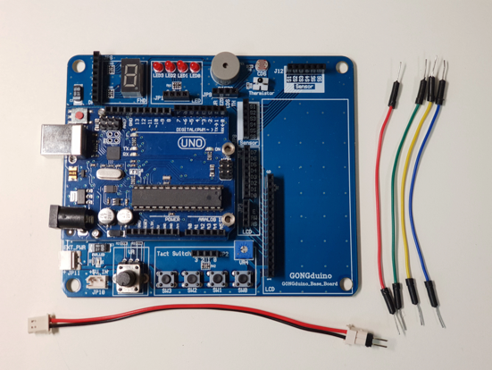
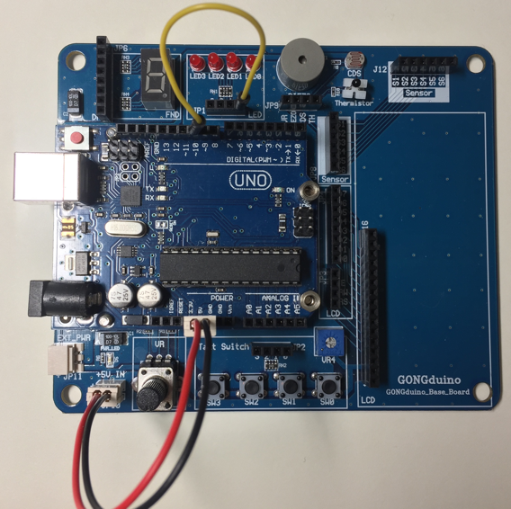
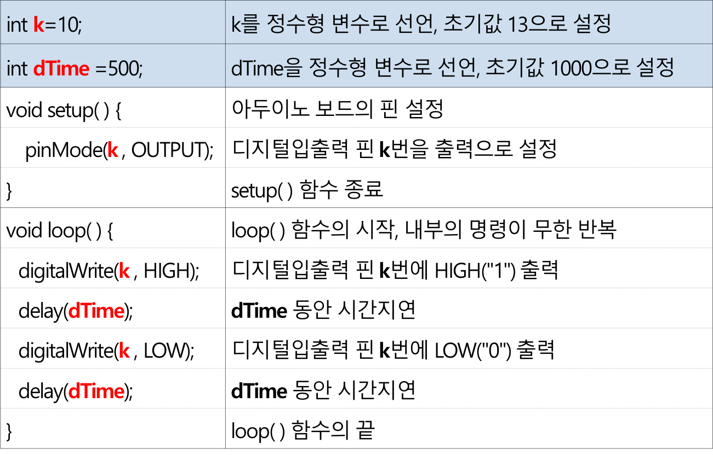
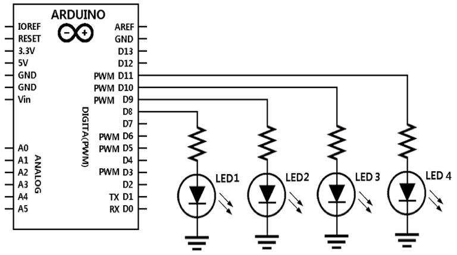
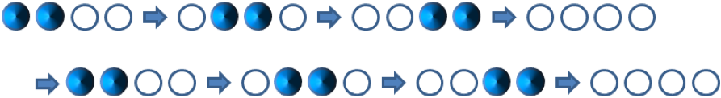

<style>
div.polaroid {
  	width: 400px;
  	box-shadow: 0 10px 30px 0 rgba(0, 0, 0, 0.2), 0 16px 30px 0 rgba(0, 0, 0, 0.19);
  	text-align: center;
	margin-bottom: 0.5cm;
}
</style>

## 아두이노로 LED 제어

### 학습 목표
- 아두이노 보드의 디지털입출력 핀을 통하여 2진 디지털 값(HIGH, LOW)을 출력하여 LED를 제어하는 방법을 이해한다.
- LED를 다양한 방법으로 제어하는 예제들을 통하여 아두이노 스케치를 작성하는 방법을 배운다.

	<div class="polaroid">
		
	</div>

### 실습준비물
- 베이스보드 + Uno 보드, 전원연결선 1개, 연결선 4개

	<div class="polaroid">
			
	</div>
		
- 베이스 보드 구성
	<div class="polaroid">
		
	</div>


	
---
### 1. 변수 사용하기
		
- 변수를 사용하여 디지털입출력 핀의 번호나 지연시간을 쉽게 변경할 수 있다.

#### 1.1 하드웨어 구성
- 전원 및 LED 연결
	- 전원연결선의 **붉은색**을 5V로, **검은색**을 GND로 연결
	- 연결선을 이용하여 Uno 보드의 디지털입출력 **핀 10번**에 베이스보드 **JP1의 0번(LED0)**을 연결

	<div class="polaroid">
	     
	     
	    
	</div>


#### 1.2 변수 사용전 코드
- 디지털핀 10번에 연결된 LED를 1초 동안 켜고 1초 동안 끄기를 반복하는 스케치 코드
	
	```c
	void setup() {
  		pinMode(10,OUTPUT);
	}

	void loop() {
  		digitalWrite(10,HIGH);
  		delay(1000);
  		digitalWrite(10,LOW);
  		delay(1000);
	}
	```

- **문제점** 
	- 디지털핀 10번 대신에 13번을 사용하고자 하는 경우, 코드의 3개의 줄이 수정되어야 함.
	- 당연히, 연결선도 **디지털핀 10번** 대신에 **디지털핀 13번**에서 베이스보드 **JP1의 0번(LED0)**으로 연결이 이루어져야 함.

#### 1.3 변수
- 변수는 나중에 프로그램에서 사용할 데이터(예 : 센서의 데이터 또는 계산에 사용 된 중간 값)를 저장하는 이름이 있는 저장소 임.
- 변수를 사용하기 전에 모든 변수를 선언해야 함.
	- 변수가 저장할 데이터의 유형과 변수의 이름을 정의
	- 선택적으로 초기 값 설정
	
	```c
	int inputVariable1;
	int inputVariable2 = 0;
	```
- 참고자료: https://www.arduino.cc/en/Reference/VariableDeclaration

#### 1.4 변수 사용 예제	
- 변수 k의 초기값을 원하는 디지털입출력 핀의 번호로 설정

	<div class="polaroid">
	  	
	</div>

- 정수형 변수 **dTime** 를 사용하여 지연시간 쉽게 변경

	<div class="polaroid">
	  	
	</div>
- 결과 코드  

	```c
	/*
 	변수를 사용하여 디지털 핀 출력과 지연 시간을 설정
	*/ 

	int k=10;
	int dTime=500;

	void setup() {
  		pinMode(k,OUTPUT);    
	}

	void loop() {
  		digitalWrite(k,HIGH);
  		delay(dTime);
  		digitalWrite(k,LOW);
  		delay(dTime);
	}
	```
	
---
### 2. 함수 만들기
- 프로그램에서 반복적으로 사용되는 부분을 함수로 만들어 사용

<a name="2.1"> </a>
#### 2.1 하드웨어 구성
- 디지털입출력 핀 4개를 사용하여 LED 4개를 연결

	<div class="polaroid">
	  	
	  	
	</div>
	
#### 2.2 함수 사용전 코드
- DigitalPin 8~11에 연결된 LED를 1초씩 번갈아가면서 켜고 끄는코드

	```c
	/*
  		DigitalPin 8~11에 연결된 LED를 1초씩 번갈아가면서 켜고 끄는코드 
	*/

	void setup() {
  		pinMode(8, OUTPUT);
  		pinMode(9, OUTPUT);
  		pinMode(10, OUTPUT);
  		pinMode(11, OUTPUT);  
	}

	void loop() {
  		digitalWrite(8,HIGH);
  		delay(1000);
		digitalWrite(8,LOW);
  		delay(1000);
    
  		digitalWrite(9,HIGH);
  		delay(1000);
  		digitalWrite(9,LOW);
  		delay(1000);
    
  		digitalWrite(10,HIGH);
  		delay(1000);
  		digitalWrite(10,LOW);
  		delay(1000);
    
  		digitalWrite(11,HIGH);
  		delay(1000);
  		digitalWrite(11,LOW);
 	 	delay(1000);
	}
	```
	
- **문제점** 
	- 여러 개의 LED의 on/off 상태를 1초 간격으로 제어하는 유사한 코드가 반복됨

#### 2.3 함수
- 모듈화된 코드 블록
	- 형식: *반환타입* *함수이름*(*파라미터*,...)
	- 예: **int myMultiplyFunction(int x, int y)**
	
	 <div class="polaroid">
	  	 
	 </div>
- 참고자료: https://www.arduino.cc/en/Reference/FunctionDeclaration
	
#### 2.4 함수 사용 예제
1. 공통적으로 반복되는 부분을 **함수**로 정의
	- LED가 1초 간격으로 켜졌다가 껴지는 기능 --> **blink\_ft()** 함수 제작 
2. **blink\_ft()** 함수를 **loop()** 에서 호출

	<div class="polaroid">
	  	 
	 </div>
	 
- 결과 코드

	```c
	/*
  		함수를 사용하여 4개의 LED를 순차적으로 깜박이기
	*/

	void setup() { // 디지털입출력 핀 8, 9, 10, 11번을 출력으로 설정
  		pinMode(8, OUTPUT);
  		pinMode(9, OUTPUT);
  		pinMode(10, OUTPUT);
  		pinMode(11, OUTPUT); 
	}

	void loop() {  // 내부의 명령이 무한 반복
  		blink_ft(8);  // blink_ft( ) 함수를 호출, 변수 pin의 값으로 8 전달 
  		blink_ft(9);
  		blink_ft(10);
  		blink_ft(11);
	}

	void blink_ft(int pin) { // 디지털입출력 핀 pin번을 1초 간격으로 on/off
  		digitalWrite(pin, HIGH);
  		delay(1000);
  		digitalWrite(pin, LOW);
  		delay(1000);
	}
	```

### 3. FOR 문 활용하기
#### 3.1 앞 예제의 문제점
- 같은 구조의 스케치가 반복적으로 사용됨

	```c
	void setup() { 
  		pinMode(8, OUTPUT);
  		pinMode(9, OUTPUT);
  		pinMode(10, OUTPUT);
  		pinMode(11, OUTPUT); 
	}
	...
	void loop() {  
  		blink_ft(8);   
  		blink_ft(9);
  		blink_ft(10);
  		blink_ft(11);
	}
	```

#### 3.2 for 문
- for 문은 초기값을 증가(또는 감소) 시키면서 조건이 만족하는 동안 지정된 블록의 코드를 반복하는 명령문

	<div class="polaroid">
	  	 
	 </div>

#### 3.3 for 문 적용 예제

```c
/*
  for 문과  함수를 사용하여 4개의 LED를 순차적으로 깜박이기
*/
int k;

void setup() {
  for (k=8; k<12; k++) {
    pinMode(k, OUTPUT);
  } 
}

void loop() {
  for (k=8; k<12; k++) {
    blink_ft(k);
  }  
}

void blink_ft(int pin) { // 디지털입출력 핀 pin번을 1초 간격으로 on/off
  digitalWrite(pin, HIGH);
  delay(1000);
  digitalWrite(pin, LOW);
  delay(1000);
}
```

---
### 4. Array 문 활용하기
#### 4.1 앞 예제의 문제점
- for문의 인텍스 변수 k가 디지털입출력 핀의 번호를 직접 나타냄
 
	```c
	int k;
	
	void setup() { 
  		for (k=8; k<12; k++) { // k는 디지털 핀 번호를 나타냄
  			pinMode(k, OUTPUT);
	  	} 
	}
	...
	```
- 연속적이지 않은 디지털입출력 핀을 LED에 연결한 경우에는 for문을 사용하기 힘듦
	- 예, 디지털핀 6,9,10,11을 LED에 연결할 경우  

#### 4.2 배열 (Array)
- 배열은 여러 개의 변수를 묶어서 하나의 이름을 부여하고, 배열 내의 각 변수를 번호(인덱스)를 통해 접근

	<div class="polaroid">
	  	 
	 </div>

#### 4.3 배열문 적용 예제
- 배열과 for문을 사용
	- 필요한 부분을 간단하게 반복실행 가능
	- 사용하고자 하는 디지털 입출력 핀을 배열에 저장
	- for문을 사용하여 호출

```c
/*
  배열, for 문, 함수를 사용하여 4개의 LED를 순차적으로 깜박이기
*/
int pinLED[] = {6,9,11,12};
int k;

void setup() {
  for (k=0; k<4; k++) {
    pinMode(pinLED[k], OUTPUT);
  } 
}

void loop() {
  for (k=0; k<4; k++) {
    blink_ft(pinLED[k]);
  }  
}

void blink_ft(int pin) { // 디지털입출력 핀 pin번을 1초 간격으로 on/off
  digitalWrite(pin, HIGH);
  delay(1000);
  digitalWrite(pin, LOW);
  delay(1000);
}
```

---
### 5. 실습 과제

#### 하드웨어 구성
- [2.1 하드웨어 구성](#2.1)과 동일

#### 기본 시작 코드

```c
int pinLED[] = {6,9,11,12};
int k;

void setup() {
  for (k=0; k<4; k++) {
    pinMode(pinLED[k], OUTPUT);
  } 
}

void loop() {
   // 이 부분에 코드를 추가 하세요. 
}
```

#### 과제 세부 내용
- 앞에서 제시된 *기본 시작 코드*를 바탕으로 다음 4 개의 문제를 각각 구현하시오.

1. LED 4개가 모두에 켜졌다가 1초 후에 4개가 모두 꺼지도록 구성

	[실행 동영상](videos/practice1_1.mp4)


2. LED가 1개씩 오른쪽에서 왼쪽으로 순차적으로 켜지다가 4개가 다 켜지면, 
   오른쪽에서 왼쪽으로 순차적으로 1개씩 꺼지도록 구성 

	[실행 동영상](videos/practice1_2.mp4)

3. LED가 1개씩 왼쪽에서 오른쪽으로 순차적으로 켜지다가 4개가 다 켜지면,
     오른쪽에서 왼쪽으로 순차적으로 1개씩 꺼지도록 구성 
     
     [실행 동영상](videos/practice1_3.mp4)

4. LED가 1개씩 오른쪽에서 왼쪽으로 순차적으로 1초 간격으로 켜졌다 
     꺼지도록 구성 
     
     [실행 동영상](videos/practice1_4.mp4)

---
<a name="exercise"></a>
### 6. 연습 과제

1. 4개의 LED가 다음 그림과 같이 2개씩 번갈아가며 on/off 되는 스케치를 작성하여 보자

	
     
2. 4개의 LED가 다음 그림과 같이 오른쪽에서 왼쪽으로 순차적으로 2개씩 on되는 스케치를 작성하여 보자.

	


