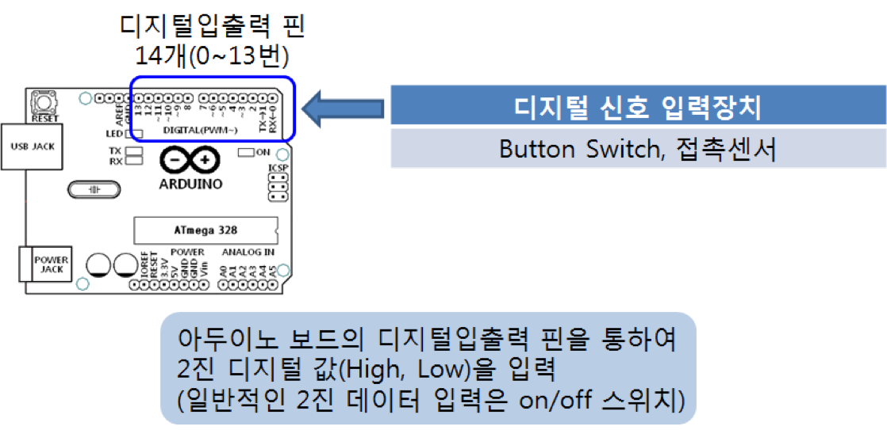
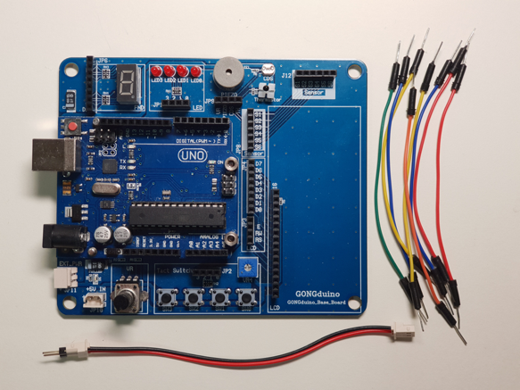
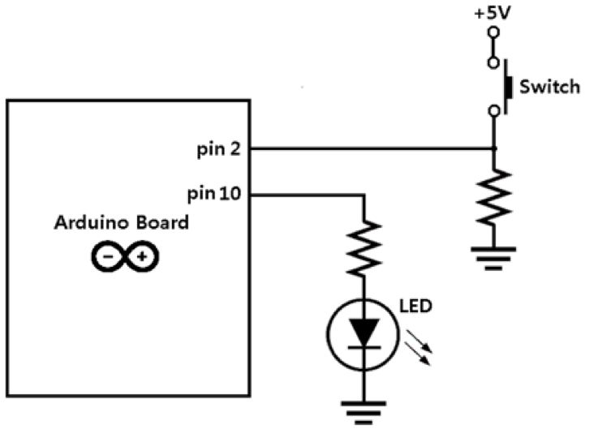
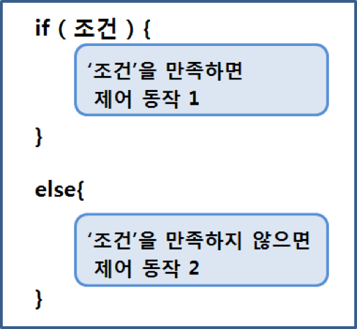
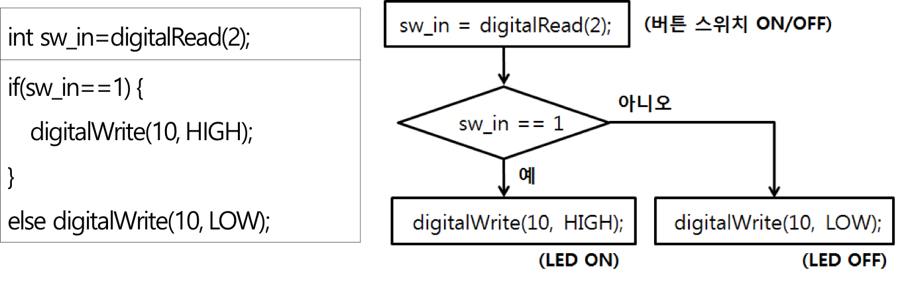
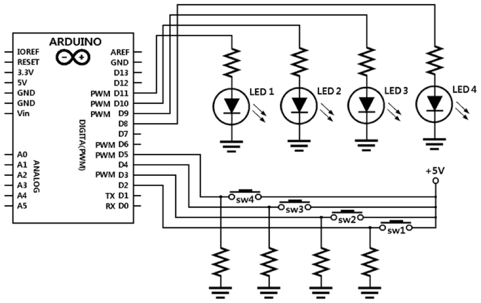
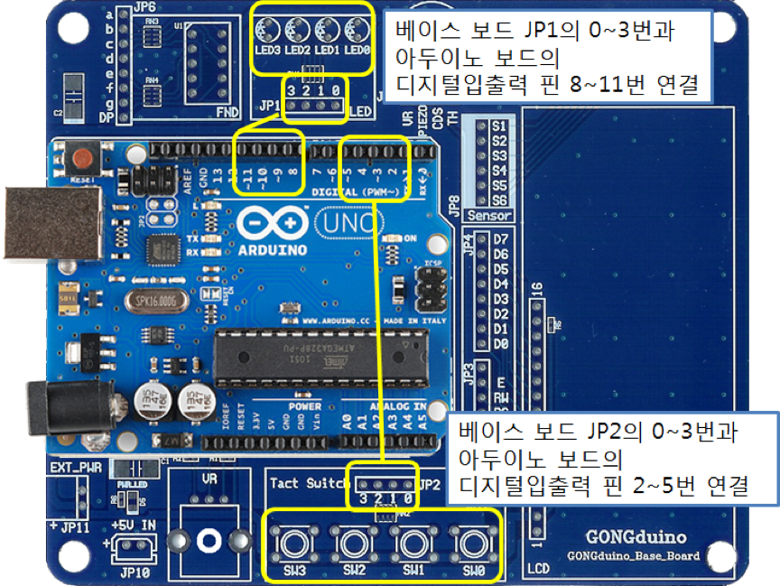
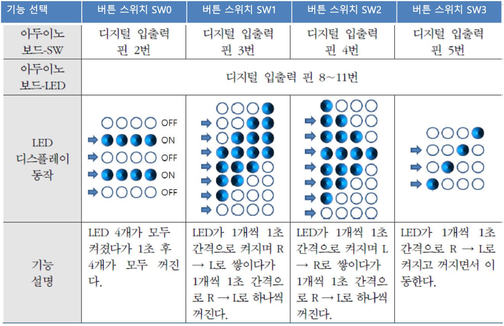

<style>
div.polaroid {
  	width: 400px;
  	box-shadow: 0 10px 30px 0 rgba(0, 0, 0, 0.2), 0 16px 30px 0 rgba(0, 0, 0, 0.19);
  	text-align: center;
	margin-bottom: 0.5cm;
}
</style>

## 스위치로 LED 제어

### 학습 목표
- 아두이노 보드의 디지털입출력 핀을 통하여 스위치나 on/off 센서로 부터 디지털 입력을 받는 방법을 이해한다.
- 다양한 조건(디지털입출력 핀을 통하여 입력받은 값이 무엇인지)에 따라 LED를 제어하는 방법을 알아본다.

	<div class="polaroid">
		
	</div>

### 실습준비물
- 베이스보드 + Uno 보드, 전원연결선 1개, 연결선 8개

	<div class="polaroid">
			
	</div>

---
### 1. 디지털입력제어: LED와 Switch 제어
		
- 버튼 스위치를 통하여 디지털입력을 받아들이고, 그 입력 된 정보에 따른 결과를 확인하기 위하여 LED를 사용한다.
	- 버튼 스위치가  눌려지면, +5V의 전압이 아두이노 보드의 디지털입출력 2번으로 들어가게 되어 "**HIGH**"가 입력
	- 버튼이 눌려지지 않으면, 저항을 통하여 연결된 접지로 인하여 0V가 입력되어 "**LOW**"가 입력
	- 디지털입출력 2번 핀이 **HIGH**이면, 디지털입출력 10번에 연결된 LED를 켠다
	
	<div class="polaroid">
	     
	</div>


#### 1.1 하드웨어 구성
- Switch 및 LED 연결
	- Switch 연결: 연결선을 이용하여, 베이스보드 **JP2의 0**번과 아두이노 보드의 **디지털입출력 핀 2번** 연결 
	- LED 연결: 연결선을 이용하여, 베이스보드 **JP1의 0**번과 아두이노 보드의 **디지털입출력 핀 10번** 연결

	<div class="polaroid">
	     
	</div>


#### 1.2 Sketch 프로그램
- 입출력 설정

	```c
	void setup( ) {
	   pinMode( 2, INPUT );
	   pinMode( 10, OUTPUT );
	}
	```

- 디지털입출력 핀 2번으로 입력을 받는 명령

	```c
	digitalRead(2);
	```

- 조건문
	- 입력된 값이 어떤 값인지에 따라 프로그램 제어 흐름 변경
	
	  
	  
	   

- 완성된 Sketch 프로그램

	```c
	/*
	디지털입출력 핀 2번으로 버튼 스위치의 값을 받아들여
	버튼 스위치가 눌려지면(HIGH), 디지털입출력 핀 10번에 연결된 LED ON 
	버튼 스위치가 눌려지지 않으면(LOW), LED OFF
	*/

	void setup( ) {
  		pinMode(2, INPUT); 		// 디지털입출력 핀 2번을 입력으로 설정
  		pinMode(10, OUTPUT);	// 디지털입출력 핀 10번을 출력으로 설정
	}


	void loop() {
  		int  sw_in=digitalRead(2);		// 핀 2번에 연결된 버튼 스위치 값을 읽어옴
  		if(sw_in==1) {					// 버튼 스위치가 눌러지면
     		digitalWrite(10, HIGH);		// 디지털입출력 핀 10번에 연결된 LED ON
   		} 
  		else digitalWrite(10, LOW); 	// 버튼 스위치가 눌러지지 않았으면, 디지털입출력 핀 10번에 연결된 LED OFF

	}
	```
	

### 2. 다중 if-esle문을 이용한 디지털 제어

- 디지털입출력 핀 2~5번에 각각 버튼 스위치 연결
- 디지털입출력 핀 8~11번에 각각 LED 연결
- 버튼 스위치가 눌려지면 각 스위치에 지정된 LED가 켜지도록 제어(if-else문 사용)

	<div class="polaroid">
	     
	</div>

<a name="2.1"> </a>
#### 2.1 하드웨어 구성
- Switch 및 LED 연결
	- Switch 연결: 연결선을 이용하여, 베이스보드 **JP2의 0~3**번과 아두이노 보드의 **디지털입출력 핀 2~5번** 연결 
	- LED 연결: 연결선을 이용하여, 베이스보드 **JP1의 0~3**번과 아두이노 보드의 **디지털입출력 핀 8~11번** 연결

	<div class="polaroid">
	     
	</div>	
	
#### 2.2 Sketch 프로그램


<a name=2.2></a>
- 완성된 Sketch 프로그램

```c
/*
  4개의 스위치와 4개의 LED를 이용한 입출력 제어
  - 만약 2번 핀에 연결된 버튼이 눌러지면, 8번 핀에 연결된 LED를 ON
  - 만약 3번 핀에 연결된 버튼이 눌러지면, 9번 핀에 연결된 LED를 ON
  - 만약 4번 핀에 연결된 버튼이 눌러지면, 10번 핀에 연결된 LED를 ON
  - 만약 5번 핀에 연결된 버튼이 눌러지면, 11번 핀에 연결된 LED를 ON
  - 그렇지 않은 모든 경우에 모든 LED는 OFF
*/
int pin_SW[4] = {2,3,4,5};		// pin_SW 배열 선언 및 초기화
int pin_LED[4] = {8,9,10,11};	// pin_LED 배열 선언 및 초기화
int k;

void setup() {
  for (k=0; k<4; k++) {
    pinMode(pin_SW[k], INPUT);		// 핀 번호 pin_SW[k]를 입력으로 설정 
    pinMode(pin_LED[k], OUTPUT);	// 핀 번호 pin_LED[k]를 출력으로 설정
  }    
}

void loop() {
  if (digitalRead(pin_SW[0]) == 1) { 		// 핀 번호 pin_SW[0]에 연결된 버튼이 눌러지면
    digitalWrite(pin_LED[0], HIGH);			// 핀 번호 pin_LED[0]에 연결된 LED를 ON
  } else if (digitalRead(pin_SW[1]) == 1) {	// 핀 번호 pin_SW[1]에 연결된 버튼이 눌러지면
    digitalWrite(pin_LED[1], HIGH);			// 핀 번호 pin_LED[1]에 연결된 LED를 ON
  } else if (digitalRead(pin_SW[2]) == 1) {	// 핀 번호 pin_SW[2]에 연결된 버튼이 눌러지면
    digitalWrite(pin_LED[2], HIGH);			// 핀 번호 pin_LED[2]에 연결된 LED를 ON
  } else if (digitalRead(pin_SW[3]) == 1) {	// 핀 번호 pin_SW[2]에 연결된 버튼이 눌러지면
    digitalWrite(pin_LED[3], HIGH);			// 핀 번호 pin_LED[3]에 연결된 LED를 ON
  } else {									// 아무 버튼이 눌러지지 않은 경우, 모든 LED를 OFF
    for (k=0; k<4; k++) {
      digitalWrite(pin_LED[k], LOW);		
    }
  }
}
```

### 3. 실습과제
- 버튼 스위치 4개로 아래 표와 같이 LED의 동작 기능을 제어하여 보자.

	  
	
#### 하드웨어 구성
- [2.1 하드웨어 구성](#2.1)과 동일

#### 기본 시작 코드

```c
int pin_SW[4] = {2,3,4,5};
int pin_LED[4] = {8,9,10,11};
int k;

void setup() {
  for (k=0; k<4; k++) {
  	pinMode(pin_SW[k], INPUT);
    pinMode(pin_LED[k], OUTPUT);
  } 
}

void loop() {
   // 이 부분에 코드를 추가 하세요. 
}
```
<a name="exercise"></a>
### 4. 연습과제
1. [2.2절의 예제코드](#2.2)에서 스위치의 우선순위를 정하여 두 개 이상의 스위치가 동시에 눌려졌을 때 우선순위가 높은 스위치의 제어만 이루어지도록 스케치를 만들어 보자.
	- 동작 예: 우선순위가 SW0<SW1<SW2<SW3일 때, 
		- SW1과 SW3이 동시에 눌려지면 SW3에 의하여 LED3만 켜지고, LED1은 꺼져야한다.
		-  SW1과 SW3이 동시에 눌려진 상태(LED3만 켜져 있음)에서, SW3의 손을 떼면 LED1만 켜져야 한다.
		- SW1이 눌러진 상태(LED1이 켜져 있음)에서 SW3을 누르면, LED3만 켜지고 LED1은 꺼져야 한다.

2. 4개의 스위치를 사용하여 LED 4개가 모두 깜박이는 속도를 4단계로 조정하는 스케치를 만들어 보자.
	- SW0을 누르고 있으면 1초 간격으로 깜박
	- SW1을 누르고 있으면 0.8초 간격으로 깜박
	- SW2를 누르고 있으면 0.6초 간격으로 깜박
	- SW3을 누르고 있으면 0.4초 간격으로 깜박 


