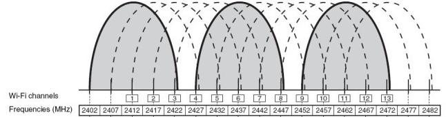
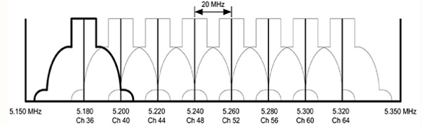
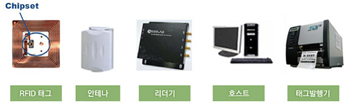
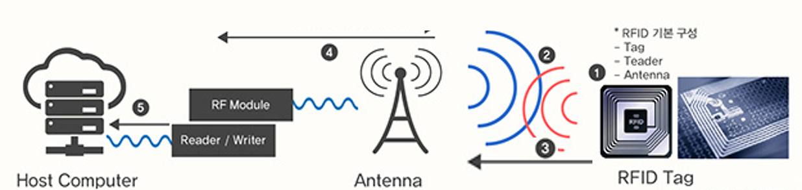
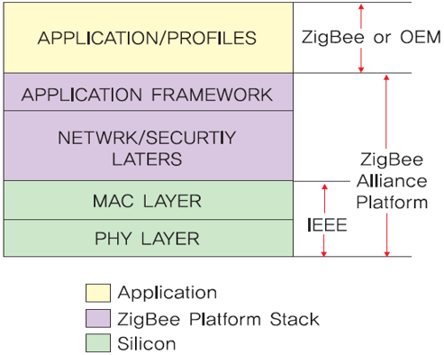

# 사물인터넷 네트워크

## 학습 목표
- 사물인터넷의 주요 네트워크 기술의 용어와 개념을 이해한다.

---
## 1. 개요

- **사물인터넷이란?**
	- 다양한 **사물들을** 센서와 **통신기술을 더해** 사물과 사물, 사물과 사람을 **연결**함으로써 정보를 주고 받으며 새로운 가치를 만드는 것

- 사물인터넷의 주요 기술 분야
  - 디바이스/센서 플랫폼
  - **네트워크 인프라**
  - 서비스 플랫폼

- **네트워크 인프라**는 사물(*디바이스/센서 플랫폼*)이 인터넷에 연결되도록 지원하는 기술
  - [컴퓨터네트워크](#2)
  - [근거리무선통신](#3)
  - [저전력 장거리 통신](#4)

---
## 2. 컴퓨터 네트워크과 인터넷

### 2.1. 컴퓨터 네트워크
- 컴퓨터 네트워크는 둘 이상의 컴퓨터의 집합이며, **컴퓨터 간에 정보와 자원을 공유하기 위해 연결**된 것
- 네트워크 상의 컴퓨터는 전화선, 동축 케이블, 위성통신, 무선 등 **다양한 통신 기술로 상호 연결**되어 있음
- 컴퓨터들은 지리적으로 어느 곳에서나 위치할 수 있음.

  

    
  

#### 2.1.1 네트워크 종류
- 네트워크 범위에 따른 분류
	- **LAN (Local Area Network)**
		- 집, 사무실, 학교, 대학 캠퍼스 등과 같이 소규모 공간 내의 컴퓨터들을 연결하는 근거리 통신망
	- **WAN (Wide Area Network)**
		- 국가, 대륙 등과 같은 넓은 지역을 연결하는 원거리 통신망
		- 다른 지역의 LAN이나 다른 종류의 네트워크를 연결하는 네트워크

		

		    
	  	

#### 2.1.2 네트워크 기술
- **이더넷 (Ethernet)**
	- 네트워크에 연결된 각 기기들이 48비트 길이의 고유의 **MAC (Media Access Control)주소**를 가지고 이 주소를 이용해 상호간에 데이터를 주고 받음
	- 일반적으로 LAN에서 가장 많이 활용되는 기술 규격
	- [IEEE 802.3](https://en.wikipedia.org/wiki/IEEE_802.3) 표준 규격
	- 버스 토폴로지를 사용

		

			    
	  	

- **와이파이 (WiFi)**
	- 유선 LAN 형태인 이더넷의 단점을 보완하기 위해 고안된 기술
		- 보통 폐쇄되지 않은 넓은 공간(예를 들어, 하나의 사무실)에 하나의 **핫스팟**을 설치하며, **핫스팟을 통해 인터넷에 연결**
		- **핫스팟부터 각 사무실의 컴퓨터는 무선으로 연결**
	- [ISM (Industiral Scientific and Medical)](https://en.wikipedia.org/wiki/ISM_band) 무선 대역으로 지정된 2.4 GHz (12센티미터)와 5 GHz (6센티미터) 주파수를 이용
	- [IEEE 802.11](https://ko.wikipedia.org/wiki/IEEE_802.11) 표준 규격

		

			
	  	

---
### 2.2. 인터넷
- **인터넷**은 **TCP/IP 프로토콜**을 이용해 정보를 주고 받는 **컴퓨터 네트워크**이다.

#### 2.2.1 TCP/IP 프로토콜
- 프로토콜이란?
  	- 통신 프로토콜 또는 통신 규약은 컴퓨터나 원거리 통신 장비 사이에서 메시지를 주고 받는 양식과 규칙의 체계 [[참고자료]](https://ko.wikipedia.org/wiki/%ED%86%B5%EC%8B%A0_%ED%94%84%EB%A1%9C%ED%86%A0%EC%BD%9C)

		

			
  		

- **인터넷 프로토콜** (**IP**, **I**nternet **P**rocotol)
  	- **호스트의 주소** 지정, **패킷 기반**의 정보 전송
  	- IP는 패킷 전달 여부를 보증하지 않고, 패킷을 보낸 순서와 받는 순서가 다를 수 있다
- **전송 제어 프로토콜** (**TCP**, **T**ransmission **C**ontrol **P**rotocol)
  	- **TCP**는 **IP** 위에서 동작하는 프로토콜로, 데이터의 전달을 보증하고 보낸 순서대로 받게 해준다.

	
  	
  	[참고자료, https://image.slidesharecdn.com/081-111113041506-phpapp01/95/08-1-3-728.jpg?cb=1321157739]	  

#### 2.2.2 IP 주소
- 컴퓨터 네트워크에서 **IP(Internet Protocol) 주소**는 전세계 컴퓨터에 부여된 **고유의 식별 주소**다
- **IPv4** (IP version 4) 주소 체계
  	- 0~255 범위의 10진수 4개와 .(점)으로 표현하며, 실제로 32비트로 구성됨
  	- 예, 211.102.111.012  
- **IPv6** (IP version 6) 주소 체계
  	- IPv4의 주소 부족 문제 해결을 위해 제정됨
  	- 128비트로 구성됨
  	- 예, 3122:FFAB:1234:3120:1111:DCDD:2241:0099

#### 2.2.3 자동 IP (DHCP)와 고정 IP
- IP 주소 할당 방식에 따라 고정 IP와 자동 IP로 구분됨
	- **고정 IP 주소**
  		- 인터넷 서비스 업체의 의해서 할당된 IP 주소로서 항상 고정된 주소임
  	- **자동 IP 주소 (Dynamic Host Configuration Protocol, DHCP)**
  		- 컴퓨터가 부팅될 때마다 DHCP 서버에 의해 할당된 IP 주소로서 유동적임.

#### 2.2.4 게이트웨이
- 다른 네트워크로 들어가는 톨게이트 역할을 하는 네트워크 포인트
- 외부 인터넷으로 나가기 위해서는 반드시 게이트웨이 설정이 필요함
- 게이트웨이에도 중복되지 않는 IP 주소가 필요함
	- 일반적으로 게이트웨어 IP 주소는 컴퓨터에 할당된 IP 주소 중 끝자리만 다른형태, 보통 1을 지정
  		- 예, 211.102.111.1

#### 2.2.5 DNS
- **도메인 네임 시스템 (Domain Name System, DNS)**는 사람이 이해하기 쉬운 도메인 이름을 숫자로 식별된 IP 주소로 변환해 줌

	

### 2.2.6 IP 주소 및 네트워크 정보를 확인하는 방법
- 운영체계가 MS 윈도우 라면,
  	1. [**시작**]-[**실행**]에서 *cmd*를 입력
  	2. **명령 프롬프트** 창에서 *ipconfig /all* 명령을 입력하여 실행

  	  

---

## 3. 근거리무선통신

### 3.1 WiFi
- 우리나라는 2.4㎓(2.400~2.483㎓) 대역에 83㎒ 주파수 대역 할당
- 83㎒ 주파수 대역에 20/22㎒ 대역폭을 5㎒ 간격으로 13개 채널 할당
- 같은 채널에 여러 대의 WiFi 기기가 사용되거나 WiFi 기기들이 인접한 채널 이용 시 서로 다른 기기 간 통신 시 간섭(Interference) 발생
- 간섭 문제 해결을 위해 1, 6, 13번 채널 또는 1, 5, 9, 13번 채널처럼 서로 중첩되지 않는 채널들을 이용하도록 권장

  

    
  

- WiFi 이용 기기들의 폭발적인 증가로 인하여 간섭을 피하고자 비중첩 채널이 20개 이상인 5㎓ 대역 이용 증가 추세
  - 관련 표준: IEEE802.11n, IEEE 802.11ac 등

  

    
  

### 3.2 Bluetooth
- 10m 안팎의 초단거리에서 데이터나 음성, 영상 등 저전력 무선연결에 사용하는 무선기술
- 1994년 스웨덴 Ericsson사에서 시작한 무선 기술 연구를 바탕으로 1998년
   노키아, IBM, 도시바, 인텔 등으로 구성된 Bluetooth SIG(Special Interest
   Group)를 통해 개발된 무선 기술 표준
- 스마트폰, 노트북, PC주변장치, 이어폰 등 휴대용 기기에 이용
- Bluetooth 무선 시스템은 ISM 대역인 2,400~2,483.5㎒ 사용
- 인접 주파수를 쓰는 다른 시스템들과의 간섭 방지를 위해 2,402~2,480㎒ 대역에서
   총 79개 채널 할당
- 시스템 간 전파 간섭 방지를 위해 주파수 호핑(Frequency Hopping) 방식 사용
   - 주파수 호핑이란 다수 채널을 특정 패턴에 따라 빠르게 이동시키며 패킷(데이터)을 조금씩 전송하는 기술
   - 할당된 79개 채널을 1초당 1,600번 호핑
   - 호핑 패턴이 Bluetooth 기기 간에 동기화되어야 통신 가능
   - Bluetooth는 기기 간 마스터(Master)와 슬레이브(Slave)로 구성

### 3.3 RFID(Radio Frequency Identification)
- 개요
  - RFID는 전자태그, 스마트 태그, 전자 라벨 및 무선식별 등으로도 지칭
  - 리더 장치가 전파를 방사하면 태그는 수신한 에너지를 이용하여 칩에 저장된 데이터
   를 리더로 변환하여 정보 전달
- RFID 구성요소
  - RFID 태그
  - 안테나
  - 리더기
  - 호스트
  - 태그발행기

  

    
  

- RFID 주파수별 특징

  |주파수 | 135 kHz 이하 | 13.56 MHz | 433 MHz | 860~960 MHz | 2.45 GHz|
  |-----| -----|-----| -----|-----| -----|
  |주 응용분야 | 보안, 동물관리| 교통카드, 도서관리 | 컨테이너, 자동차 | 유통, 물류 | 여권, ID 카드 |
  | 능동/수동 | 수동형 | 수동형 | 능동형 | 수동형 | 수동/능동형 |
  | 표준규격 | ISO 18000-2 | ISO 18000-3 | ISO 18000-7 | ISO 18000-6 | ISO 18000-4 |

- RFID 동작절차
  1. 칩과 안테나로 구성된 RFID 태그에 활용 목적에 맞는 정보 입력 및 대상에 부착
  2. 게이트, 계산대, 톨게이트 등에 부착된 리더에서 안테나를 통해 RFID 태그를 향해
    무선 신호 송출
  3. 태그는 신호에 반응하여 태그에 저장된 데이터 송출
  4. 태그로부터의 신호를 수신한 안테나는 수신한 데이터를 디지털 신호로 변조하여
    리더로 전달
  5. 리더는 데이터를 해독하여 호스트 컴퓨터로 전달

  

    
  

### 3.4 NFC(Near Field Communication)

- 개요

	<iframe width="560" height="315" src="https://www.youtube.com/embed/8q9iISSRx7k? frameborder="0" allow="autoplay; encrypted-media" allowfullscreen></iframe>

    - 2002년 일본 SONY사와 네덜란드 NXP 반도체가 공동 개발한 13.56 ㎒대역
   RFID 기술을 발전시킨 **비접촉식 양방향 근접 통신** 기술
   - 2004년 NFC Forum이 설립된 후 기술개발과 상용화 본격화, 스마트폰에
   NFC가 탑재되면서 대중화
   - 별도의 준비 없이 10㎝내의 근접거리 통신이 가능하여 보안 우수
   - 가격이 저렴하여 차세대 근거리 통신 기술로 주목
   - Bluetooth나 ZigBee 등 경쟁기술에 비해 보안성과 편의성 우수
   - 데이터 읽기와 쓰기 기능을 모두 사용 가능

- NFC 동작모드
  - Peer-to-Peer 모드
	    - 두 대의 NFC 디바이스가 상호 데이터 송수신 가능
	    - 각각 독자적인 RF필드 생성으로 인해 전력소모가 큼
	    - 예) 명함 교환, 개인송금 등에 응용
  - Reader/Writer 모드
	    - Reader모드는 휴대폰이 리더기의 역할을 수행하여 특정 태그로 부터 정보를 읽어 들이는 모드
	    - Writer모드는 필요한 정보를 태그에 기록하는 모드
	    - 태그 인식을 위한 전력 필요
	    - 예) [스마트 NFC Writer 어플리케이션](https://blog.naver.com/tonylee9239/220324727237)
  - 카드 애뮬레이션 (Card Emulation) 모드
	    - 기존 비접촉식 스마트 카드처럼 동작
	    - 전력공급 불필요
	    - 예) 신용카드, 교통카드, 신분증 등에 응용

### 3.5 ZigBee
- 개요

	<iframe width="560" height="315" src="https://www.youtube.com/embed/6WYX1Z1vXAE?rel=0&amp;start=359&end=502" frameborder="0" allow="autoplay; encrypted-media" allowfullscreen></iframe>

<!--
	

https://www.youtube.com/watch?v=6WYX1Z1vXAE&feature=youtu.be&t=359

https://www.youtube.com/watch?v=iquILj4CcaU
-->
  - 인터넷 전화 접속으로 홈 오토메이션을 편리하게 하기 위한 목적으로
   개발된 기술
  - 사물인터넷 디바이스 간 통신에 필요한 요구사항을 고려한 표준기술
  - **소형·저전력·저비용·근거리통신**을 위한 [IEEE 802.15.4](https://ko.wikipedia.org/wiki/IEEE_802.15.4) 기반으로 구성
  - 모토로라, 하니웰 등이 중심이 되어 1998년부터 기술 개발 시작, 2002년
   ZigBee Allience 설립
  - 세계 대부분 지역에서 ISM 밴드인 2.4㎓ 대역 사용
  - 무선랜, Bluetooth 등 동일 주파수 대역을 사용하는 무선 기술과의 간섭
   회피 목적으로 일부 국가에서 868㎒(유럽), 915㎒(미국/호주) 대역 사용

- ZigBee 계층 구조
	- ZigBee 장치는 물리(PHY) 계층, 매체 접속(MAC) 계층, 네트워크(Network)계층, 응용(Application) 계층으로 구분되는 프로토콜로 구성
 	- 물리 계층 및 매체접속 제어 계층은 IEEE 제정 IEEE802.15.4 표준 채택
 	- ZigBee 네트워크와 응용 계층은 산업체 표준단체인 ZigBee 연합(ZigBee Alliance)을
   결성하여 표준 기술 제정

   

     
   

- ZigBee 주요장치
	- 단말장치: 각종 센서에 연결되어 데이터 전송
 	- 코디네이터 장치: 정보 수집 및 장치 제어
 	- 라우터 장치: 여러 장치 간 데이터 전달

- ZigBee 네트워크 구조
	- 클러스터 트리(Tree) 구조
 	- 스타(Star) 구조
 	- 메시(Mesh) 구조의 다양한 토폴로지 지원
 	- 네트워크 접속 가능 장치 수: 최대 65,000개

### 3.6 Z-Wave
- 개요
  - ZenSys가 주축이 되어 2005년에 설립된 Z-Wave Alliance에서 개발한
     홈오토메이션 모니터링 및 컨트롤을 위한 저전력 통신 기술
  - 908.42㎒(미국) 및 주변 주파수 대역에서 동작
  - ITU-T에서 sub 1㎓ 협대역 무선 디바이스를 위한 1,2계층 표준
     (G.9959)으로 등록
  - 국내는 2013년 12월 919.7㎒, 921.7㎒, 923.1㎒가 Z- Wave 용도로 승인

- 주요 특징
  - 혼잡한 2.4㎓ 주파수 기반 통신기술에 비해 간섭이 없음
  - 9,600bps~100Kbps의 전송속도 제공
  - Z-Wave 기기들은 동일 네트워크에 위치한 다른 밴더 제품과의 호환성
   이 뛰어나며, 투과성이 좋아 30m 정도의 거리에서는 벽이 있어도 통신
   가능

- ZigBee와 Z-Wave 특성 비교

| 구분 | 주파수 | 전송속도 | 거리 | 주 응용분야
|------|-------|---------|------|------|
| ZigBee | 2.4GHz |250Kbps|10m|스마트그리드, 원격검침, 스마트홈
|Z-Wave|908.42MHz|9.6/100Kbps|30m|스마트홈, 보안

---

## 4. 저전력 장거리 통신 (LPWA: Low Power WIde Area) 기술
- 개요
  - 가정용 IoT는 Bluetooth, WiFi 등 근거리무선통신을 활용해 서비스 제공 가능하나, IoT 서비스 범위 확대 시 근거리무선통신은 단거리 제공범위 한계 극복 필요
  - LPWAN의 특징
	  	- 사물인터넷은 특성 상 연결기기 수가 매우 많으므로 안정적으로 데이터를
	   교환하면서 비용을 줄이는 통신망 구축이 매우 중요한 요소
	  	- 낮은 소비전력: 별도의 교체 비용 및 업무가 없거나 최소화되어야 함 
	  	- 전파가 넓게 또 깊이 침투할 수 있어야 함

### 4.1 Weightless 기술
- **Weightless**는 영국 캠브리지 주변의 *ARM*과 *Neul*,
     *CSR(Cambridge Silicon Radio)* 등이 주축이 되어 만든 **개방형 표준 기반의
     *LPWAN* 기술 개발 표준 협의체**
- **LPWAN (Low Power Wide Area Network)**를 위한 **사물 간의 무선 통신 기술**로도 일컫음
- 주요 특징
	- 커버리지: 도시지역-10km, 교외지역-30km
	- 넓은 범위와 침투성을 위해 비면허 주파수 대역대인 ISM 대역 사용
		- 유럽: 868 MHz
		- 미국: 915 MMz 
	- 저렴한 모듈가격(2달러 이하)와 낮은 운영 비용으로 서비스 제공할 수 있는 기반 제공	  	
	
### 4.2 SIGFOX
- 2009년 설립된 프랑스 **기업**으로 **사물인터넷 네트워크의 효시**
- **UNB(Ultra Narrow Band)** 기술 사용
- 원거리에 배터리 교체없이 몇 년 간 사용할 수 있는 **저전력 기반**의 사물
   인터넷 네트워크 서비스 제공
- 주파수 사용료가 없는 비면허 주파수 대역대인 ISM 대역 사용
	- 유럽: 868 MHz
	- 미국: 902 MHz
- 가장 먼저 사물인터넷 네트워크 서비스를 제공한 만큼 현재 **가장 넓은 커버리지와 파트너 보유**

### 4.3 LoRaWAN(Long Range Wide Area Network)
- 반도체 기업인 셈태크(SemTech)와 IBM 리서치가 개발한 **LPWAN** 기술
- 매우 적은 전력을 사용하여 넓은 대역으로 데이터 분산을 통해 동시에
   송신이 가능한 **직접 확산 스펙트럼 CDMA** 기술 활용
- **UNB**에 비해 전력 소모가 크지만 전파 간섭이 적음
- UNB와 마찬가지로 비허가 대역(ISM 밴드) 이용
- **커버리지**: 최대 100km 까지, 도시지역-2km, 교외지역-15km 
- **속도**: 300bps ~ 100kbps
- 많은 AP(Access Point)와 중계기(Repeater)가 필요 없어 구축비용 절감
   가능
- **LoRa Alliance**가 결성되어 표준화 주도
- SKT가 2016년 7월 LoRa 기술을 채택하여 전국에 IoT 전용망 구축

### 4.4 NB-IoT (NarrowBand-IoT, 협대역-IoT)
- **NB-IoT**는 좁은 대역을 이용해 **150kbps 이하의 데이터 전송 속도**와 **8km
   이상의 장거리 서비스**를 지원하는 협대역 사물인터넷 표준 기술
- KT와 LG U+는 NB-IoT 공동 기술 개발 협력을 통해 2017년 1/4분기에
   상용화하고 2017년 전국망 구축 완료
- 비면허 주파수를 사용하는 LoRa와 달리 **LTE 전국망을
   기반**으로 커버리지가 넓고 안정적인 서비스 품질 제공에 유리한 기술
- 접속 기술은 무선 채널들이 상당부분 중첩되지만 직교성(Orthogonality)
   이 있어 서로 중첩되어도 방해 없이 정보 전송 가능한 OFDM 방식 사용
- 이 기술은 전력 소비가 적으면서 가스·수도·전기 검침, 위치 추적용 기기
   등과 같이 원거리에 있는 사물 간 통신에 적합
   
### 4.5 LTE-MTC(Machine Type Communication) 
- 국내 이동통신 3사는 LTE-M 기반의 IoT 네트워크 도입 예정
- LTE-M은 LTE-MTC(Machine Type Communication)로 [3GPP](http://www.3gpp.org/)가 표준화한
   기술
- 전국망이 구축되어 있는 LTE망을 이용하므로 전국 서비스가 가능
- **면허대역 주파수를 사용**하므로 주파수 간섭으로 인한 품질 저하 없음
- 로밍을 통한 글로벌 확장 가능
- LTE-M 최대 속도는 10Mbps

### 4.6 LPWAN 기술 방식별 특징 비교
  
|구분| LTE-M | NB-IoT | SIGFOX | LoRaWAN|
|---|------|---------|--------|-----|
| **커버리지** |~11km | 8km~15km | ~10km(도시), ~30km(교외)  | ~2km(도시), ~15km(교외)|
| **주파수대역** | 면허대역(LTE) | 면허대역(LTE) | 비면허대역 | 비면허대역 |
| **대역폭** | 20MHz | 200kHz | 200kHz | ~500kHz |
| **통신속도** | 10Mbps | ~150Kbps | 1Kbps | ~100Kbps|

- IoT 네트워크 적용 기술 비교

  

    
  

