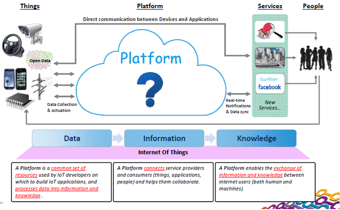
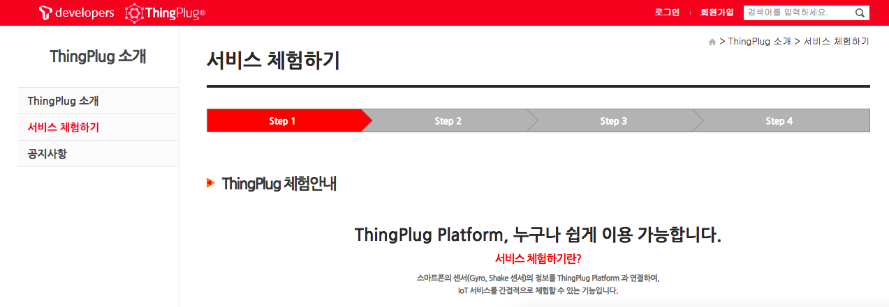
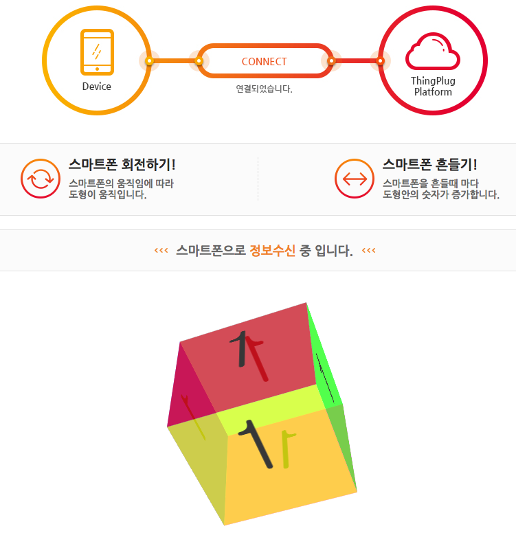
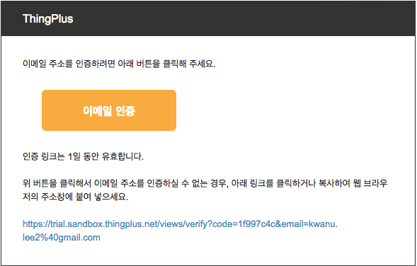
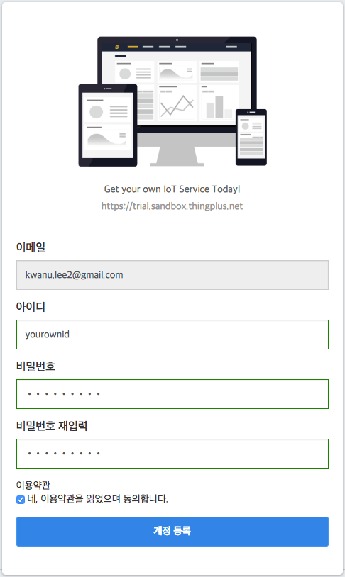
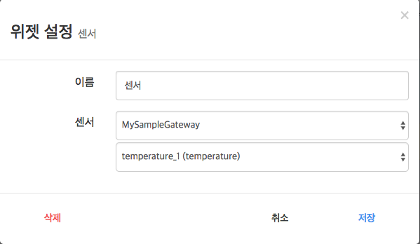

# 사물인터넷 플랫폼

## 학습 목표
- 사물인터넷 플랫폼 기술의 용어와 개념을 이해한다.
- 다양한 사물인터넷 플랫폼 제품의 사용을 실습한다.

---
## 1. 개요

### 1.1 사물인터넷 서비스란
- **사물인터넷(Internet of Things, 약어로 IoT)**은 각종 사물에 센서와 통신 기능을 내장하여 인터넷에 연결하는 기술.

- **사물인터넷 서비스**는 사물인터넷 기술을 활용하여 사용자에게 새로운 가치를 제공하는 기능
  - 사물들로부터 수집된 정보를 저장 및 모니터링
      - [사례1: IoT 디바이스 관리 플랫폼 NeoIDM 적용사례](https://www.youtube.com/watch?v=yjWHU59g8l8)
  - 규칙 엔진 혹은 사용자에 의한 사물들의 원격 제어
      - [사례2: 스마트 홈 시스템](https://www.youtube.com/watch?v=qR3vACJnkFA)
  - 사물들로부터 수집된 정보를 분석 및 학습하여 지능화된 서비스 제공
  		- [사례3: 삼성SDS, AI기술로 지능화된 첼로 물류 플랫폼 공개](https://www.samsungsds.com/global/ko/about/news/cello-tech-fair-2018.html) 
    <!--  - [사례3: Amazon AI 및 IoT](https://youtu.be/V4GidNmlHVA?t=248) -->

### 1.2 **사물인터넷  플랫폼이란?**
  - 사물들로부터 데이터를 수집하거나 사물의 제어방법 제공, 사물기기 관리, 연결 기능 등을 제공하는 공통시스템
  - 플랫폼은 **서버**나 **클라우드** 형태로 제공됨

  

  		 
  

#### 1.2.1 클라인트-서버 모델  [[참고자료](https://ko.wikipedia.org/wiki/%EC%84%9C%EB%B2%84)]
- **서버(영어: server)**는 클라이언트에게 네트워크를 통해 정보나 서비스를 제공하는 컴퓨터(server computer) 또는 프로그램(server program)을 말한다.
- 서비스를 요청하는 클라이언트와 클라이언트의 요청을 처리하는 서버와의 상호작용을 통해서 사용자가 원하는 결과를 얻는 처리방식이 **클라이언트-서버** 시스템이다.

  

       
  

#### 1.2.2 **클라우드 서비스란?**
- **클라우드 서비스**란 인터넷 상에 컴퓨팅 자원(저장소, 애플리케이션, 컴퓨터, 네트워크 등)을 보관해 두고, 사용자가 필요한 자원을 인터넷 접속을 통해 언제 어디서나 이용할 수 있는 서비스를 말한다.

- 클라우드 서비스 모델
  - **SaaS (Software as a Service)**
    	- 응용 프로그램을 웹서비스 형태로 제공
    	- 예, Google Docs, Gmail, 등

  - **Paas (Platform as a Service)**
    	- 응용 프로그램 개발자를 위한 서비스로, 개발자들이 기반 인프라스트럭처에 대해 신경을 쓰지 않고 앱을 개발하고 테스트할 수 있는 환경을 제공
    	- 예, Google Cloud Platform, Firebase, AWS IoT, 등

  - **IaaS (Infrastructure as a Service)**
    	- 컴퓨팅 파워, 스토리지, 네트워크 등을 서비스 형태로 제공
    	- 예, AWS, Google Cloud, Azure, 등

- 클라우드 서비스의 이점
    - 비용
        - 초기 인프라 자원 투자에 대한 부담 감소
        - 데이터 센터 운영 및 유지 관리에 비용 투자 불필요
        - 사용한 양에 따른 비용 구조
    - 유연성
        - 즉각적인 인프라 자원 확장
    - 개발 용이성
        - 빠른 인프라 구축을 통한 개발 라이프사이클 단축
        - 다양한 형태의 서비스에 대한 솔루션 제공

- IoT 클라우드 서비스 구현
  - [AWS로 연결하는 사물인터넷의 세계](https://www.youtube.com/watch?v=qI8fs26bXmE)

- 오픈 IoT 클라우드 플랫폼 사례
  - [SKT ThingPlug 플랫폼](https://sandbox.sktiot.com/)
  		- [**동영상**] [SKT ThingPlug 플랫폼 소개](https://www.youtube.com/watch?v=ylBeyEm0VSk)
  - [KT IoTMakers 플랫폼](http://iotmakers.kt.com/openp/index.html#/introduce)
  		- [**동영상**]] [KT 개방형 IoT 플랫폼 IoTMakers와 아두이노 간의 연동](https://www.youtube.com/watch?v=am-jWlzOnmc)
  - [달리웍스 Thing+ 플랫폼](https://www.youtube.com/watch?time_continue=90&v=PrgJZpohSQA)

---
## 2. ThingPlug 플랫폼 체험하기 [실습]
스마트폰의 센서(Gyro, Shake 센서)의 정보를 ThingPlug Platform 과 연결하여,
IoT 서비스를 간접적으로 체험할 수 있는 기능입니다

1. https://sandbox.sktiot.com/ 접속
2. 화면 중앙 위에 있는 [**ThingPlug 소개**] 클릭
	

  		 
  	

3. 왼쪽 메뉴 중에 [**서비스 체험하기**] 클릭
	

  		 
  	

4. [**체험 시작하기**] 클릭
5. **디바이스 이름**과 **E-mail**을 입력후 [**링크 보내기**] 클릭
	

  		 
  	

6. 스마트폰으로 전송된 **Link**를 클릭하여, ThingPlug Platform과 연결
 	

  		 
  	

7. 스마트폰을 회전시키거나 흔들어서 ThingPlug 플랫폼의 변화를 확인한다.
 	

  		 
  	

---
## 3. KT IoTMakers 플랫폼 [실습]
### 3.1 회원가입
1. http://iotmakers.kt.com/openp/index.html#/auth/join 접속하여, 이용약관 및 개인정보 수집 및 이용에 동의한 후에, **아이디**, **이름**, **비밀번호**를 포함한 필수정보를 입력후에 회원가입을 진행
2. 회원가입 후, 등록된 아이디와 비밀번호로 **login**

### 3.2 디바이스 등록
1. [**IoT 개발**]-[**나의 디바이스**] 선택
2. [**디바이스 등록**] 버튼 클릭
3. 디바이스 정보 등록
	- 	**디바이스명**으로 *sample device* 입력 후, **디바이스 등록** 버튼 클릭
5. 나의 디바이스 목록에서 **태그 스트림** 및 **이벤트**를 등록할 디바이스를 선택
	1. **Tag Stream** 탭의 **태그 스트림 생성** 버튼 클릭
	2. **Tag Stream ID**에 *temperature* 입력후, **생성** 버튼 클릭
	3. **Event** 탭의 **이벤트 생성** 버튼 클릭
	4. 이벤트 생성 조건 설정
		- **이벤트 이름**: *비정상 온도*
		- **이벤트 발생조건**: *temperature*, *>*, *40* 설정
	5. **저장** 버튼 클릭 

### 3.3 가상 디바이스 시뮬레이터 등록
1. [**IoT 개발**]-[**가상 디바이스 등록**] 선택
2. **시뮬레이터 등록** 버튼 클릭
3. 가상 디바이스 등록 화면에서, 다음 정보 입력
	- **가상 디바이스 시뮬레이터 이름**: *mySampeDeviceSIm* 입력
	- **디바이스 이름**: 생성된 디바이스 중에 하나(예, *sample device*) 선택
	- **시작 시간 및 동작 시간**: *현재시간* 과 *5분* 선택
	- **데이터 생성 주기**: *5초* 선택
4. **Tag Stream 목록**에서 *temparature*를 더블클릭 후, 시뮬레이션 조건 설정
	- **시작값**: *19*
	- **조건**: *증가*
	- *변화값**: *1*
5. **저장** 버튼 클릭

### 3.4 대시보드 꾸미기
1. [**IoT 개발**]-[**나의 대시보드**] 선택
2. **+** 버튼을 눌러 다양한 위젯 생성
3. **디바이스 현황** 위젯 선택 후, **추가** 버튼 클릭
4. **설정**(톱니바퀴 모양 아이콘)을 클릭 후, 왼쪽 **디바이스 목록**의 *sample device*를 **보여줄 디바이스 목록**으로 이동하고, **저장** 버튼 클릭 
5. **실시간 태그 스트림 현황** 위젯 선택 후, **추가** 버튼 클릭
6. **디바이스 선택**에서 *sample device*를, **수집 태그스트림**에서 temperature*를 선택 후, **추가** 클릭 후, **저장** 버튼 클릭
7. 필요에 따라 여러분의 대시보드를 꾸며보세요.

### 3.5 이벤트 관리
1. [**IoT 개발**]-[**이벤트 관리**] 선택
2.  발생된 이벤트 조회

---

## 4. Thing+ 플랫폼 [실습]
### 4.1. 회원가입
1. https://thingplus.net 접속
2. 상단에 위치한 **가입하기** 버튼을 통해 회원가입 페이지로 이동합니다.
3. 개인 사용자 무료로 **가입하기**를 진행합니다.
4. 자신의 *이메일* 주소를 입력한후 **회원가입** 버튼을 클릭합니다.
	

  		 
  	

5. 입력한 이메일 주소로 보내진 인증 메일을 확인하고 **이메일 인증** 버튼을 눌러 회원가입을 진행합니다.
	

  		 
  	

6. 아이디, 비밀번호, 비밀번호 재입력 란을 채운후, 이용약관의 동의를 체크하고 **계정등록**을 완료합니다.
	

  		 
  	

  	
### 4.2 게이트웨이 등록
Thing+와 연동된 하드웨어를 통해 누구나 쉽게 디바이스를 클라우드로 연결할 수 있습니다. 디바이스의 상태를 원격에서 관리할 수 있으며, 안정적인 연결과 보안 기능을 제공합니다.
아직 보유한 게이트웨장비가 없다면, 가상 게이트웨이를 등록하실 수 있습니다.

1. 화면 우측 상단의 [**설정**]의 [**게이트웨이 관리**] 메뉴 선택
	

  			 
  	

2. 화면 상단의 **+** 버튼으로 게이트웨이를 등록할 수 있습니다.
	

  			 
  	
 
3. [가상 게이트웨이 등록] 게이트웨이 등록하기 화면에서 다음 정보 입력 후, **[게이트웨어,디바이스,센서 등록 진행]** 버튼 클릭
	- 게이트웨이 모델 : *Virtual Gateway-Simulator* 선택
	- 게이트웨이 이름: *MySampleGateway* 입력
	- 디바이스 모델: *Air Environment* 선택
	- 디바이스 이름: *MySampleDevice* 입력  	
4. 화면 우측 상단의 [**설정**]의 [**게이트웨이 관리**] 메뉴 선택하여, 새로이 생성된 게이트웨어 확인

### 4.3 대시보드 꾸미기
Thing+의 다양한 위젯을 기반으로 자신만의 맞춤형 대시보드를 꾸밀 수 있습니다. 언제 어디서나 실시간 모니터링이 가능하며, PC, 태블릿, 모바일 등 모든 클라이언트 환경을 지원합니다.

1. 화면 상단의 [**대시보드**] 메뉴 선택
2. 화면 상단의 **+** 버튼으로 다양한 위젯을 추가할 수 있습니다. 
3. **게이트웨이** 위젯 추가하기
	1. 화면 상단의 위젯 메뉴중에 [**게이트웨이**] 클릭
	2. 추가된 위젯에서 [**게이트웨이**] 버튼 클릭 후에, 위젯 설정 화면에서 **MySampleGateway** 선택

		

  			 
  		

4. **센서** 위젯 추가하기
	1. 화면 상단의 위젯 메뉴중에 [**센서**] 클릭
	2. 추가된 위젯에서 [**센서**] 버튼 클릭 후에, 위젯 설정 화면에서 모니터링하고자 원하는 게이트웨이와 센서를 선택후 [**저장**] 버튼 클릭
		

  			 
  		

5. 유사한 방법으로 자신만의 대시보드를 꾸며 봅니다.

### 4.4 규칙 설정하기
"트리거 - 컨디션 - 액션" 모델을 기반으로 다양한 규칙 설정 기능을 제공합니다. 조건에 따른 이벤트 발생 등의 간단한 규칙부터 날씨와 같은 외부 환경 변수를 포함한 복합 규칙도 설정할 수 있습니다.

1. 화면 우측 상단의 [**설정**]의 [**규칙 관리**] 메뉴 선택
2. 화면 상단의 **+** 버튼으로 새로운 규칙을 생성할 수 있습니다. 
3. **템플릿 사용** 메뉴 선택
4. **온도 이상 감지** 위젯의 **+** 버튼 클릭
5. 규칙만들기 화면에서 **센서 목록**의 체크박스 선택후, **시작값**과 **끝 값**을 설정하고, **이메일 제목**을 입력 후에, **저장**버튼 클릭

### 4.5 타임라인 살펴보기
설정한 규칙에 의해 발생하는 모든 이벤트를 트위터와 같은 타임라인 형태로 제공합니다. 단계(심각/경고/정보)를 지정할 수 있으며, 규칙 및 디바이스 별로 발생한 타임라인을 분류해서 확인할 수 있습니다.

1. 화면 상단의 [**대시보드**] 메뉴 선택
2. 화면 상단의 위젯 메뉴 중에서 [**타입라인**] 선택 
