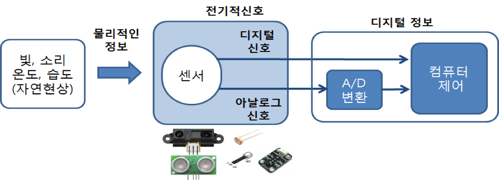
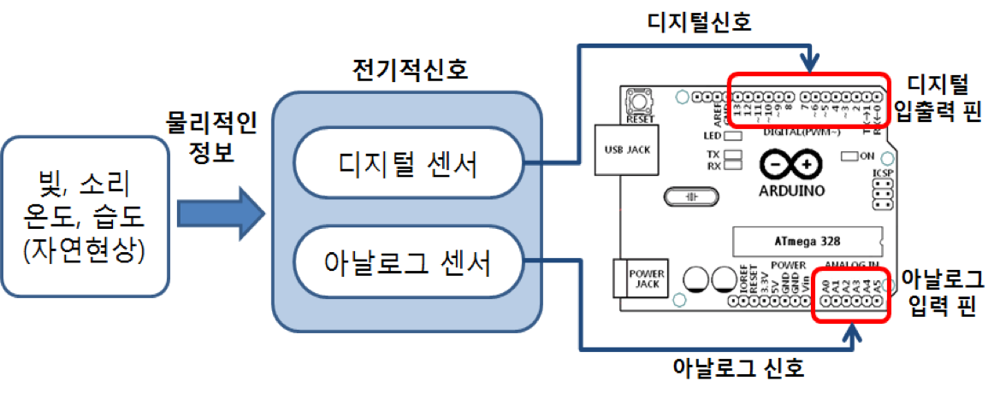
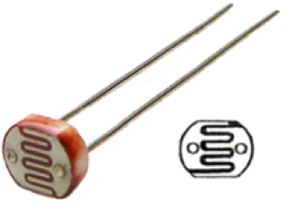
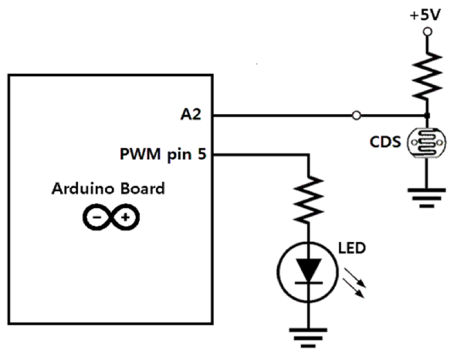
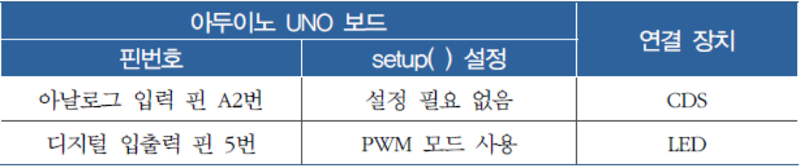
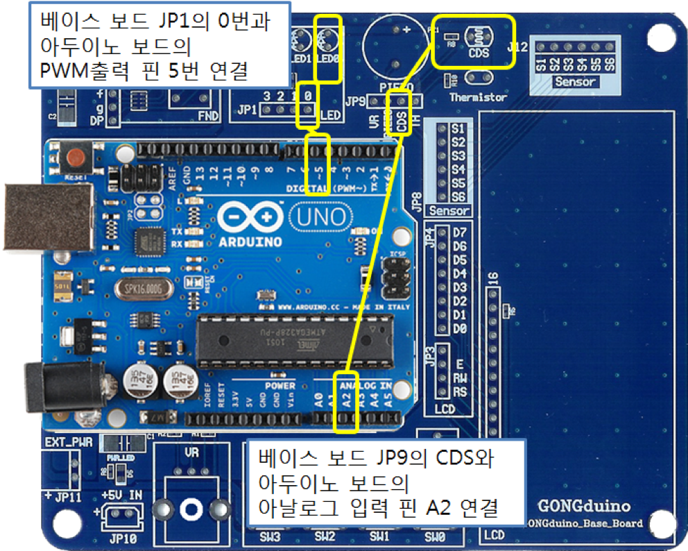
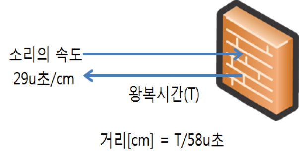
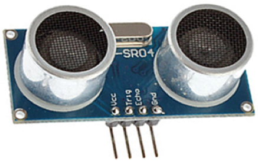
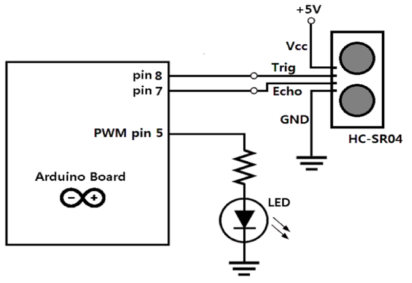

<style>
div.polaroid {
  	width: 400px;
  	box-shadow: 0 10px 30px 0 rgba(0, 0, 0, 0.2), 0 16px 30px 0 rgba(0, 0, 0, 0.19);
  	text-align: center;
	margin-bottom: 0.5cm;
}
</style>

# 센서

## 학습목표
- 아두이노 보드의 아날로그 입력 핀을 통하여 **센서의 아날로그 신호**를 받아들이고 처리하는 방법들을 배운다.

## 1. 센서란?
- 인간이 접하는 빛, 열, 바람, 냄새, 기울기나 속도 등 같은 대부분의 물리적 현상을 전기적 신호로 변환해 주는 장치
- 대부분의 센서
 	- 연속적인 변화를 갖는 아날로그적 특성
	- A/D변환을 통하여 디지털로 변환된 정보를 제어에 이용
	
	<div class="polaroid">
		
	</div>
- 아두이노 보드와 센서의 연결

	<div class="polaroid">
		
	</div>


## 2. 빛 센서 (CDS)
- CDS는 빛 세기가 변하면 저항 값이 변화
	- 빛의 세기가 클수록 전도율이 높아져 저항값이 낮아지고, 빛의 세기가 약할수록 저항값이 높아지게 된다. 	

	

<a name="cds_ex"></a>
### 2.1 예제 1 (빛의 변화에 따라 LED의 밝기 조절)
- CDS 센서로부터 입력되어지는 전압의 크기 (0~5V)에 따라 0~1023 범위의 값이 변환되어 반환됩니다.
- [map](https://www.arduino.cc/reference/en/language/functions/math/map/)()를 이용하여 0~1023범위의 val값을 0~255 범위로 변환
- 0~255 범위의 값을 갖는 PWM 신호를 LED에 출력하여 빛의 밝기에 따라 LED의 밝기를 제어

#### 2.1.1 회로도



#### 2.1.2 아두이노 보드 연결 구성

<div class="polaroid">
		
</div>

<div class="polaroid">
		
</div>

#### 2.1.3 Sketch 프로그램

```c
void setup() {
  pinMode(5, OUTPUT);   // PWM 출력(디지털 핀 5)으로 LED 제어  
}

void loop() {
  // 아날로그 입력핀 2번을 통하여 입력된 전압값을 0~1023범위의 값으로 읽어 cdsValue에 저장
  int cdsValue = analogRead(2);   

  int pwmValue = map(cdsValue, 0, 1023, 0, 255);  // 0~1023범위의 val값을 0~255 범위로 변환
  analogWrite(5, pwmValue);                       // PWM 신호로 출력 
  delay(20);
}
```

---
## 3. 초음파 센서
### 3.1 초음파 센서로 거리 측정 원리
- 소리의 속도가 340m/s인 것을 이용하여 거리 측정
	- 소리가 1cm를 가는데 29μ초가 소요 (1000000μs /34000 cm = 29 μs/cm) 
	- 초음파 발생기에서 발생한 초음파가 전방에 있는 물체에 반사되어 센서로 돌아오는 시간을 측정하여 거리 계산

		<div class="polaroid">
			
		</div>
		
### 3.2 디지털 초음파 센서 **HC-SR04**
- **트리거 핀(Trig)**를 통하여 10μ초의 펄스 발생
- **에코 핀(Echo)**을 통하여 반사되는 초음파 값 입력

	
	
	
	
### 3.3 예제 2

#### 3.3.1 회로도



#### 3.3.2 아두이노 보드 연결 구성

<div class="polaroid">
		
</div>


#### 3.3.3 Sketch 프로그램

1. 10μ초의 트리거 펄스를 발생

	```
	digitalWrite(TRIG_pin, LOW); 
	delayMicroseconds(2);
	digitalWrite(TRIG_pin, HIGH); 
	delayMicroseconds(10);
	digitalWrite(TRIG_pin, LOW); 
	```
	
2. **HC-SR04** 모듈은 트리거 펄스를 기준으로 40kHz의 초음파 신호를 8번 발생
3. 되돌아오는 반사 펄스를 pulseIn( )함수를 사용하여 계측

	```
	time= pulseIn(ECHO_pin, HIGH);
	```
	
4. 시간을 거리로 계산

	```
	distance = time/58
	```
	
- 완성된 Sketch

	```c
	int ECHO_pin = 7;     // 반사 신호 수신 핀
	int TRIG_pin = 8;     // 트리거 신호 발생 핀 
	int time; 

	void setup( ){
  		pinMode(ECHO_pin, INPUT);   // 반사 신호 수신 핀 입력모드 설정
  		pinMode(TRIG_pin, OUTPUT);  // 트리거 신호 발생 핀 출력모드 설정
  		Serial.begin(9600);         // 시리얼 통신을 위한 전송속도 9600 설정 
	}


	void loop() {
  		digitalWrite(TRIG_pin, LOW); 
  		delayMicroseconds(2);       // 트리거 핀을 2μ초 동안 “LOW”
  		digitalWrite(TRIG_pin, HIGH); 
  		delayMicroseconds(10);      // 트리거하기 위하여 10μ초 동안 “HIGH”
  		digitalWrite(TRIG_pin, LOW); // 트리거 핀을 다시 “LOW”
  
  		time = pulseIn(ECHO_pin, HIGH); // 반사펄스 시간 읽기
  		int distance = time/58;         // 펄스 시간을 거리로 계산 (cm 단위)
    
  		int pwmVal = map(distance, 0, 200, 0, 255);  // pwm 출력값으로 변환
  		analogWrite(5, pwmVal);                       // 5번에 연결된 led에 pwmVal 출력
  		delay(100); 
	}
	```


---	

<a name="exercise"></a>
## 4. 연습문제
	
1. 빛의 밝기에 따라 LED의 깜박이는 속도가 4단계로 조정되는 스케치를 만들어 보자.
	
4. 물체의 거리에 따라 도레미파솔라시도를 연주하는 스케치를 만들어 보자.
	- 0~10cm : 도 
	- 11~20cm: 레
	- 21~30cm: 미
	- 31~40cm: 파
	- 41~50cm: 솔
	- 51~60cm: 라
	- 61~70cm: 시
	- 71~80cm: 도


