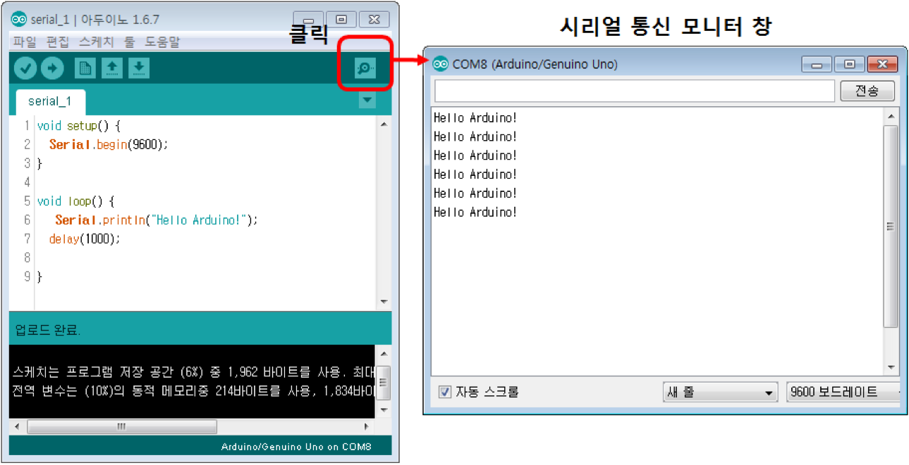

<style>
div.polaroid {
  	width: 400px;
  	box-shadow: 0 10px 30px 0 rgba(0, 0, 0, 0.2), 0 16px 30px 0 rgba(0, 0, 0, 0.19);
  	text-align: center;
	margin-bottom: 0.5cm;
}
</style>

# 시리얼 통신 (직렬 통신)

## 학습목표
- 아두이노 보드-PC 간의 시리얼 통신 방법들을 배운다.
- 시리얼 통신을 이용하여 PC에서 아두이노 보드의 LED를 제어한다.

## 1. 시리얼 통신 개요

- **시리얼 통신**은 기기들 사이에서 송신(TX), 수신(RX) 2개의 데이터 선을 이용하여 한번에 한 비트씩 전송하는 방법

- UNO 보드
  - 1개의 하드웨어적인 시리얼 통신 사용 가능
  		- USB 포트
  			- 아두이노 IDE에서 작성된 Sketch 프로그램을 보드에 업로드할 때 사용됨
  			- PC와 아두이노 보드간의 시리얼 통신에 사용됨

  			
  	출처: http://www.ladyada.net/learn/arduino/lesson4.html

  		- 디지털 입출력 핀 0번(RX)와 1번(TX) 이용
  			- 다른 모듈(예, 블루투스 모듈)과의 시리얼 통신에 사용됨
  			- **이 핀이 다른 용도로 사용중이라면, PC에서 프로그램을 USB 케이블로 업로들 할 때, 업로드가 되지 않음.**

			<div class="polaroid">
			  
			</div>

<!--
- 시리얼 통신을 위해서는 속도(bps), 패리티(Parity), 스탑비트(Stop bit), 데이터 비트(Data bits) 설정 필요
    - 속도(9,600bps)
    - 패리티(No parity)
    - 1 스탑비트
    - 8데이터 비트
-->

---
## 2 시리얼 통신을 통해 PC로 데이터 전송
### 2.1 예제 1
- 아두이노 보드에서 PC의 모니터에 “Hello Arduino!” 전송

	```c
	void setup() {
  		Serial.begin(9600);
	}

	void loop() {
  		Serial.println("Hello Arduino!"); 
  		delay(1000);
	}
	```

	1. setup() 함수 안에서 Serial 통신 설정

		``` c
		void setup() {
			Serial.begin(9600);
		}
		```

		- 9600 이 의미하는 것은 통신 속도입니다. **Baud rate (보레이트, bit per second 단위)** 라고 합니다. 주의할 점은 **여기서 지정한 통신 속도와 Serial 통신으로 연결되는 상대방이 지정하는 통신 속도가 일치**해야 한다는 점입니다.
			- 이번 예제에서는 USB 를 통해 PC와 연결되므로, 아두이노 IDE – Serial Monitor 에 설정된 통신 속도가 일치해야 합니다. Serial Monitor 를 실행해보면 하단부에 통신 속도를 선택할 수 있는 옵션이 있습니다
	2. **Serial.print(), Serial.println()** 명령을 사용하여 데이터 전송

		``` c
		void loop() {
			Serial.println("Hello Arduino!");
			delay(1000);
		}
		```

	3. 아두이노 IDE의 시리얼 모니터에서 데이터 출력 확인
		<div class="polaroid">
  			
		</div>


### 2.2 예제 2
- 센서 값 모니터에서 확인하기
	<div class="polaroid">
	  
	</div>

- [빛 센서 (CDS) 예제 1](../sensors/sensor.html#cds_ex)에서 CDS 센서 값을 모니터에 출력


	```c
	void setup() {
  		pinMode(5, OUTPUT);     
  
  		// 	CDS 센서의 값을 확인하기 위하여 시리얼 통신을 설정 (전송속도 9600bps)
  		Serial.begin(9600);     
	}

	void loop() {
  		int cdsValue = analogRead(2);   

  		int pwmValue = map(cdsValue, 0, 1023, 0, 255);  
 		 analogWrite(5, pwmValue);                    
  
  		// 변환된 PWM 값를 시리얼 모니터에 출력합니다.
  		Serial.print("pwmValue=");
  		Serial.println(pwmValue);
  
  		delay(500);
	}
	```

- 아두이노 Web IDE 왼쪽 **Monitor** 메뉴를 클릭하여 출력 값을 확인

	<div class="polaroid">
		
	</div>


---
## 3. 시리얼 통신으로 PC에서 아두이노 보드로 메시지 보내기

- PC에서 시리얼 통신을 통하여 아두이노 보드로 한 개의 문자를 보내고, 아두이노 보드에서 받은 데이터를 다시 PC의 시리얼 모니터에 출력

	<div class="polaroid">
		
	</div>

- [Serial.available](https://www.arduino.cc/reference/en/language/functions/communication/serial/available/)( )
  - 시리얼 포트로부터 읽을 수 있는 데이터의 바이트 수
- [Serial.read](https://www.arduino.cc/en/Serial/Read)()
  - 시리얼 포트로 들어오는 데이터의 값을 byte형으로 읽어들임

### 3.1 예제 3
- 한 개의 문자를 받아서 시리얼 모니터에 출력하기

	<div class="polaroid">
		
	</div>

	```c
	void setup() {
    	Serial.begin(9600);   
	}

	void loop() {
    	if (Serial.available()) {
        	char ch = Serial.read();
        	Serial.println(ch);
    	}
	}
	```
<a name="ex4"> </a>
### 3.2 예제 4 (시리얼 모니터를 이용한 아두이노 보드 출력제어)
- PC와 아두이노보드의 시리얼 통신 기능을 사용하여 아두이노 보드의 LED의 ON-OFF를 제어해 보자.
- PC의 키보드로 부터 "1, 2, 3, 4"을 시리얼 통신으로 아두이노 보드로 전송
	- 입력된 값이 "1"이면 LED1, "2"이면 LED2, "3"이면 LED3, "4"이면 LED4가 켜지도록 제어

	<div class="polaroid">
		
	</div>

#### 하드웨어 구성
- 핀 연결 구성

	<div class="polaroid">
		
	</div>

	<div class="polaroid">
		
	</div>

#### Sketch 프로그램
```c
int pin_LED[4] = {8,9,10,11};
int k;

void setup() {
  Serial.begin(9600);
  for (k=0; k<4; k++) {
    pinMode(pin_LED[k], OUTPUT);
  }
  Serial.println("Enter 1,2,3,4!");
}

void loop() {
  if (Serial.available()) {         // 입력된 문자가 하나 이상 있는지 검사 
    char select = Serial.read();    // PC로부터 1개의 문자를 받아 저장
    Serial.print("Select Number=");
    Serial.println(select);         // 저장된 문자를 표시
    
    if (select == '1') {				// 문자 '1'이 입력된 경우
      digitalWrite(pin_LED[0],HIGH);	// pin_LED[0]에 연결된 LED ON
    } else if (select == '2') {			// 문자 '2'이 입력된 경우
      digitalWrite(pin_LED[1],HIGH);	// pin_LED[1]에 연결된 LED ON
    } else if (select == '3') {			// 문자 '3'이 입력된 경우
      digitalWrite(pin_LED[2],HIGH);	// pin_LED[2]에 연결된 LED ON
    } else if (select == '4') {			// 문자 '4'이 입력된 경우
      digitalWrite(pin_LED[3],HIGH);	// pin_LED[3]에 연결된 LED ON
    } else {							// 나머지 경우
      for (k=0; k<4; k++) {				// 모든 LED OFF
        digitalWrite(pin_LED[k], LOW);
      }
    }
    delay(1000);
  }
}
```
