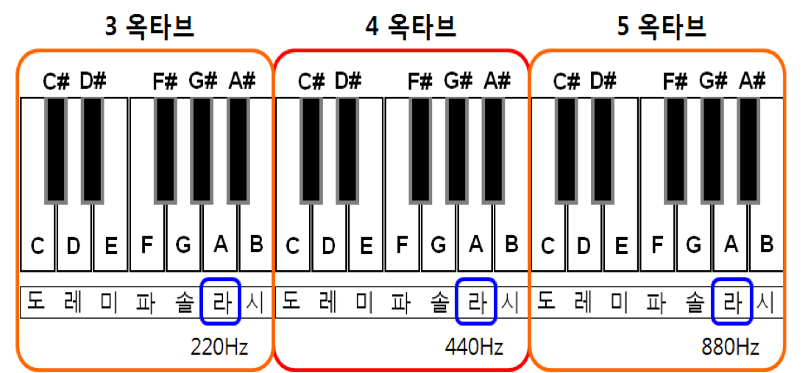
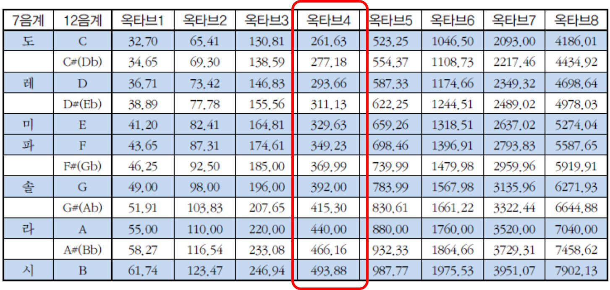
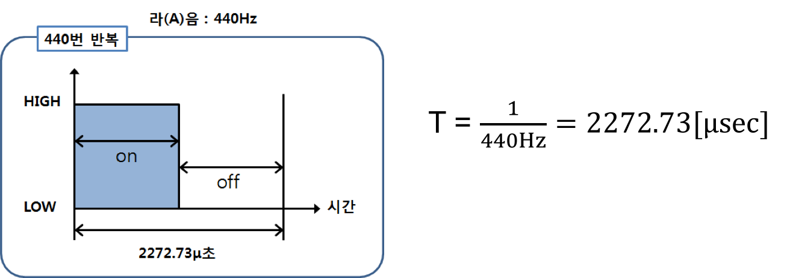
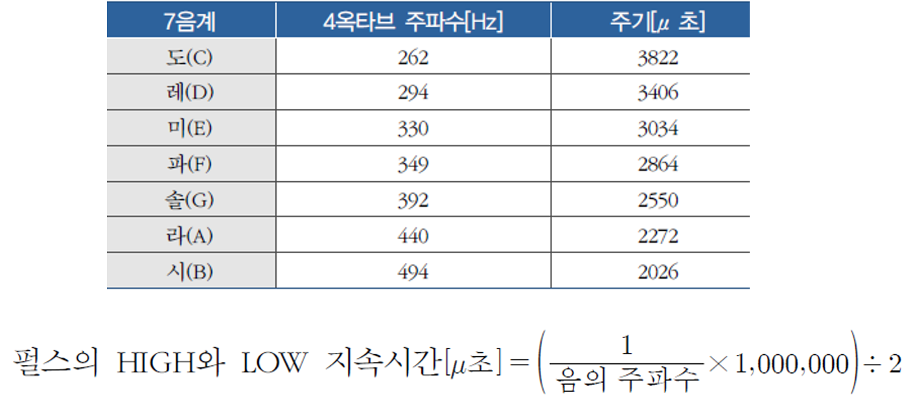
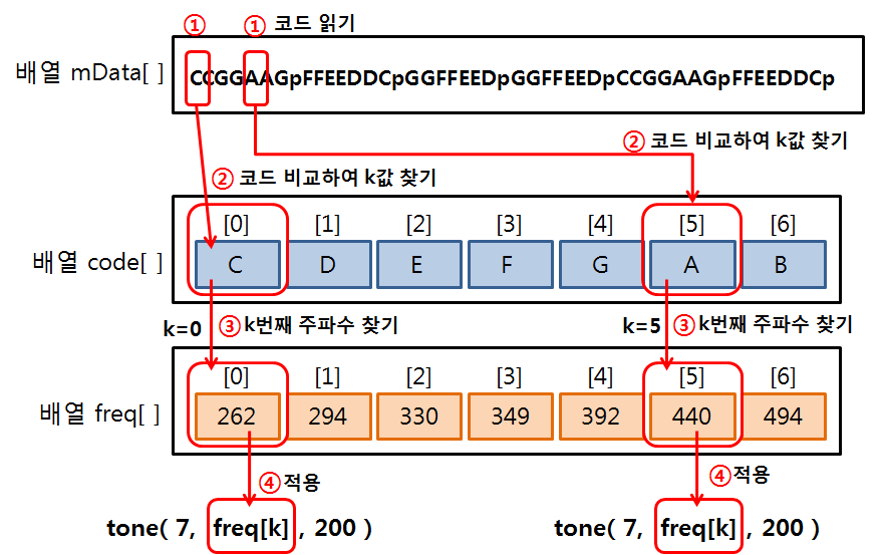
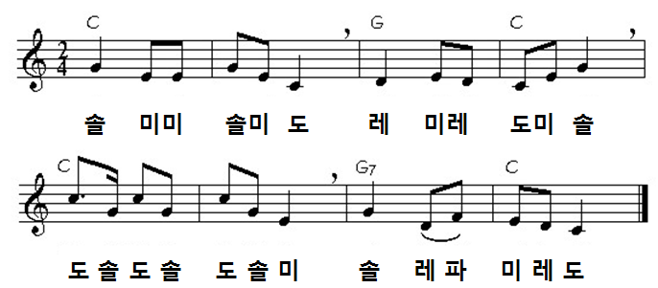

<style>
div.polaroid {
  	width: 400px;
  	box-shadow: 0 10px 30px 0 rgba(0, 0, 0, 0.2), 0 16px 30px 0 rgba(0, 0, 0, 0.19);
  	text-align: center;
	margin-bottom: 0.5cm;
}
</style>

# 아두이노에서 소리내기

## 학습 목표
- 음계와 주파수와의 관계를 이해한다.
- tone() 함수를 이용하여 음악을 연주해 보자.

## 1. 소리내기 이론
- 공기 중에서 일어나는 진동으로 인한 현상인 소리는 **진동의 주파수에 따라 다양한 종류의 소리 발생**
- 가청 주파수
	- 사람이 들을 수 잇는 주파수
	- 20Hz~20,000Hz의 범위의 주파수
- 가청 주파수 진동을  스피커나 피에조(piezo)에 출력

	<div class="polaroid">
		
	</div>

## 2. 소리의 높낮이 (음계, SCALE)
- **주파수에 따라서 음의 높이(피치, pitch)가 다름**
- 국제 피치음
	- 피아노의 A(라)음 : 진동수 440Hz
	- 12음계(scale)  : 진동수 440Hz 를 등비수열로 12등분한 것
- 12등분된 음의 높이
 	- A, A#, B, C, C#, D, D#, E, F, F#, G, G#로 표시

	

<!--
	
-->

  12음계 | 7음계 | 주파수 | 주파수 계산식
  -------|------|-------|------------
  C | 도 | 261.63 Hz | 440 X 2<sup>(-9/12)
  C# |   | 277.18 Hz | 440 X 2<sup>(-8/12)  
  D | 레 | 293.66 Hz | 440 X 2<sup>(-7/12)  
  D# |    | 311.13 Hz | 440 X 2<sup>(-6/12)
  E | 미 | 329.63 Hz | 440 X 2<sup>(-5/12)  
  F | 파 | 349.23 Hz | 440 X 2<sup>(-4/12)
  F# |    | 369.99 Hz | 440 X 2<sup>(-3/12)
  G |  솔  | 392.00 Hz | 440 X 2<sup>(-2/12)
  G# |    | 415.30 Hz | 440 X 2<sup>(-1/12)
  A | 라 | 440.00 Hz | 440 X 2<sup>(0/12)
  A# |  | 446.16 Hz | 440 X 2<sup>(1/12)
  B | 시 | 493.88 Hz | 440 X 2<sup>(2/12)


- "도레미파솔라시"는 12음계 중 7개만을 표현
- "C(도), D(레), E(미), F(파), G(솔), 라(A), 시(B)"

	

- 옥타브에 따른 음계의 주파수

	

## 3. 소리 만들기
### 3.1 소리 발생 원리


- **펄스**: 일정한 주기로 반복되는 파동

	

- **주파수**: 단위펄스가 1초에 반복하는 회수
- **주기(T)**: 단위펄스가 반복하는데 걸리는 시간
	- 주파수의 역수

- 원하는 소리의 주파수로 전기신호를 만들어 스피커나 피에조(piezo)에 입력하면 스피커나 피에조의 물리적인 구조로 인하여 진동을 일으켜 소리 발생
  - 예, 주파수가 440Hz인 라(A)음을 1초동안 출력하는 방법
    - 1초에 440번의 펄스를 만들어 디지털입출력 핀을 통하여 피에조에 출력
    - 한 주기가 약 2272.73[μsec]인 펄스를 1초에 걸쳐서 440번 반복
    

<!--
	- 아두이노 보드의 디지털입출력 핀을 사용하여 주파수를 갖는 신호 출력
		- 1초에 펄스신호를 주파수 값만큼 반복하여 출력
-->


- 음계의 주파수와 주기

	

### 3.2 예제 1: 표준 라(A)음 내기
- 표준 "**라(A)**"음 :  440Hz의 주파수(약 2272μ초의 주기)
- 디지털출력으로 HIGH와 LOW를 각각 1136μ초씩 출력
- **delayMicroseconds**( )함수 : μ초 단위의 시간지연

<a name="3.2.1"> </a>
#### 3.2.1 하드웨어 구성
- 베이스 보드 JP9의 PIEZO와 아두이노 보드의 디비털입출력 핀 7번 연결

	<div class="polaroid">
	     
	</div>

#### 3.2.2 Sketch 프로그램
```c
/*
 주파수가 440Hz인 라(A)음을 1초동안 출력
*/
void setup( ) {
   pinMode(7, OUTPUT);        // 피에조와 연결된 핀 7을 출력으로 설정
}

void loop( ) {
	for (int  k=0; k<440; k++) {  // 주파수 갯수만큼 반복 (1초 동안)
        digitalWrite(7, HIGH);  // HIGH 펄스
        delayMicroseconds(1136);// HIGH 펄스 지속시간
        digitalWrite(7, LOW);   // LOW 펄스
        delayMicroseconds(1136);// LOW 펄스 지속시간
    }
    delay(1000);
}
```
<div class="polaroid">
     
</div>

-[**토의**] 위 코드의 for 문에서 440 번 반복하는 것은 어떠한 의미를 가지는가?

### 3.3 예제 2
- 피에조를 통하여 ‘도레미파솔라시’ 출력
- 4옥타브  도레미파솔라시의 주파수와 주기
  <div class="polaroid">
     
  </div>

#### 3.3.1 하드웨어 구성
  - [3.2.1 하드웨어 구성](#3.2.1)과 동일

#### 3.3.2 Sketch 프로그램
```c
/*
  피에조를 통하여 ‘도레미파솔라시’ 출력
*/

void setup() {
  pinMode(7,OUTPUT);  
}

void loop() {
  scalePlay(262);  // 도 (주파수 262Hz)  
  scalePlay(294);  // 레 (주파수 294Hz)
  scalePlay(330);  // 미 (주파수 330Hz)
  scalePlay(349);  // 파 (주파수 349Hz)
  scalePlay(392);  // 솔 (주파수 392Hz)
  scalePlay(440);  // 라 (주파수 440Hz)
  scalePlay(494);  // 시 (주파수 494Hz)
  exit(0);         // loop 종료
}

/*
  파라미터로 주어진 주파수 값(freq)으로 1초 동안 음을 내기 위한 함수
  freq: 주파수 값
*/
void scalePlay(int freq) {
  int T = 1000000/freq;     // 펄스주기 (마이클마이크로초 단위)
  int t = T/2;        // 펄스주기의 1/2

  for (int k=0; k<freq; k++) { // 주파수 갯수만큼 반복 (1초 동안)
    digitalWrite(7, HIGH);     // HIGH 펄스 출럭
    delayMicroseconds(t);      // HIGH 펄스 지속시간
    digitalWrite(7, LOW);      // LOW 펄스 출럭
    delayMicroseconds(t);      // LOW펄스 지속시간
  }
}

```

## 4. tone( )과 noTone( ) 함수
- **[tone(pin,freq,dtime )](https://www.arduino.cc/reference/en/language/functions/advanced-io/tone/)** :  소리를 나게 하는  함수
    - 재생하고자 하는 음의 주파수(freq)와 그 음이 지속되어야 할 시간(dtime)을 msec 단위로 지정
    - 음이 지속될 시간을 지정하지 않으면, 다른 tone( )함수가 실행되거나 noTone( )함수가 실행 될 때까지 계속 출력

    
- **[noTone(pin )](https://www.arduino.cc/reference/ko/language/functions/advanced-io/notone/)** : 소리가 나지 않도록 하는 함수


### 4.1 예제 3
- tone( )함수를 이용하여 ‘도레미파솔라시’ 출력

	```c
	void setup( ) {
	    pinMode( 7, OUTPUT );
	}
	void loop( ) {
	  	tone(7, 262,1000);	// '도' 음
	  	delay(1000);
	  	tone(7, 294, 1000);	// '레' 음
	  	delay(1000);
	  	tone(7, 330, 1000);	// '미' 음
	  	delay(1000);
	  	tone(7, 349, 1000);	// '파' 음
	  	delay(1000);
	  	tone(7, 392, 1000);	// '솔' 음
	  	delay(1000);
	  	tone(7, 440, 1000);	// '라' 음
	  	delay(1000);
	  	tone(7, 494, 1000);	// '시' 음
	  	delay(1000);
	  	exit(0);				// loop 종료
	}
	```

### 4.2 예제 4
- tone() 함수 사용하여  "반짝반짝 작은 별"의 연주


#### 4.2.1 하드웨어 구성
- [3.2.1 하드웨어 구성](#3.2.1)과 동일


#### 4.2.2 프로그램 코드
- 연주할 곡의 계이름 코드를 문자 배열로 표시 (코드 사이의 'p'는 앞의 음이 2박자임을 나타냄)

  ```c
  char mData[ ]="CCGGAAGpFFEEDCCpGGFFEEDpGGFFEEDpCCGGAAGpFFEEDDCp";
  ```
- sizeof()함수를 사용하여 저장된 배열의 크기 측정

  ```c
  const byte mSize = sizeof(mData);
  ```

- '도레미파솔라시' 코드는 배열 code[]에 저장, 각 코드의 순서에 따른 각 음의 주파수는 배열 freq[]에 저장

  ```c  
  char code[ ] = {'C', 'D', 'E', 'F', 'G', 'A', 'B'};
  int  freq[ ] = {262, 294, 330, 349, 392, 440, 494};
  ```
- 다음과 같은 절차로 악보가 연주됨
  1. 악보가 들어 있는 배열 mData[ ]에서 하나 씩 문자를 읽어온다.
  2. 읽어 온 문자를 배열 code[ ]의 내용과 비교하여 같은 문자가 저장되어 있는
      배열 code[ ]에서의 순서 k를 찾는다.
  3. 배열 freq[ ]에서 k번째인 freq[k]의 값을 tone( )함수 전달한다.
  4. freq[k]의 값을 적용하여 tone(7, freq[k], 200) 실행한다.

	

<a name="code"></a>
- **전체 코드**

```c
	const  int  piezo=7;
	char code[ ]= {'C', 'D', 'E', 'F', 'G', 'A', 'B'};
	unsigned int  freq[ ]= {262, 294, 330, 349, 392, 440, 494};
	char mData[ ]="CCGGAAGpFFEEDDCpGGFFEEDpGGFFEEDpCCGGAAGpFFEEDDCp";
	const  byte mSize=sizeof(mData);

	void  setup( ) {
	   	pinMode(piezo, OUTPUT);
	}

	void loop( ) {
	   	int  playT=500;   // 1박자를 0.5초
	   	for (int  m=0; m<mSize; m++) {
 	      	for(int k=0; k<7; k++) {
	         	if( mData[m]==code[k] ) {        // 배열 mData[]의 문자와 배열 code[] 의 문자 비교하여 인텍스 k 검색
	             	tone(piezo, freq[k], playT);  // freq[k]의 값을 tone( )함수 전달
	              delay(playT);                 // 1박자 연주
	         	}
	        }
	        if (mData[m]=='p') {                // 배열 mData[]의 문자가 'p' 인 경우
	          delay(playT);                     // 1박자 더 쉼
	        }
	    }
	    noTone(piezo);
	    delay(2000);
	    exit(0);
	}  
```

### 4.3 예제 5: 간이형 키보드 만들기

#### 4.3.1 하드웨어 구성

  <div class="polaroid">
  	    d
  </div>

#### 4.3.2 1단계
- 2번 핀에 연결된 버튼에 대해서 다음과 같이 동작하는 코드
  - 버튼 스위치가 계속 눌려지고 있으면, 계속 같은 음 '도'를 출력
  - 버튼 스위치의 눌림이 종료되면, 출력되던 음 출력 정지
  - 오래 누르면 길게 소리가 나고 짧게 누르면 짧게 소리 출력

  ```c
  int piezo = 7;  //피에조가 연결된 디지털입출력 핀
  int sw = 2;     // 디지털입출력 2번 핀을 버튼스위치와 연결
  int freq= 262;  // 도의 주파수
  int val = 0;    // 변수의 초기값

  void setup() {
    	pinMode(piezo, OUTPUT);  // 출력 핀 설정
    	pinMode(sw, INPUT);      // 입력 핀 설정
  }

  void loop() {
    	if (digitalRead(sw)==1) {      // 버튼 스위치가 눌러진 경우
      		tone(piezo,freq);           // '도(262)'의 주파수 출력
      		while(digitalRead(sw)==1) {} // 버튼 스위치가 계속 눌러진 경우
      		noTone(piezo);
    	}
  }
  ```

#### 4.3.3 2단계
-  버튼 스위치 입력에 따라 도, 레, 미, 파 연주
  -  버튼 스위치가 계속 눌려지고 있으면, 계속 같은 음 출력
  -  버튼 스위치의 눌림이 종료되면, 출력되던 음 출력 정지
  -  오래 누르면 길게 소리가 나고 짧게 누르면 짧게 소리 출력

  ```c
  int piezo = 7;                      //피에조가 연결된 디지털입출력 핀
  int sw[4] = {2, 3, 4, 5};           // 4개 스위치 지정
  int freq[4]= {262, 294, 330, 349};  // 도, 레, 미, 파의 주파수
  int val = 0;    // 변수의 초기값

  void setup() {
  		pinMode(piezo, OUTPUT);         // 출력 핀 설정
  		for(int  k=0; k<4; k++) {
      		pinMode( sw[k],  INPUT);      // 입력 핀 설정
      	}
  }

  void loop() {
    	if (digitalRead(sw[0])==1) {
      		tone(piezo,freq[0]);
      		while(digitalRead(sw[0])==1) {}
      		noTone(piezo);
    	} else if (digitalRead(sw[1])==1) {
      		tone(piezo,freq[1]);
      		while(digitalRead(sw[1])==1) {}
      		noTone(piezo);
    	} else if (digitalRead(sw[2])==1) {
      		tone(piezo,freq[2]);
      		while(digitalRead(sw[2])==1) {}
      		noTone(piezo);
    	} else if (digitalRead(sw[3])==1) {
      		tone(piezo,freq[3]);
      		while(digitalRead(sw[3])==1) {}
      		noTone(piezo);
     	}
  }
  ```

#### 4.3.4 3단계 (코드 축약 버전)
  -  for 문과 배열을 이용하여 중복 코드 단순화

    ```c
    int piezo = 7;                      //피에조가 연결된 디지털입출력 핀
    int sw[4] = {2, 3, 4, 5};           // 4개 스위치 지정
    int freq[7]= {262, 294, 330, 349};  // 도, 레, 미, 파의 주파수
    int val = 0;    // 변수의 초기값

    void setup() {
      pinMode(piezo, OUTPUT);         // 출력 핀 설정
      for(int  k=0; k<4; k++) {
        pinMode( sw[k],  INPUT);      // 입력 핀 설정
      }
    }

    void loop() {
      for(int k=0; k<4; k++) {
        val = digitalRead(sw[k]);   
        if(val) {                     // k번째 스위치가 눌렸는지 검사
          tone(piezo, freq[k]);       // k번째 주파수 출력
          while(digitalRead(sw[k]));  //스위치가 계속 눌려지고 있는지 검사
          noTone(piezo);              //스위치 눌림이 끝나면 소리 정지
        }
      }
    }
    ```

<a name="exercise"></a>
## 5. 연습문제
1. 음과 박자를 고려하여, 다음 동요를 연주하는 스케치를 작성하여 보자.
<div class="polaroid">
	    
</div>

	- 힌트
		- 박자를 나타내는 배열(time[])을 만들어 음마다 연주할 박자를 기록하고, 음을 연주할 때는 [예제4 코드](#code)와 같이 tone()함수를 이용하고, 박자를 적용할 때는 배열 time[]의 값을 delay()함수에 파라미터로 전달하는 방법을 사용할 수도 있습니다.

```
