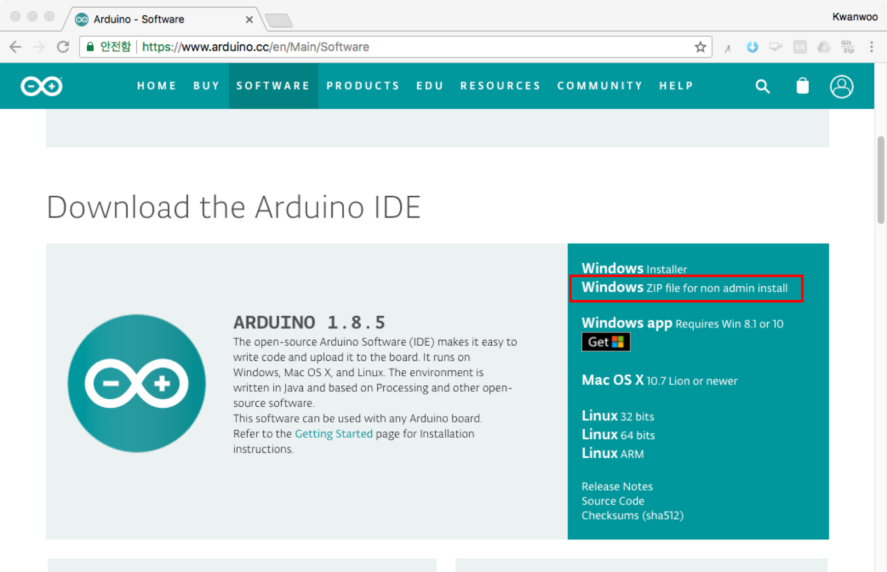
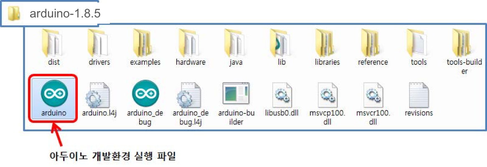
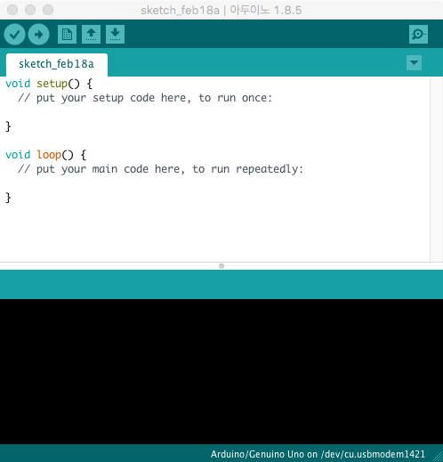

#Arduino Desktop IDE 설정

1. Arduino 개발자 홈페이지 (http://www.arduino.cc/en/Main/Software) 에서 다운로드
	
	

2. Windows용 다운로드 파일은 ZIP 형태의 압축파일이므로 다운로드 후에 원하는 경로에 압축 해제 (**한글이 포함되지 않은 경로에 압축을 해제**)
	- 압축을 해제한 후 생성되는 Arduino-x.x.x폴더 (여기서 x.x.x는 아두이노의 릴리스 번호)를 열어 보면, 실행파일(Arduino.exe) 및 여러 개의 파일과 폴더 존재
3. Arduino.exe 파일을 실행

	
	
4. Arduino Desktop Editor 초기 실행화면 

	

