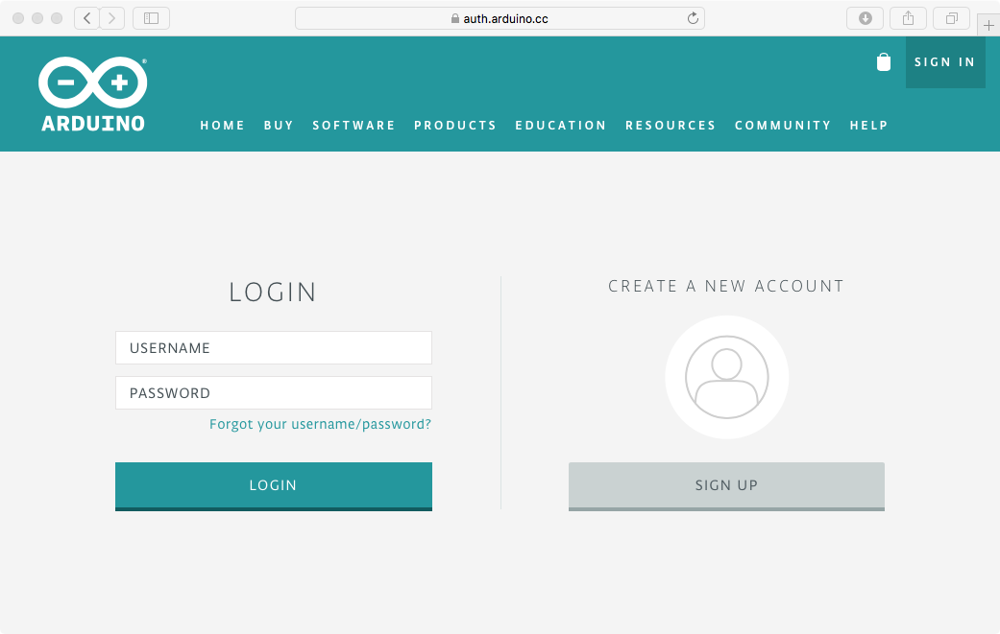

# Arduino Web IDE 설정

1. https://create.arduino.cc/editor 접속

	
	
2. 계정이 없는 경우 [**SIGN UP**] 클릭

	
	
	1. 요구 정보 (*USERNAME*, *PASSWORD*, *CONFIRM PASSWORD*, *EMAIL*)입력
	2. *로봇이 아닙니다* 체크박스 선택하여 해당 질문에 응답
	3. [**CREATE ACCOUNT**] 클릭
	4. 입력된 *EMAIL*로 전송된 계정 활성화 링크를 클릭
	
		
	
	5. [**Ardunio Web Editor**] 선택
	6. [**Welcome to the Arduino Web Editor**] 화면에서 *이름*과 *국가*를 입력하고 [**AGREE**] 버튼을 클릭
	
		
	
	7. **Arduino Web Editor** 초기 실행화면
	
		

3. 아두이노랑 USB로 연결하기 위해서는 Plugin 설치
	1. Plugin이 설치되지 않은 경우, [**HELP**] 클릭
		
		 	
	
	2. [**DOWNLOAD**]를 클릭하여 Plugin 다운로드
	
		
		
	3. [**실행**]을 클릭하여 Arduino Plugin 설치

		
		
	4. 이후 설치과정에 따라 진행하게 되면, 최종적으로 다음과 같은 화면이 나오게 됨

		