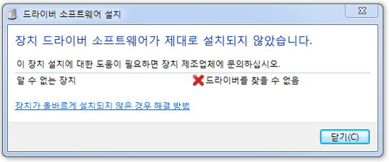
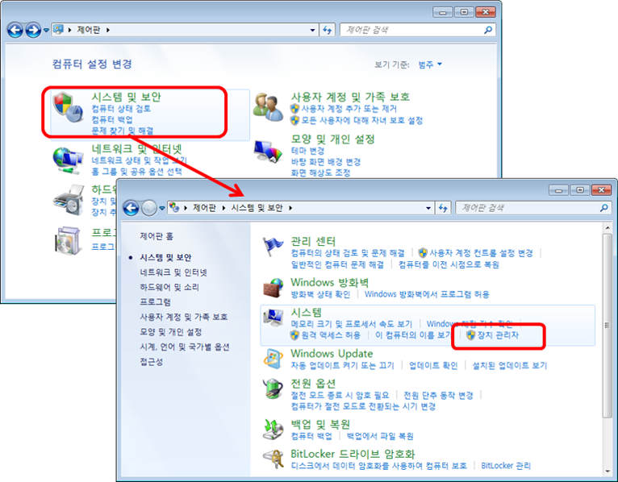
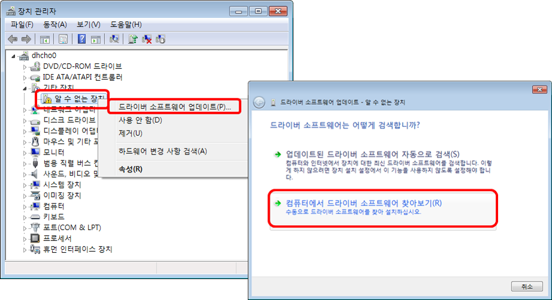
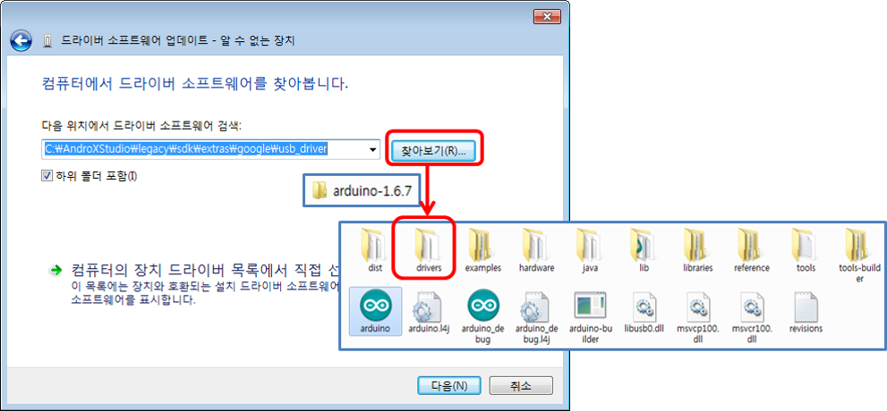
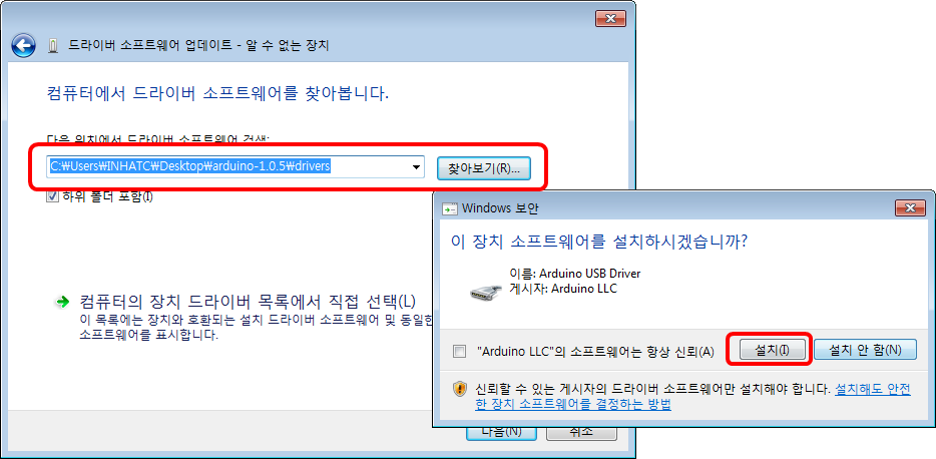
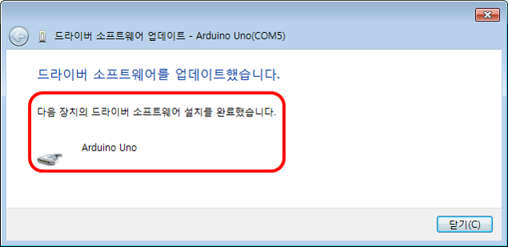

# 아두이노 개발환경 설정

## 1. 아두이노 IDE 설치
1. https://www.arduino.cc/en/Main/Software 접속
2. 다음 두 가지 설치 옵션 중에 하나를 선택하여 아두이노 IDE 설치
  - [**Arduino Desktop IDE**](Arduino_Desktop_IDE.html)
  - [**Arduino Web IDE**](Arduino_Web_IDE.html)

## 2. 아두이노 UNO 보드 드라이버 설치
1. USB 케이블을 통해 개발용 PC의 USB 포트에 아두이노 UNO보드를 연결
2. 개발용 PC에 드라이버 소프트웨어 설치 창 확인.
	- 아두이노 보드를 위한 드라이버 프로그램은 개발용 PC에 자동으로 설치되지 않으므로 장치 드라이버를 수동으로 설치

	

3. 장치관리자
	- 아두이노 보드의 드라이버 설치를 위하여 제어판의 장치관리자로 들어가야 하므로 다음과 같이 제어판-시스템 및 보안-장치관리자를 찾아 들어간다

  

4. 드라이버 소프트웨어 업데이트
	- 장치 관리자에서 다음과 같이 알 수 없는 장치가 보이면, 선택하여 마우스 오른쪽 버튼을 눌러 "**드라이버 소프트웨어 업데이트**"를 선택
	- 개발용 PC에서 드라이버 소프트웨어 찾아보기(R)를 선택

  

5. 개발환경에서 설치한 아두이노 프로그램이 있는 폴더를 찾아서 그 밑에 있는 drivers 폴더 선택

  

6. drivers 폴더 선택 후 다음과 같이 설치

  

7. 설치 완료 창 확인

  
