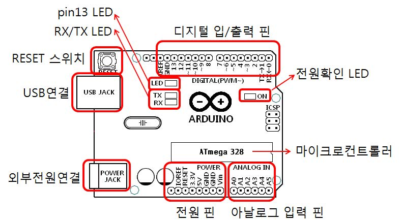

# 아두이노 IDE 시작하기
아두이노 통합 개발환경(IDE)를 처음 사용하는 사용자를 위해 간단한 예제를 이용하여 작성한 코드를 컴파일하고 이를 장비에 프로그램하는 과정을 진행

- 아두이노 Desktop IDE 시작하기
- 아두이노 Web IDE 시작하기


## 아두이노 Desktop IDE 시작하기


1. **Arduino.exe** 파일을 실행
2. 파일 → 예제 → 1.Basics → Blink 선택

  

3. 아두이노 보드 선택
  - 툴 → 보드 → Arduino/Genuino Uno 선택

	

4. 시리얼 포트 선택
  - 툴 → 포트 → COM8(Ardunio/Genuino Uno)

  

  - 아두이노 보드가 연결된 시리얼 포트 번호는 "컴퓨터 관리 →장치관리자 →포트" 순으로 확인 가능
5. 확인/컴파일
  - 상단 툴바의 확인/컴파일을 누르면, 작성한 스케치가 선택한 아두이노 보드에 맞는 형식으로 컴파일

  

  - 만일 스케치에 오류가 있거나 보드선택이 잘못되면 스케치창 아래 부분에 오류 메시지 표시

  

6. 업로드
  - 확인/컴파일에서 오류가 발생하지 않으면, 개발용 PC에 USB 케이블로 연결된 아두이노 보드에 컴파일된 코드를 전송하여 저장

	

7. 보드 확인
  - 예제 스케치인 "Blink"를 아두이노 보드에 업로드 하였다면, **아두이노 보드의 LED가 약 1초 간격으로 켜졌다 꺼졌다** 하는 것을 확인

  
## 아두이노 WEB IDE 시작하기
1. https://create.arduino.cc 접속 후, **Arduino Web Editor** 선택

	
	
2. Sign In 후 초기화면
	
	
	
3. **Examples** - **01.BASICS(6)** - **Blink** 선택

	
	
4. 아두이노 보드 선택
	
	

5. 확인/컴파일

	
	
6. 업로드

	
	
7. 보드 확인
  - 예제 스케치인 "Blink"를 아두이노 보드에 업로드 하였다면, **아두이노 보드의 LED가 약 1초 간격으로 켜졌다 꺼졌다** 하는 것을 확인

<!--
##1. 아두이노 소개
- **아두이노**는 마이크로프로세서나 컴퓨터 하드웨어에 대한 전문적인 지식 없이 쉽게 구현할 수 있는 **오픈소스 전자장치 플랫폼**로서, 다음의 구성요소를 가짐
	+ [아두이노 하드웨어](#1.1)
	+ [아두이노 프로그래밍](#1.2)
	+ [아두이노 IDE (Integrated Development Environment)](#1.3)
- 특징
	- 초보에서부터 전문적인 수준의 기능도 구현할 수 있도록 다양한 확장성 제공
	- 회로도 및 관련 소프트웨어가 공개된 대표적인 오픈소스 시스템
	- 아두이노 보드를 사용한 많은 활용 예제 코드들이 공개되어 있음
- 아두이노 공식 홈페이지: http://www.arduino.cc/

<a name="1.1"> </a>
### 1.1 아두이노 하드웨어
- 보드
	+ 컴퓨터와 같은 확장 가능한 전자기기의 부품의 일종으로, CPU나 램과 같은 시스템이 작동되기 위한 주요 부품 장착과 주변 장치를 연결할 수 있는 인터페이스를 제공하는 인쇄회로기판(PCB)을 의미 [https://ko.wikipedia.org/wiki/메인보드]
		- 아두이노 우노 보드 ([Arduino Uno REV3]((https://store.arduino.cc/usa/arduino-uno-rev3)))

			
			
			- Atmel사의 8비트 ATmega328 마이크로컨트롤러
			- 디지털입/출력핀(0~13번) : 14개
				- PWM 출력: 3, 5, 6, 9, 10, 11번핀(“~”가붙어있는핀)
				- 시리얼통신: RX 출력(0번), TX 입력(1번)
			- 아날로그입력핀(0~5번) : 6개
		- 다양한 [아두이노 보드 종류](https://ko.wikipedia.org/wiki/%EC%95%84%EB%91%90%EC%9D%B4%EB%85%B8_%EB%B3%B4%EB%93%9C#%EC%83%81%EC%97%85%EC%9A%A9_%EC%95%84%EB%91%90%EC%9D%B4%EB%85%B8_%EB%B3%B4%EB%93%9C)
- 쉴드
	+ 추가 기능 확장을 위하여 보드에 플러그 인되는 요소
		
		

<a name="1.2"></a>
###1.2 아두이노 프로그래밍
- [**Sketch**](https://www.arduino.cc/en/Tutorial/Sketch)
	- 아두이노 보드에 업로드되고 실행되는 프로그램 코드 단위
	- C/C++ 문법을 따름
	- 많은 활용 예제 코드들이 공개되어 있음
	- Sketch 예제 (1초마다 LED를 켜고 끄는 것을 반복)

		```C
		// the setup function runs once when you press reset or power the board
		void setup() {
		  // initialize digital pin LED_BUILTIN as an output.
		  pinMode(LED_BUILTIN, OUTPUT);
		}

		// the loop function runs over and over again forever
		void loop() {
		  digitalWrite(LED_BUILTIN, HIGH);   // turn the LED on (HIGH is the voltage level)
		  delay(1000);                       // wait for a second
		  digitalWrite(LED_BUILTIN, LOW);    // turn the LED off by making the voltage LOW
		  delay(1000);                       // wait for a second
		}
		```

- [**S4A**](http://s4a.cat/)
	- **S4A**는 *아두이노를 위한 스크래치 (Scratch for Arduino)* 라는 의미로 *스크래치*로 아두이노를 간단하게 제어할 수 있도록 한 것이다.
		- [스크래치](https://scratch.mit.edu/)는 창의력을 기반으로 직관적인 프로그램을 작성할 수 있도록 개발된 프로그래밍 도구이다
		- S4A 스크립트 예제 (스페이스바를 눌렀을 때, 1초마다 13번 디지털 출력에 연결된 LED를 켜고 끔)

			

- 비교 (**Sketch** vs. **S4A**)

	|          |  **S4A**       |  **Sketch**      |   
	|:-------- |:---------------| :-------------|
	| 장점      | <ul> <li> 직관적임</li> </ul> | <ul> <li> 다양한 예제 <li> **S4A**에 비해 특별한 제약사항 없음 </ul> |
	| 단점      | <ul> <li> **S4A**에서 제공되는 블록의 한계 </ul>        |           <ul> <li> C/C++ 프로그래밍 기초 지식이 필요 </ul>  |

<a name="1.3"> </a>
###1.3 아두이노 IDE
- [**Arduino WEB Editor**](https://create.arduino.cc/editor)
	- 웹 브라우저 환경에서 Sketch 프로그램을 작성하고 보드에 업로드할 뿐만아니라, 작성된 Sketch 프로그램을 공유하고 협업할 수 있는 개발 환경   

	

- **Ardunio Desktop IDE**
	- Windows, Mac OSX, Linux 환경에서 	Sketch 프로그램을 작성하고 업로드할 수 있는 개발 환경
	- [설치 가이드](https://www.arduino.cc/en/Guide/HomePage)

	-->
