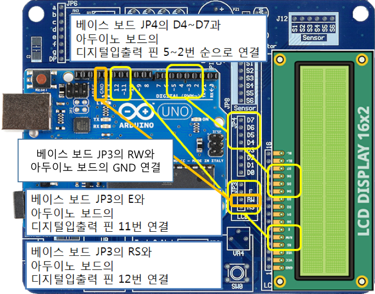

<style>
div.polaroid {
  	width: 400px;
  	box-shadow: 0 10px 30px 0 rgba(0, 0, 0, 0.2), 0 16px 30px 0 rgba(0, 0, 0, 0.19);
  	text-align: center;
	margin-bottom: 0.5cm;
}
</style>

# 아두이노에서 text LCD 사용하기

## 학습목표
- LCD 화면에 문자를 표시할 수 있는 Text LCD를 아두이노에서 사용할 수 있도록 디지털 핀 연결을 구성할 수 있다.
- 아두이노에서 TEXT LCD를 제어하는 다양한 함수를 이용하여 다양한 방식으로 문자 혹은 문자열을 LCD 화면에 출력할 수 있다.

## Text LCD 모듈
-  LCD화면에 정해진 형태의 문자를 표시할 수 있는 장치
	<div class="polaroid">
		
	</div>

- TextLCD 모듈 연결 구성

  <div class="polaroid">
	
	</div>

- 베이스보드 사용시 TextLCD 모듈 연결 구성
	- 1단계  
		- 전원선(**5V**,**IN**)을 브레드보드의 **+**, **-** 에 연결
		- 아두이노보드 POWER의 **5V** 핀을 브레드보드의 **+**에, POWER의 **GND** 핀을 브레드보드의 **-** 연결
		- 베이스보드 JP3의 **RW**와 브레드보드의 **-** 연결
		
		<div class="polaroid">
		
		</div>

	- 2단계
		- 베이스보드 JP4의 **D4~D7**과 아두이노보드의 디지털입출력 핀 **5~2** 순으로 연결
		- 베이스보드 JP3의 **E**와 아두이노보드의 디지털입출력 핀 **11**번 연결   
		- 베이스보드 JP3의 **RS**와 아두이노보드의 디지털입출력 핀 **12**번 연결
		
		<div class="polaroid">
		
		</div>
	- 최종 하드웨어 구성 사진
	  <div class="polaroid">
		
		</div>

## 아두이노 Text LCD 함수


## 예제 1
- Text LCD 모듈에 "Hello, World!" 출력하기

```C
#include "LiquidCrystal.h"        // Text LCD 라이브러리 함수

LiquidCrystal lcd(12,11,5,4,3,2); // LCD 모듈 제어선 설정

void setup() {
  lcd.begin(16,2);                // LCD 초기화
  lcd.print("Hello,World!2");     // 문자열 출력
}

void loop() {   
}
```

## 예제 2
1. LCD 모듈에 커서를 나타나게 하고, 2초 동안 깜빡이게 하기

  ```C
  /*
    	LCD 모듈에 커서를 나타나게 하고, 2초 동안 깜빡이게 하기
  */
  #include "LiquidCrystal.h"

  LiquidCrystal lcd(12,11,5,4,3,2);

  void setup() {
    	lcd.begin(16,2);

  }
  void loop() {
    	lcd.print("Cursor ON-Blink"); // "Cursor ON-Blink" 출력
    	lcd.cursor( );                // 커서 보이기
    	lcd.blink( );                 // 깜빡이기
    	delay(2000);                  // 2초 지연
    	lcd.clear( );                 // LCD화면 지우기
  }
  ```

2. 깜박임을 멈추고, 커서를 감추기

  ```C
  /*
    	깜박임을 멈추고, 커서를 감추기
  */
  #include "LiquidCrystal.h"

  LiquidCrystal lcd(12,11,5,4,3,2);

  void setup() {
    	lcd.begin(16,2);
  }
  
  void loop() {
    	lcd.print("Cursor OFF");      // "Cursor OFF" 출력
    	lcd.noBlink( );               // 깜박임 정지
    	lcd.noCursor( );              // 커서 감추기
    	delay(1000);                  // 1초 지연
    	lcd.clear( );                 // LCD화면 지우기
  }
  ```

3. 표시위치(0,0)에서 숫자 0부터 10까지 0.2초 간격으로 출력하기

  ```C
  /*
    	표시위치(0,0)에서 숫자 0부터 10까지 0.2초 간격으로 출력하기
  */
  #include "LiquidCrystal.h"

  LiquidCrystal lcd(12,11,5,4,3,2);

  void setup() {
    	lcd.begin(16,2);

  }
  void loop() {
    	lcd.print("Count Up");      // "Count Up" 출력
    	for (int k=0; k<=10; k++) {
      		lcd.home();               // 표시위치를 (0,0)으로 이동
      		lcd.print("No:");         // "No:"를 나타내고 이어서
      		lcd.print(k);             // 숫자를 0 부터 10까지 출력
      		delay(200);               // 0.2초 지연
    	}
    	lcd.clear( );               // LCD화면 지우기
  }
  ```

4. LCD 모듈에 Hello를 표시하고 1초 간격으로 3번 깜빡이기

  ```C
  /*
    	LCD 모듈에 Hello를 표시하고 1초 간격으로 3번 깜빡이기
  */
  #include "LiquidCrystal.h"

  LiquidCrystal lcd(12,11,5,4,3,2);

  void setup() {
  		lcd.begin(16,2);

  }
  void loop() {
    	lcd.print("Hello!");      // "Hello!" 출력
    	for (int k=0; k<3; k++) {
      		lcd.noDisplay();        // 표시 안함
      		delay(1000);            // 0.2초 지연
      		lcd.display();          // 표시
      		delay(1000);            // 0.2초 지연
    	}
    	lcd.clear( );             // LCD화면 지우기
  }
  ```
  
5. LCD 모듈에 Hello를 표시하고 1초 간격으로 3번 오른쪽 이동하기
  
  ```C
  /*
     	LCD 모듈에 Hello를 표시하고 1초 간격으로 3번 오른쪽 이동하기
  */
  #include "LiquidCrystal.h"

  LiquidCrystal lcd(12,11,5,4,3,2);

  void setup() {
    	lcd.begin(16,2);

  }
  void loop() {
    	lcd.setCursor(6,0);           // lcd.setCursor(6,0);
    	lcd.print("Hello!");          // "Hello!" 출력
    	for (int k=0; k<3; k++){      // LCD 모듈에 표시된 글자를 3번
       	lcd.scrollDisplayRight( ); // 오른쪽으로 이동
       	delay(500);
    	}
    	lcd.clear( );                 // LCD화면 지우기
  }
  ```
