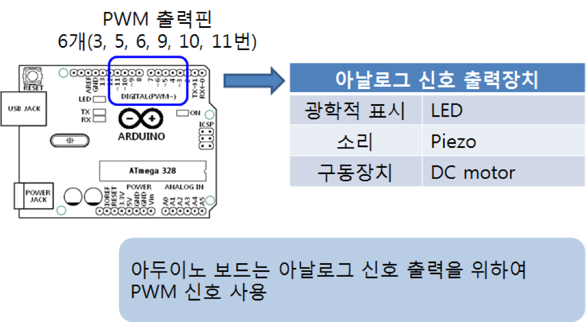
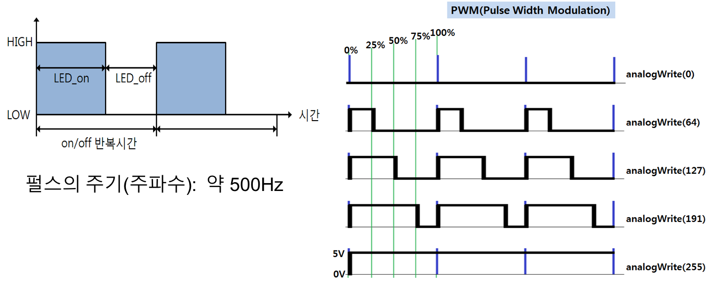
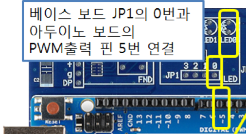

<style>
div.polaroid {
  	width: 600px;
  	box-shadow: 0 10px 30px 0 rgba(0, 0, 0, 0.2), 0 16px 30px 0 rgba(0, 0, 0, 0.19);
  	text-align: center;
	margin-bottom: 0.5cm;
}
</style>

# PWM 출력하기
- 아두이노 보드는 아날로그 신호 출력을 위하여 **PWM** 신호를 사용

## 아날로그 출력
- 전류의 세기 조정하여 어둡게 하거나 밝게 가능
- **PWM** 신호를 이용한 아날로그 출력
	- 디지털입출력 가운데 “**~**”가 붙어 있는 핀 3, 5, 6, 9, 10, 11번은 **PWM** 제어가 가능한 핀
	- LED의 밝기나 모터의 속도 빠르기를 제어 가능

		


## PWM(Pulse Width Modulation)
- 펄스의 **HIGH(+5V)**와 **LOW(0V)**되는 간격을 조정하여 전류를 조정하는 방법
	- 펄스가 **HIGH**가 되는 시간이 길수록 더 많은 전류가 흐르게 되어 LED의 경우 더 밝아지고, 모터의 경우 속도가 빨라지게 된다.

 	<div class="polaroid">
	
	</div>

## 예제: LED 밝기 변화 제어
- PWM 출력을 이용하여 LED의 밝기가 점점 밝아 졌다가 어두워지도록 만든다.

### 하드웨어 구성
- 아두이노 보드의 PWM 출력핀 5번에 LED 연결

	
	
### Sketch 코드
```c
/*
  PWM 출력을 이용하여 LED의 밝기가 점점 밝아 졌다가 어두워지도록 만든다.
  아두이노 보드의 PWM 출력핀 5번에 LED 연결
*/

int pinPWM = 5;
int k;

void setup() {
  pinMode(pinPWM, OUTPUT);    // 입출력 모드를 설정하지 않아도 됨
  
}

void loop() {
  for(k=0; k<255; k++) {
    analogWrite(pinPWM,k);  // 0에서 255까지 서서히 켜지는 PWM 신호 출력
    delay(15);
  }  
  
  for(k=255; k>0; k--) {
    analogWrite(pinPWM,k);  //255에서 0까지 서서히 줄어드는 PWM 신호 출력
    delay(15);
  }  
}

```

	