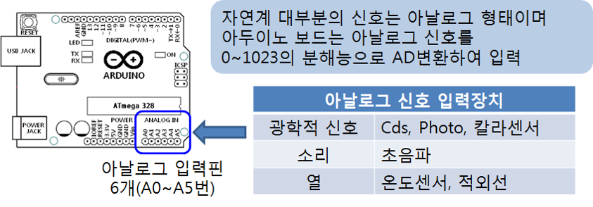
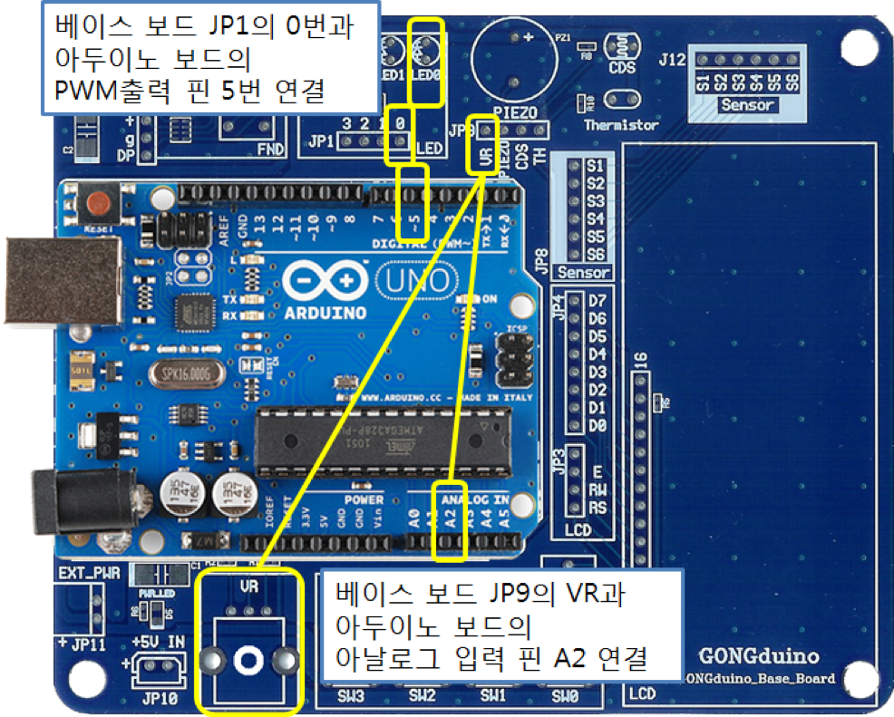

<style>
div.polaroid {
  	width: 400px;
  	box-shadow: 0 10px 30px 0 rgba(0, 0, 0, 0.2), 0 16px 30px 0 rgba(0, 0, 0, 0.19);
  	text-align: center;
	margin-bottom: 0.5cm;
}
</style>

# 가변저항 입력 제어

## 학습목표
- 아두이노 보드의 아날로그 입력 핀을 통하여 가변저항 (VR)의 아날로그 신호를 받아들이고 처리하는 방법들을 배운다.

## 1. 아두이노 보드의 아날로그 입력
- 아두이노 보드는 아날로그 입력 핀을 사용하여 변하는 아날로그 신호를 받아들여 A/D변환 (Analog to Digital Conversion)하여 0~1023 범위의 값으로 읽어 들일 수 있는 기능을 제공한다.

- 아두이노 Uno 보드: A0~A5의 6개 아날로그 입력 핀 제공

  

## 2. VR을 통한  LED 제어
- 가변저항 (VR)으로 저항 값을 조정하면, 0~+5V 범위에서 변하는 전압 값이 아두이노보드 아날로그 입력 A2번으로 들어가게 되고, 내부이 ADC를 통하여 0~1023의 정수값을 가지게 된다.

### 2.1 예제 1
- 가변저항에 의하여 LED가 켜지고 꺼지는 시간 지연이 조절되는 스케치 작성

#### 2.1.1 하드웨어 구성  
- 가변저항 (VR)을 아날로그 입력핀 A2핀과 연결
- LED를 디지털입출력핀 10번과 연결


	<div class="polaroid">
  	
  	</div>

- 베이스보드 JP1의 0번 (LED에 연결됨)과 아두이노보드의 디지털입출력 핀 10번 연결
- 베이스보드 JP9의 VR과 아두이노보드 아날로그 입력 핀 A2 연결

  
  <div class="polaroid">
  
  </div>
#### 2.1.2 아날로그 입력 명령
- [analogRead](https://www.arduino.cc/reference/en/language/functions/digital-io/digitalread/)( ) 함수 사용
- 예: 아날로그 입력 핀 A2번으로 입력을 받는 명령

	```c
	analogRead(2);
	```

#### 2.1.3 Sketch 프로그램
```c
/*
  가변저항을 변화시키면 LED의 켜지고 꺼지는 간격이 변화
    - 가변저항 은 아두이노 보드의 아날로그 입력 A2에 연결
    - LED는 디지털입출력 핀 10번에 연결

*/

int analogPin = 2;  // 아날로그 핀 2

void setup() {
  pinMode(10, OUTPUT);  
}

void loop() {
  int  val = analogRead(analogPin); // A/D변환되어 0~1023 범위 값으로 변화 
  digitalWrite(10, HIGH);
  delay(val);                       // 시간지연이 0~1023 msec 범위에서 조절
  digitalWrite(10, LOW); 
  delay(val);                       // 시간지연이 0~1023 msec 범위에서 조절
}
```

---
### 2.2 예제 2
- **가변저항에 의하여 LED의 밝기가 조절**

#### 2.2.1 하드웨어 구성  
- 가변저항 아두이노 보드의 아날로그 입력 A2 연결
- LED는 PWM 핀 5번 연결

	<div class="polaroid">
	  
	</div>


- 베이스보드 JP1의 0번 (LED에 연결됨)과 아두이노보드의 [PWM](pwm.html) 출력 핀 5번 연결
- 베이스보드 JP9의 VR과 아두이노보드 아날로그 입력 핀 A2 연결

  <div class="polaroid">
  
  </div>
  
### 2.2.2 map() 함수
- 아두이노 보드의 아날로그 입력핀 (가변저항 VR과 연결됨)
	- A/D변환되어 **0~1023 범위** 값 입력
- 아두이노 보드의 [PWM](pwm.html) 핀 출력 (LED와 연결됨)
	- **0~255 범위**의 값 출력
- 가변저항으로 LED의 밝기를 조절
	- 가변저항을 통하여 입력되는 **0~1023 범위**의 값을 **0~255범위**의 값으로 변환
	
	<div class="polaroid">
	
	</div>

<a name=2.2.3></a>	
### 2.2.3 Sketch 프로그램
```c
/*
  가변저항으로 LED의 밝기를 조절
  - 가변저항을 통하여 입력되는 0~1023 범위의 값을 0~255범위의 값으로 변환
*/
int pwdOut = 5;
void setup() {
  pinMode(pwdOut, OUTPUT);  
}

void loop() {
  int val1 = analogRead(2); // 아날로그입력 2번을 통하여 입력된 전압값을
                            // 0~1023범위의 값으로 읽어 val1에 저장

  int val2 = map(val1, 0, 1023, 0, 255); // 0~1023범위의 val값을 0~255 범위로 변환
  
  analogWrite(pwdOut, val2);     // PWM 신호로 출력
  delay(20); 
}
```
<a name="exercise"></a>
## 3. 연습문제
	
1. [예제 2 스케치 코드](#2.2.3)에서 LCD 화면에 두 변수 val1과 val2의 값을 출력하는 프로그램을 작성합니다.
	- TextLCD 화면 실행 예
	
	


2. 가변저항(VR)를 가변시키면, 다음 그림과 같이 값을 AD 변환하여 LED 0부터 3까지 4개의 LED를 값에 따라 켜지는 스케치를 작성해 보자.
	- 가변저항 값이 0~204 이면 LED 모두 Off
	- 가변저항 값이 205~408 이면, LED\_0 On
	- 가변저항 값이 409~612 이면, LED\_0,LED\_1 On
	- 가변저항 값이 613~819 이면, LED\_0,LED\_1, LED\_2 On
	- 가변저항 값이 820~2013 이면, LED\_0,LED\_1, LED\_2, LED\_3 On
	
	- [힌트]
		- if 문에서 두개 이상의 조건을 결합할 때는 &&(and), ||(or)를 사용할 수 있습니다.
		- 예: 변수 k가 0보다 크고 10보다 같거나 작은 지를 판별하는 if 문
		
		```c
		if (k > 0 && k <= 10) {
		}
		```


